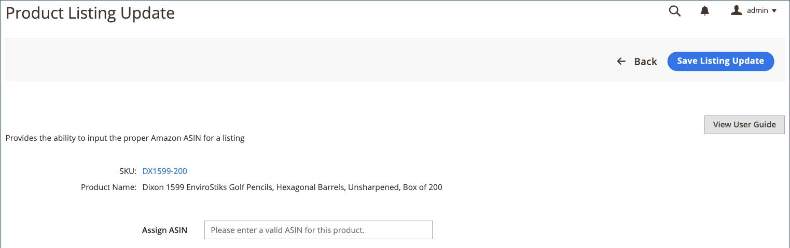
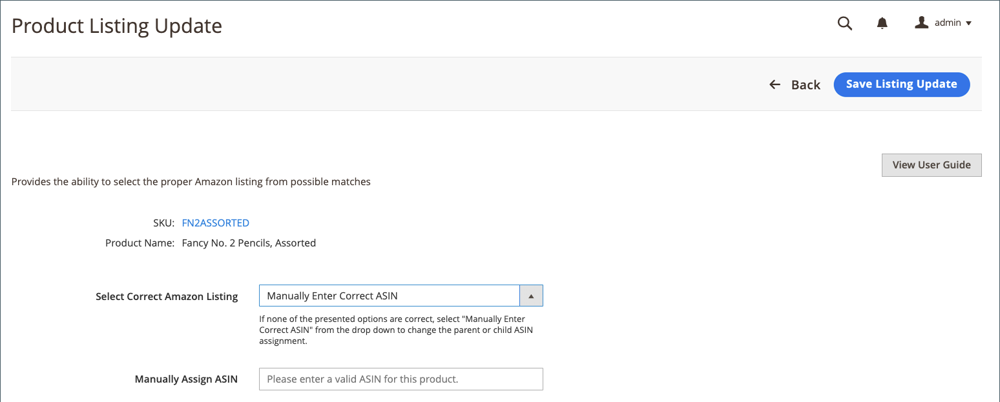
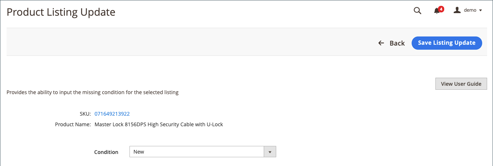

# 更新必要資訊（不完整的清單）

顯示於 _[!UICONTROL Incomplete]_標籤包含您的 [!DNL Commerce] 目錄產品符合清單規則中定義的Amazon適用性要求，但缺少清單前Amazon要求的資訊。

## 更新必要資訊(無法指派至Amazon清單) {#update-required-info-unable-to-assign-to-amazon-listing}

1. 檢視清單于 _[!UICONTROL Incomplete]_定位於 [管理清單](./managing-product-listings.md).

1. 在 _[!UICONTROL Action]_欄，按一下&#x200B;**[!UICONTROL Select]**>**[!UICONTROL Update Required Info]**以取得您要更新的清單。

1. 檢閱您嘗試符合Amazon清單的目錄產品資訊（SKU和產品名稱）。

1. 對象 **[!UICONTROL Assign ASIN]**，輸入Amazon指派的ASIN作為您要比對至目錄產品的清單。

1. 若要儲存產品相符專案，請按一下 **[!UICONTROL Save Listing Update]**.

清單現在與您的目錄相符，然後清單會根據您的cron和清單設定更新並發佈到Amazon。 它也會從 _[!UICONTROL Incomplete]_標籤。

## 更新必要資訊（找到多個相符專案） {#update-required-info-multiple-matches-found}

1. 檢視清單于 _[!UICONTROL Incomplete]_定位於 [[!UICONTROL Manage Listings]](./managing-product-listings.md).

1. 在 _動作_ 欄，按一下 **選取** > **更新必要資訊** 以取得您要更新的清單。

1. 檢閱您嘗試符合Amazon清單的目錄產品資訊（SKU和產品名稱）。

1. 對象 **[!UICONTROL Select Correct Amazon Listing]**，請針對您要符合此產品的清單，選擇正確的ASIN。

   此處列出的選項包括識別為可能相符專案的目錄產品。 如果這些選項都不正確，您可以選擇 `Manually Enter Correct ASIN` 並手動輸入產品的ASIN。

1. 如果手動輸入ASIN，請輸入正確的ASIN **[!UICONTROL Manually Assign ASIN]**.

1. 若要儲存產品相符專案，請按一下 **[!UICONTROL Save Listing Update]**.

## 更新必要資訊（具有變體） {#update-required-info-has-variants}

1. 檢視清單于 _[!UICONTROL Incomplete]_定位於 [[!UICONTROL Manage Listings]](./managing-product-listings.md).

1. 在 _[!UICONTROL Action]_欄，按一下&#x200B;**[!UICONTROL Select]**>**[!UICONTROL Update Required Info]**以取得您要更新的清單。

1. 檢閱您嘗試符合Amazon清單的目錄產品資訊（SKU和產品名稱）。

1. 對象 **[!UICONTROL Select Correct Amazon Listing]**，請針對您要符合此產品的清單，選擇正確的ASIN。

   此處列出的選項包括識別為可能相符專案的目錄產品。 如果所有選項均不正確，您可以選取 `Manually Enter Correct ASIN` 並手動輸入產品的ASIN。

1. 如果手動輸入ASIN，請輸入正確的ASIN **[!UICONTROL Manually Assign ASIN]**.

1. 若要儲存產品相符專案，請按一下 **[!UICONTROL Save Listing Update]**.

## 更新必要資訊（缺少條件） {#update-required-info-missing-condition}

1. 檢視清單于 _[!UICONTROL Incomplete]_定位於 [管理清單](./managing-product-listings.md).

1. 在 _[!UICONTROL Action]_欄，按一下&#x200B;**[!UICONTROL Select]**>**[!UICONTROL Update Required Info]**以取得您要更新的清單。

1. 檢閱您嘗試符合Amazon清單的目錄產品資訊（SKU和產品名稱）。

1. 對象 **[!UICONTROL Condition]**，選擇適當的條件。

   可用選項清單取決於您的 [產品清單條件](./product-listing-condition.md) 設定。

1. 若要儲存產品相符專案，請按一下 **[!UICONTROL Save Listing Update]** .

