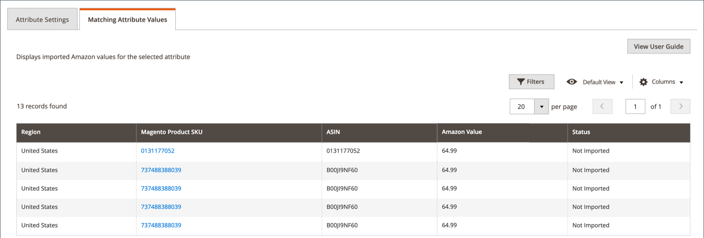

# 檢視Amazon屬性對應

將Amazon屬性對應至 [!DNL Commerce] 屬性， Amazon sales channel會追蹤並提供所有Amazon值的可篩選清單。 使用此頁面來驗證連結的值 [!DNL Commerce] 屬性正確同步於 [!DNL Commerce] 和Amazon。 您可以檢閱連結或未連結至的Amazon屬性的同步值 [!DNL Commerce] 屬性。 若要建立或編輯Amazon屬性，請參閱 [建立和編輯屬性](./creating-attributes.md).

此 _Amazon值_ 視您檢視的屬性型別和Amazon屬性而有所不同。 例如，下列專案的Amazon值： `Label` 會是文字值，而 `AmazonListPrice` 會是數字量。 狀態會指出Amazon值是否已匯入。

## 檢視您的屬性值

1. 於 _[!UICONTROL Admin]_側欄，前往&#x200B;**[!UICONTROL Marketing]**>_[!UICONTROL Channels]_ > **[!UICONTROL Amazon Sales Channel]**.

1. 按一下 **[!UICONTROL Attributes]** 在左側功能表中，找出Amazon屬性，然後按一下 **[!UICONTROL Create]** 或 **[!UICONTROL Edit]** 在 _[!UICONTROL Action]_欄。

1. 按一下 **[!UICONTROL Matching Attribute Values]** 標籤。

   具有對應欄位的清單 [!DNL Commerce] 目錄產品在中顯示連結的值 _[!UICONTROL Magento Product SKU]_欄。 按一下連結會開啟對應的目錄產品詳細資料頁面。 產品詳細資料頁面上Amazon屬性的變更不會同步回Amazon銷售管道。

>[!TIP]
>若要編輯清單的對映或將其指派給目錄產品，請參閱 [更新必要資訊](./amazon-manually-update-incomplete-listing.md).

{width="600" zoomable="yes"}

| 欄位 | 說明 |
|--- |--- |
| [!UICONTROL Region] | 中定義的銷售作業區域 **[!DNL Amazon Marketplace]國家** 存放區整合期間。 |
| [!UICONTROL Magento Product SKU] | 指示 [!DNL Commerce] 與Amazon商店同步的產品。 此值是由指派的產品ID [!DNL Commerce] 和已連結至目錄中的產品。 若要在中開啟產品 [!DNL Commerce]，按一下連結。 |
| [!UICONTROL ASIN] | 表示Amazon為產品識別而指派給產品的Amazon標準識別碼(ASIN) 10個字元的英數字元唯一識別碼。 |
| [!UICONTROL Amazon Value] | 指示所選屬性的值。 Amazon值會依您檢視的屬性型別和Amazon屬性而有所不同。 例如，下列專案的Amazon值： `Label` 會是文字值，而 `AmazonListPrice` 會是數字量。 狀態會指出Amazon值是否已匯入。 |
| [!UICONTROL Status] | 表示屬性值是否已匯入 [!DNL Commerce] 並連結至 [!DNL Commerce] 屬性。 選項： `Not Imported` / `Imported` |
