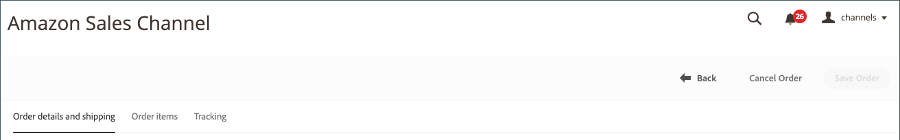
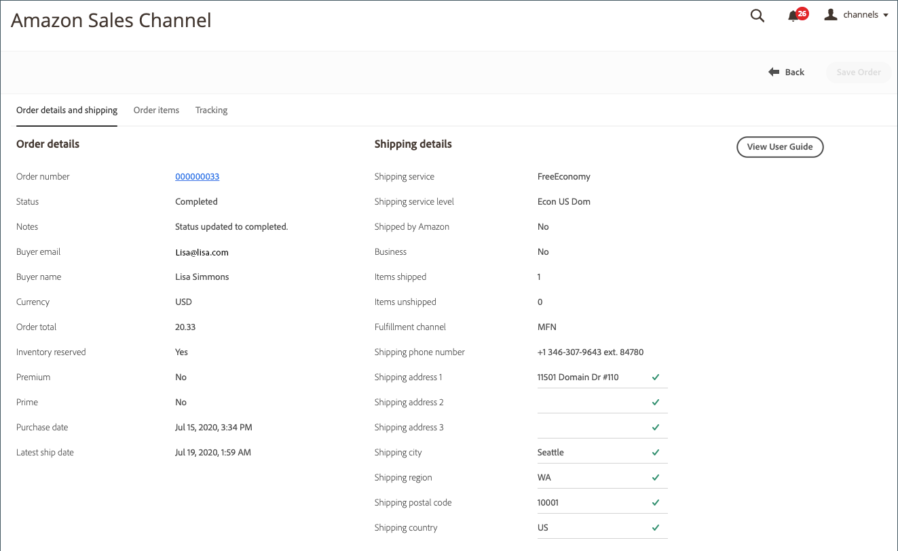
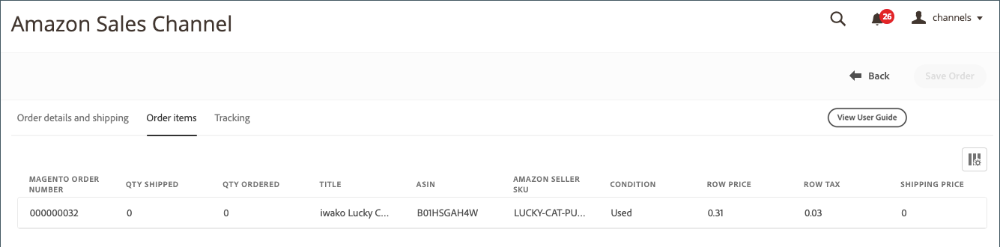
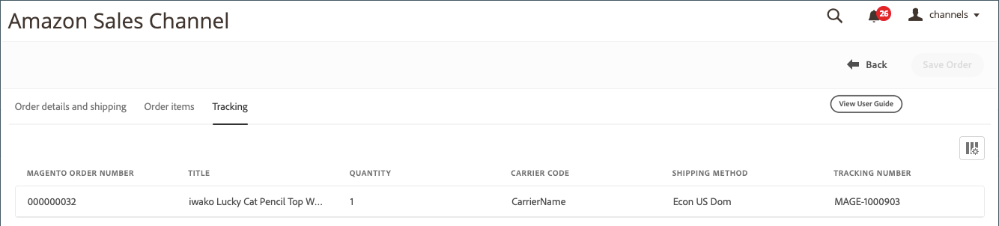

# Amazon訂單詳細資料

{width="600" zoomable="yes"}

## 檢視Amazon訂單詳細資料

1. 按一下 **[!UICONTROL View Store]** 在商店資訊卡上。

1. 在 _[!UICONTROL Recent Orders]_區段，按一下訂單編號。

   此 _[!UICONTROL Amazon Order Details]_頁面隨即開啟。

>[!NOTE]
>
>若您已在中啟用訂單匯入，請 [訂單設定](./order-settings.md) 順序為 [由Amazon (FBA)履行](./fulfilled-by.md)，您可能會在訂單詳細資料中看到某些欄位的虛擬資料。 Amazon不會針對FBA訂單傳送下列資料。
>
> - `AddressType`
> - `AddressLine1`
> - `AddressLine2`
> - `AddressLine3`
> - `BuyerName`
> - `Phone`
> - `PurchaseOrderNumber`
> - `RecipientName`
> - `CustomizedURL`
> - `GiftMessageText`

### 訂單與出貨詳細資訊頁標

此 _[!UICONTROL Order and Shipping Details]_索引標籤會顯示詳細的訂單資訊，如從Amazon收到的那樣。

>[!IMPORTANT]
>
>Amazon接受無法匯入Amazon sales channel的非標準地址資訊，因此導致某些訂單的州/國家/地區代碼無法正確更新。 若要更正地址錯誤，可在訂單詳細資料中編輯下列欄位：
>
>- `Shipping address 1`
>- `Shipping address 2`
>- `Shipping address 3`
>- `Shipping city`
>- `Shipping region`
>- `Shipping postal code`
>- `Shipping country`
>
>別忘了按一下 **儲存順序** 編輯之後。

{width="600" zoomable="yes"}

### 「訂購專案」標籤

此 _[!UICONTROL Order Items]_索引標籤會顯示從Amazon收到的與Amazon訂單相關聯的所有專案。

{width="600" zoomable="yes"}

### 「追蹤」標籤

此 _[!UICONTROL Tracking]_索引標籤會顯示與Amazon訂單相關聯的追蹤資訊。

{width="600" zoomable="yes"}
