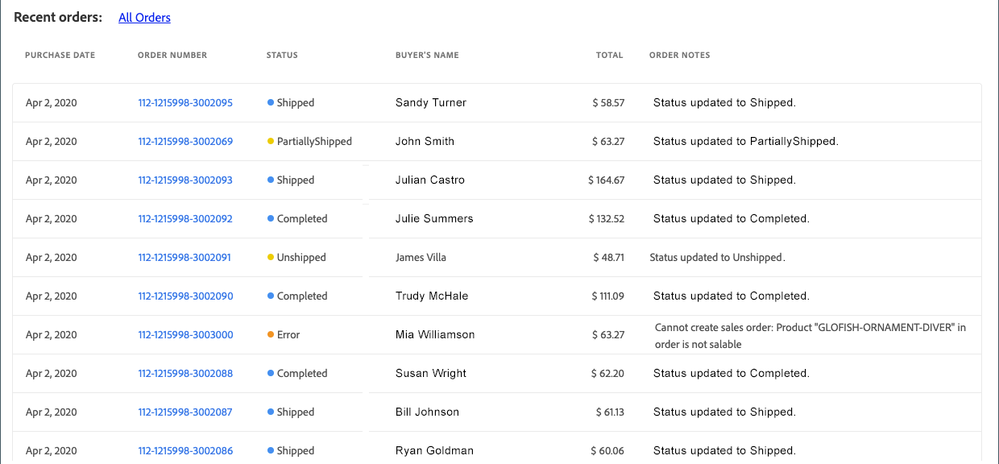
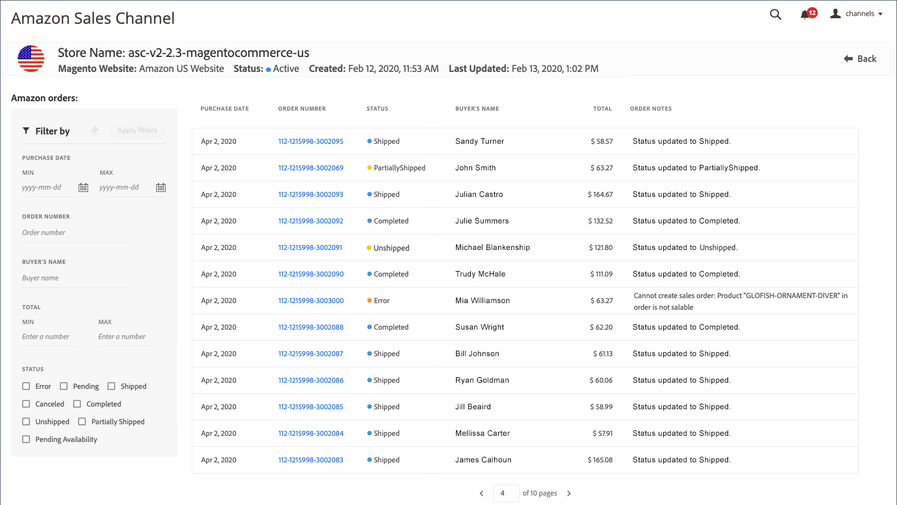
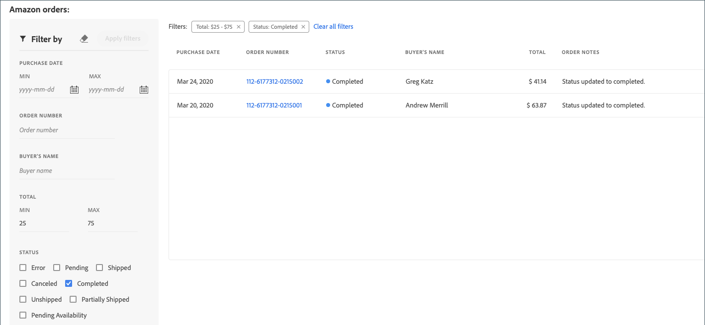

# 檢視Amazon訂單

檢視Amazon訂單的方式有兩種： _[!UICONTROL Recent Orders]_和_[!UICONTROL All Orders]_.

這兩個選項都會顯示從Amazon收到的基本訂單資訊，包括：

- 購買日期
- 訂單編號
- 狀態
- 購買者姓名
- 全部總計
- 訂購備註

_[!UICONTROL All Orders]_檢視新增訂單搜尋的篩選選項。

>[!NOTE]
>
>除了 _[!UICONTROL Order Notes]_欄，_[!UICONTROL Amazon orders]_ 表格會填入從Amazon收到的訂單資訊。 此 _訂購備註_ 欄更新者 [!DNL Commerce] 訂單處理時。

## 最近的訂單

您可以檢視您最近的訂單，位於 _[!UICONTROL Recent Orders]_部分 [存放區儀表板](./amazon-store-dashboard.md).

{width="600" zoomable="yes"}

### 檢視最近的Amazon訂單

1. 按一下 **[!UICONTROL View Store]** 在商店卡片上。

1. 在「 」中檢視您的訂單 _[!UICONTROL Recent Orders]_區段。

1. Amazon若要檢視訂單詳細資料，請按一下 _[!UICONTROL Order Number]_欄。

   此 _[!UICONTROL Amazon Order Details]_訂單頁面隨即開啟。

## 檢視所有訂單

您可以在以下網址檢視所有Amazon訂單： _[!UICONTROL Amazon orders]_頁面(也稱為_[!UICONTROL All Orders]_ 檢視)。 「Amazon訂單」表格類似於 _[!UICONTROL Recent Orders]_區段，但可讓您檢視所有Amazon訂單，並使用下列篩選選項來縮小訂單清單：

- [!UICONTROL Purchase Date (range)]
- [!UICONTROL Order Number]
- [!UICONTROL Buyer's Name]
- [!UICONTROL Total (range)]
- [!UICONTROL Status]

{width="600" zoomable="yes"}

### 檢視所有Amazon訂單

1. 按一下 **[!UICONTROL View Store]** 在商店卡片上。

1. 按一下 **[!UICONTROL All Orders]** 在 _[!UICONTROL Recent Orders]_區段。

1. 若要縮小清單範圍或搜尋特定訂單編號，請完成 **[!UICONTROL Filter by]** 引數並按一下 **[!UICONTROL Apply filters]**.

1. Amazon若要檢視訂單詳細資料，請按一下 _[!UICONTROL Order Number]_欄。

   此 _[!UICONTROL Amazon Order Details]_訂單頁面隨即開啟。

## 使用篩選器

您可以在以下位置將篩選器套用至您的訂單清單： _[!UICONTROL Filter by]_區段。 進行選取並按一下&#x200B;**[!UICONTROL Apply filters]**. 您套用的篩選器會顯示在「訂單」格線上方。

{width="600" zoomable="yes"}

### 變更套用的篩選器

- 您可以在「 」中新增或變更您的篩選器 _[!UICONTROL Filter by]_區段。 按一下&#x200B;**[!UICONTROL Apply filters]**更新訂單清單與出現在訂單格線上方的篩選選項。

- 您可以按一下「 」，一次移除一個篩選器 `x` ，或按一下以一次全部 **[!UICONTROL Clear all filters]**. 移除篩選器會更新出現在訂單格線上方的訂單清單和篩選器選項。

- 如果您的訂單清單很長，您可以使用格線下方的分頁控制項來檢視更多訂單。

>[!TIP]
>
>訂單檢視的一些相關提示：
>
>- 如果您有多個Amazon商店整合，則可能需要在商店檢視之間切換時重新整理頁面檢視，才能更新目前商店的訂單清單和分頁檢視。
>- 依欄排序時，排序僅適用於目前的清單檢視。 最佳實務是篩選清單，然後排序您正在檢視的頁面。
>- 根據檢視視窗的寬度，您可能會看到欄中有重疊文字。 若要展開要繞排文字的欄，請加寬視窗檢視。
>- 篩選條件為 _[!UICONTROL Total]_，依整數篩選。 輸入小數點可能會造成結果錯誤。

### 預設欄

| 欄 | 說明 |
|----------------------------|------------------------------------------------------------------------------------------------------------------------------------------------------------------------------------------------------------------------------------------------------------|
| [!UICONTROL Filter by] | 僅適用於 _[!UICONTROL All Orders]_檢視。 根據下列條件縮小訂單清單：<ul><li>`Purchase Date (range)`</li><li>`Order Number`</li><li>`Buyer's Name`</li><li>`Total (range)`</li><li>`Status`</li></ul> |
| [!UICONTROL Purchase Date] | 從Amazon收到的購買日期。 |
| [!UICONTROL Order Number] | Amazon產生和接收的訂單編號。 若要檢視「Amazon訂單詳細資料」畫面，請按一下連結。 |
| [!UICONTROL Status] | Amazon收到的訂單狀態。 選項： `Error` / `Pending` / `Shipped` / `Canceled` / `Completed` / `Unshipped` / `PartiallyShipped` / `PendingAvailability` |
| [!UICONTROL Buyer's Name] | 下訂單者的名稱，如從Amazon收到。 |
| [!UICONTROL Grand Total] | 從Amazon收到的訂單總貨幣值。 |
| [!UICONTROL Order Notes] | 訂單處理時記錄的最近動作 [!DNL Commerce]. 資訊包括但不限於訂單匯入錯誤和訂單處理更新。 **注意**：此欄位的更新者為 [!DNL Commerce] 訂單處理時。 |
