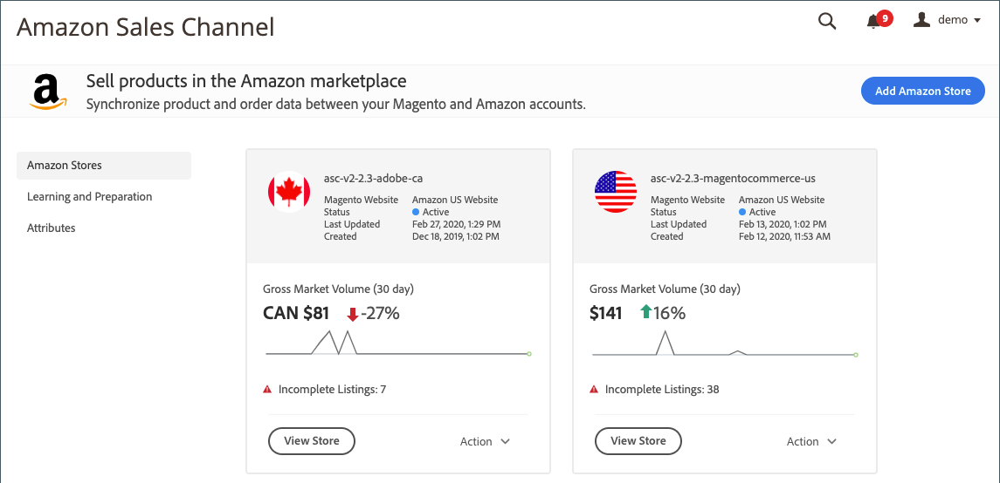

# 首頁

Amazon銷售管道首頁是存取您的Amazon銷售管道時的登陸頁面。

左側功能表中可用的檢視包括：

- [[!UICONTROL Amazon Stores]](./managing-stores.md)  — （預設檢視）檢視每個Amazon銷售管道商店的摘要資訊。 查看商店 [儀表板](./amazon-store-dashboard.md)，按一下 **[!UICONTROL View Store]**.
- [[!UICONTROL Learning and Preparation]](./learning-preparation.md)  — 檢視您的Amazon和 [!DNL Commerce] 建議的設定任務和可用的學習資料。
- [[!UICONTROL Attributes]](./managing-attributes.md)  — 檢視及管理連結 [!DNL Commerce] 和Amazon屬性。 若要自動與Amazon同步，請直接透過編輯或建立屬性並連結 [!DNL Commerce].

## 存取AmazonSales Channel

在 _[!UICONTROL Admin]_邊欄，轉到&#x200B;**[!UICONTROL Marketing]**>_[!UICONTROL Channels]_ > **[!UICONTROL Amazon Sales Channel]**.

Amazon銷售管道首頁開啟，預設為 [_Amazon商店_](./managing-stores.md) 檢視。
