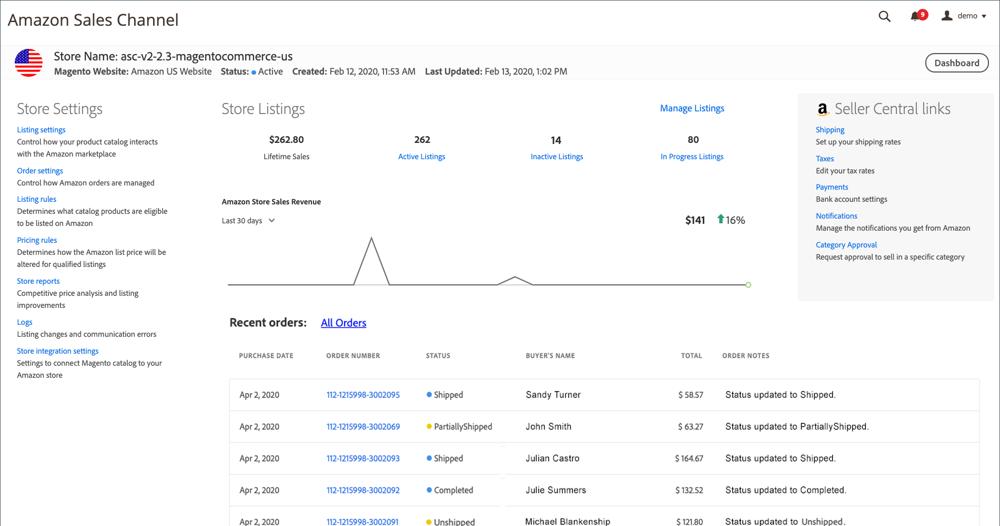

# Amazon商店儀表板

在 _[!UICONTROL Amazon Stores]_在Amazon銷售管道首頁上檢視，按一下&#x200B;**[!UICONTROL View Store]**在商店卡上以開啟商店控制面板。

存放區控制面板是您檢視每個Amazon存放區之活動的主要位置。 使用 [!DNL Amazon Seller] 新增並整合的商店，訂單和銷售會透過您的商店資料檢視追蹤。 在控制面板上，您可以檢視收入、追蹤趨勢，以及檢閱清單的銷售資料。 清單和銷售會進一步按清單類型分組和跟蹤，包括活動、非活動和正在進行中。

您也可以存取 [儲存設定](./ob-store-review.md), [管理您的清單](./managing-product-listings.md)，並查看銷售資料和最近訂單資訊。

商店控制面板的標題會顯示與商店卡片上顯示的相同基本商店資訊：

- _[!UICONTROL Store Name]_
- _[!UICONTROL Magento Website]_
- _[!UICONTROL Status]_
- _[!UICONTROL Created]_
- _[!UICONTROL Last Updated]_

儲存控制面板也包含儲存資料和設定連結或詳細資訊：

- [**[!UICONTROL Store Settings]**](./ob-store-review.md)  — 存取您的商店設定和報表。

   - [**[!UICONTROL Listing settings]**](./listing-settings.md)  — 控制產品目錄與 [!DNL Amazon Marketplace].

   - [**[!UICONTROL Order settings]**](./order-settings.md)  — 控制Amazon訂單的管理方式。

   - [**[!UICONTROL Listing rules]**](./listing-rules.md)  — 定義哪些目錄產品可列在Amazon上。

   - [**[!UICONTROL Pricing rules]**](./pricing-products.md)  — 定義Amazon價目表價格如何針對合格清單進行變更。

   - [**[!UICONTROL Store reports]**](./amazon-logs-reports.md) - [競爭價格分析](./competitive-price-analysis.md) 和 [清單改進](./listing-improvements.md).

   - [**[!UICONTROL Logs]**](./amazon-logs-reports.md) - [列出變更](./listing-changes-log.md) 和 [通信錯誤](./communication-errors-log.md).

   - [**[!UICONTROL Store integration settings]**](./store-integration-settings.md)  — 在 [!DNL Commerce] 管理員。

- **[!UICONTROL Store Listings]**  — 顯示最近7天或30天的商店銷售的圖形表示，以及期限銷售資料。

   本節也顯示 [活動清單](./active-listings.md), [非作用中清單](./inactive-listings.md)、和進行中清單，以及其對應的連結 _[!UICONTROL Product Listings]_頁面。 您也可以按一下&#x200B;**[!UICONTROL Manage Listings]**開啟_[!UICONTROL Product Listings]_ 頁面。 請參閱 [管理Amazon清單](./managing-product-listings.md).

- **[!UICONTROL Recent Orders]**  — 顯示最新Amazon訂單的資訊。 所列資訊以從Amazon收到的資訊為基礎。 此表不更新為 [!DNL Commerce] 訂購資訊，即使 [訂單匯入](./order-settings.md) 啟用。 若要檢視所有Amazon訂單，請按一下 **所有訂單**.

   請參閱 [檢視Amazon訂單](./amazon-orders-all.md) 如需欄說明，請參閱 [管理訂單](./managing-orders.md) 以取得更多資訊。

- **[!UICONTROL Seller Central links]**  — 提供重要連結 [!DNL Amazon Seller Central] 資訊。
