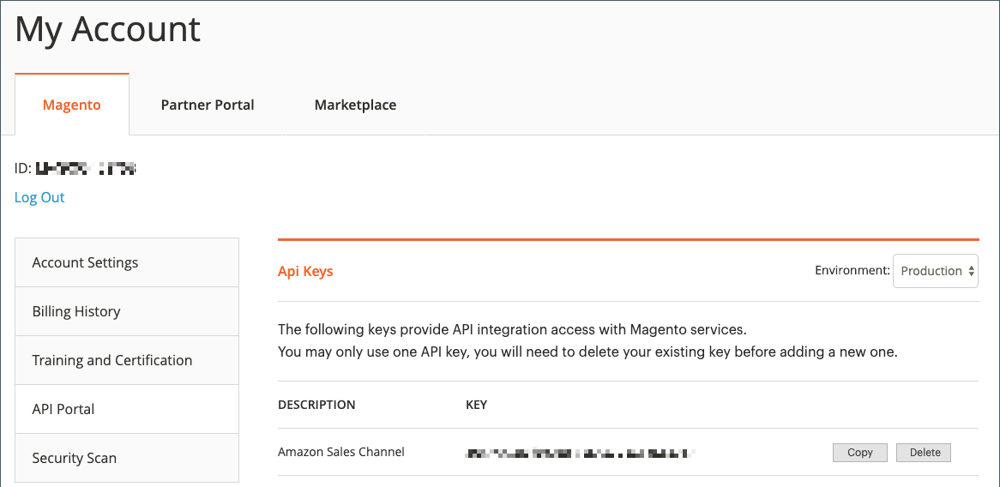
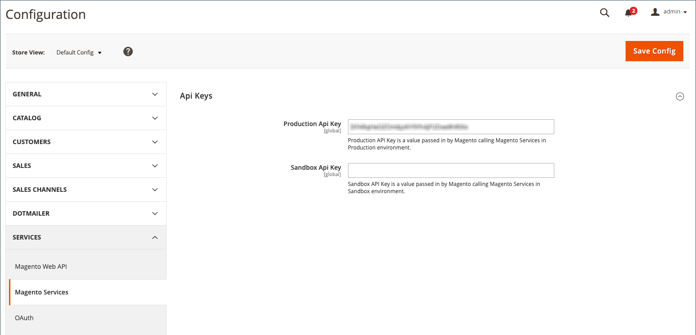

# 新增或驗證Amazon API金鑰

存取Amazon銷售管道時， [!DNL Commerce] 自動檢查及驗證您新增至商店設定的Amazon API金鑰。 如果已驗證，您可以繼續進行下一個步驟， [存放區整合](./store-integration.md).

如果Amazon API金鑰遺失、無效或過期，您必須更新金鑰。 系統會顯示訊息，提示您取得API金鑰，並將其新增至您的Amazon銷售管道設定。

## 依照提示取得並新增Amazon API金鑰

每次存取您的Amazon銷售管道時，都會驗證API金鑰。

1. 登入 [!DNL Commerce] 管理員。

1. 於 _[!UICONTROL Admin]_側欄，前往&#x200B;**[!UICONTROL Marketing]**>_[!UICONTROL Channels]_ > **[!UICONTROL Amazon Sales Channel]**.

   如果您是第一次存取Amazon銷售管道，或您的API金鑰需要更新，系統會提示您完成此程式。

   {width="500"}

1. 按一下 **[!UICONTROL Sign in]** 存取 [!DNL Commerce] 網站帳戶。

   Commerce帳戶頁面會在新的瀏覽器標籤中開啟。

   - 如果您已登入 [!DNL Commerce] 帳戶， _[!UICONTROL API Portal]_部分_[!UICONTROL My Account]_ 頁面會自動顯示。

   - 如果您未登入，系統會提示您輸入 [!DNL Commerce] 帳號使用者名稱和密碼，在 _[!UICONTROL API Portal]_標籤隨即顯示。

   - 如果您沒有帳戶，請造訪 [此 [!DNL Commerce] 帳戶頁面](https://account.magento.com/customer/account/login/){target="_blank"} 並註冊。 此帳戶應屬於您的公司或企業。

1. 如有需要，您可以檢視並產生API金鑰 _[!UICONTROL API Portal]_索引標籤中的 [!DNL Commerce] 帳戶。

   若要建立API金鑰，請輸入如下說明 `Amazon Sales Channel` 並按一下 **[!UICONTROL Add New]**. 隨即產生新金鑰，並顯示您輸入的名稱。 按一下 **[!UICONTROL Copy]** 以複製新金鑰。

   {width="500" zoomable="yes"}

1. 產生並複製新金鑰後，返回 _[!UICONTROL Amazon Sales Channel]_定位字元。

1. 於 _[!UICONTROL Welcome to Amazon Sales Channel]_頁面，按一下&#x200B;**[!UICONTROL Add the key]**.

   瀏覽器會退出Amazon銷售管道，而商店設定頁面會開啟 _[!UICONTROL Api Keys]_中的頁面 [!DNL Commerce] 管理員。 前往時，您可以手動開啟此頁面&#x200B;**[!UICONTROL Stores]**>_[!UICONTROL Settings]_ > **[!UICONTROL Configuration]**，展開 **[!UICONTROL Services]** ，然後選擇 **[!UICONTROL Magento Services]**.

1. 貼上複製的金鑰 **[!UICONTROL Production Api key]**.

1. 按一下 **[!UICONTROL Save Config]**. 您現在可以返回Amazon銷售管道。

   {width="600" zoomable="yes"}

1. 於 _[!UICONTROL Admin]_側欄，前往&#x200B;**[!UICONTROL Marketing]**>_[!UICONTROL Channels]_ > **[!UICONTROL Amazon Sales Channel]**.

   重新存取Amazon sales channel triggers [!DNL Commerce] 驗證及驗證您的API金鑰，並允許您繼續。

   如果系統提示您再次驗證金鑰，請重複此步驟 _新增並驗證_ 程式。

 [**繼續儲存整合**](./store-integration.md)
