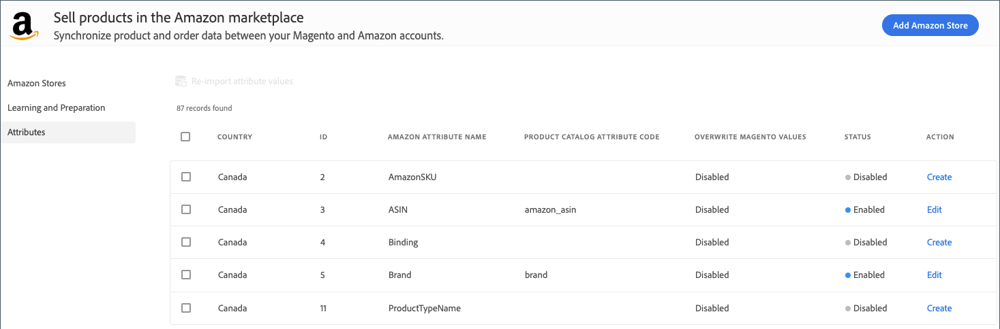

# Amazon清單的屬性

此 _[!UICONTROL Attributes]_檢視會顯示您的Amazon清單和 [!DNL Commerce] 屬性。 此清單也會指出已對應用於產品比對的屬性。 如需詳細資訊，請參閱 [管理屬性](./managing-attributes.md).

{width="600" zoomable="yes"}

從 _[!UICONTROL Attributes]_檢視，您就可以檢閱表格中的屬性設定和 [建立或編輯](./creating-attributes.md) 屬性。

## 檢視您的屬性清單

1. 於 _管理員_ 側欄，前往 **[!UICONTROL Marketing]** > _[!UICONTROL Channels]_>**[!UICONTROL Amazon Sales Channel]**.

1. 按一下 **[!UICONTROL Attributes]** 在左側功能表中，找出Amazon屬性，並檢閱屬性清單。

1. 視需要建立或編輯屬性：

   - 至 [建立](./creating-attributes.md#create-an-attribute) 並定義屬性的「相符屬性值」，按一下 **[!UICONTROL Create]**.

   - 若要停用或 [編輯設定](./creating-attributes.md#edit-an-attribute) 或屬性的「相符屬性值」，按一下 **[!UICONTROL Edit]**.

     編輯屬性包括變更產品比對的屬性對應。

| 欄位 | 說明 |
|---------------------------------------------|---------------------------------------------------------------------------------------------------------------------------------------------------------------------------------------------------------------------------------------------------------------------------------------------------------------------------------------------------------------------------------------------------------------------|
| [!UICONTROL Country] | 中定義的銷售活動國家/地區  **[!DNL Amazon Marketplace]國家** 期間 [存放區整合](./store-integration.md). |
| [!UICONTROL ID] | 產生的一般屬性值 [!DNL Commerce] 建立屬性時。 |
| [!UICONTROL Amazon Attribute Name] | 從Amazon匯入的屬性名稱。 |
| [!UICONTROL Product Catalog Attribute Code] | 如果已對應，則 [!DNL Commerce] 指派給對映的屬性 _[!UICONTROL Amazon Attribute Name]_以比對目錄並列出產品。 |
| [!UICONTROL Overwrite Magento Values] | 如果屬性設定為 `Overwrite Existing Magento Values` 在「屬性設定」中，表格顯示 `Enabled`. 啟用表示從Amazon收到屬性的更新產品資訊時，新資訊會更新（覆寫）中產品的對應資訊。 [!DNL Commerce] 目錄。 它也會影響下列清單中的產品： [!DNL Commerce] 商店。 |
| 狀態 | 表示屬性值是否已匯入 [!DNL Commerce] 並對應至 [!DNL Commerce] 屬性。 選項： `Enabled` / `Disabled` |
| 動作 | 表示可用於屬性的工作選項。 選項： `Create` / `Edit` |
