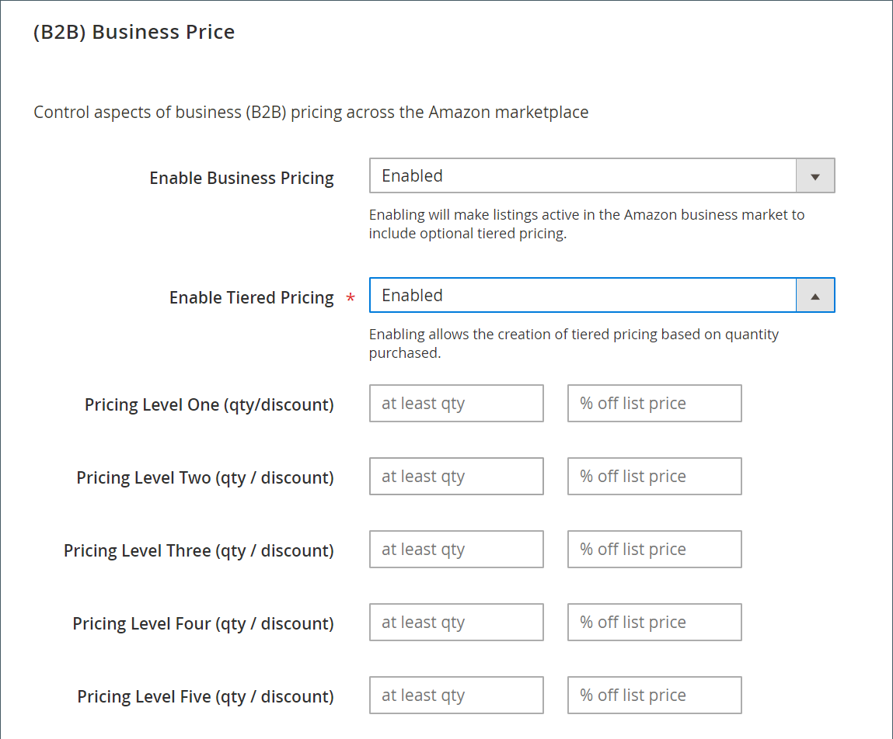

# (B2B)商業價格

(B2B)商業價格設定是商店清單設定的一部分。 清單設定可從以下位置存取： [存放區儀表板](./amazon-store-dashboard.md).

[!DNL Amazon Business] 是Amazon註冊企業帳戶專屬的市場，僅開放美國、法國、德國和英國使用。 如果Marketplace允許B2B商業定價，則可在清單設定中編輯。

[!DNL B2B Business Pricing] 可讓擁有商業帳戶的商戶彼此以Amazon購物體驗的預期效能進行購買。 有了B2B業務定價，企業就可以根據購買的數量提供分層定價。

您的產品將列在 [!DNL Amazon Business (B2B)] 網站，您必須先在 [!DNL Amazon Seller Central] 帳戶。 如需B2B功能的詳細資訊，請參閱 [Amazon：B2B Central](https://sellercentral.amazon.com/gp/help/G202161480/){target="_blank"} （需要Seller Central登入）。

## 設定(B2B)商業價格設定

1. 按一下 **[!UICONTROL Listing Settings]** 在商店控制面板上。

1. 展開 _[!UICONTROL (B2B) Business Price]_區段。

1. 對象 **[!UICONTROL Enable Business Pricing]**，選擇一個選項。

   - `Disabled` - （預設）選擇您不想啟用企業對企業的銷售時。 選擇後，此區段中的所有其他欄位都會停用。

   - `Enabled`  — 選擇何時啟用企業對企業的銷售。 啟用時，業務價格會在套用所有訂價規則後設為等於定價。 業務價格會遵循網站訂價範圍（若已啟用）。 業務價格不得低於1美元。

1. 對象 **[!UICONTROL Enable Tiered Pricing]**，選擇一個選項。

   - `Disabled` - （預設）當您想要所有訂單數量使用相同的清單價格時，請選擇此選項。 選擇後，全部 _[!UICONTROL Pricing Level]_此區段中的欄位已停用。

   - `Enabled`  — 選擇何時要根據訂單數量啟用訂價調整。 選擇後， _[!UICONTROL Pricing Level]_欄位已啟用。

1. 完成 **[!UICONTROL Pricing Level]** 設定。

   您可以定義最多5個數量/折扣設定，以設定業務清單的層級訂價。 在每個資料列中，輸入要套用的數量臨界值和折扣百分比。 例如，如果您輸入 `5` 在第一列的第一個欄位和 `5` 在第二個欄位中，當其他企業購買數量為5或以上時，價格會套用5%的折扣。

1. 完成後，按一下 **[!UICONTROL Save listing settings]**.

| 欄位 | 說明 |
|--- |--- |
| [!UICONTROL Enable Business Pricing] | 選項： <ul><li>**[!UICONTROL Disabled]** - （預設）選擇您不想啟用企業對企業的銷售時。 選擇後，此區段中的所有其他欄位都會停用。</li><li>**[!UICONTROL Enabled]**  — 選擇何時啟用業務對業務銷售。 選擇後，業務價格會在套用所有訂價規則後設為等於定價。 業務價格會遵循網站訂價範圍（若已啟用）。 業務價格不得低於1美元。</li></ul> |
| [!UICONTROL Enable Tiered Pricing] | （必要）選項： <ul><li>**[!UICONTROL Disabled]** - （預設）當您想要所有訂單數量使用相同的清單價格時，請選擇此選項。 選擇後，全部 _[!UICONTROL Pricing Level]_此區段中的欄位已停用。</li><li>**[!UICONTROL Enabled]**  — 選擇何時啟用根據訂單數量調整的訂價。 選擇後， _[!UICONTROL Pricing Level]_欄位已啟用。</li></ul> |
| [!UICONTROL Pricing Level One-Five (qty/discount)] | 啟用「階層式訂價」後，您最多可以定義5個數量/折扣設定，以設定業務清單的階層式訂價。 在每個資料列中，輸入要套用的數量臨界值和折扣百分比。 例如，如果您輸入 `5` 在第一列的第一個欄位和 `5` 在第二個欄位中，當其他企業購買數量為五或以上時，價格會套用5%的折扣。 |

**快速存取** - [!UICONTROL Listing Settings] 區段

- [[!UICONTROL Product Listing Actions]](./product-listing-actions.md)
- [[!UICONTROL Third Party Listings]](./third-party-listing-settings.md)
- [[!UICONTROL Listing Price]](./listing-price.md)
- [[!UICONTROL (B2B) Business Price]](./business-pricing.md)
- [[!UICONTROL Stock / Quantity]](./stock-quantity.md)
- [[!UICONTROL Fulfilled By]](./fulfilled-by.md)
- [[!UICONTROL Catalog Search]](./catalog-search.md)
- [[!UICONTROL Product Listing Condition]](./product-listing-condition.md)
