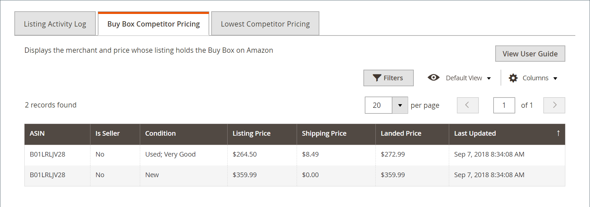

# [!DNL Buy Box] 競爭者定價

此 [!DNL Buy Box] 由Amazon授予通常以最佳價格列出產品的賣家，以及其他因素，例如提供的FBA/Prime運費、可用性和賣家的績效。

此 _[!UICONTROL Buy Box Competitor Pricing]_標籤上的_[!UICONTROL Product Listing Details]_ 頁面包含 [[!DNL Buy Box]](./buy-box-competitor-pricing.md) 列出您競爭對手的價格、運費和到岸價格。 使用此資訊來瞭解您的競爭對手在Amazon上的價格定位。

[智慧型重新訂價規則](./intelligent-repricing-rules.md) 可設定為根據 [!DNL Amazon Buy Box] 價格。

## 存取 [!DNL Buy Box] 競爭者定價詳細資料

1. 按一下 **[!UICONTROL Manage Listings]** 在商店控制面板上。

   此 [_[!UICONTROL Product Listing]_](./managing-product-listings.md) 頁面隨即開啟。

1. 在任何清單狀態標籤上，按一下產品清單名稱即可清單。

   此 _[!UICONTROL Product Listing Details]_頁面隨即開啟。

1. 按一下 **[!UICONTROL Buy Box Competitor Pricing]** 標籤。

   顯示其清單中包含 [[!DNL Buy Box]](./buy-box-competitor-pricing.md) 在Amazon上。

| 欄 | 說明 |
|--- |--- |
| [!UICONTROL ASIN] | 識別專案的10個字母和/或數字的唯一區塊。  對於書籍，ASIN與ISBN編號相同，但對於所有其他產品，當專案上傳到您的目錄時會建立新的ASIN。 您可以在產品詳細資訊頁面上找到專案的ASIN以及與專案相關的其他詳細資訊（例如大小、頁數或磁碟數目）。 |
| [!UICONTROL Is Seller] | 指出賣家是否已贏得清單的Buy Box位置。 |
| [!UICONTROL Condition] | 此 [條件](./product-listing-condition.md) 產品的。 |
| [!UICONTROL Listing Price] | 用於您的Amazon清單的價格。 |
| [!UICONTROL Shipping Price] | 出貨產品的成本。 |
| [!UICONTROL Landed Price] | 產品的清單價格加上其送貨價格。 |
| [!UICONTROL Last Updated] | 上次更新Buy Box訂價的日期。 |
