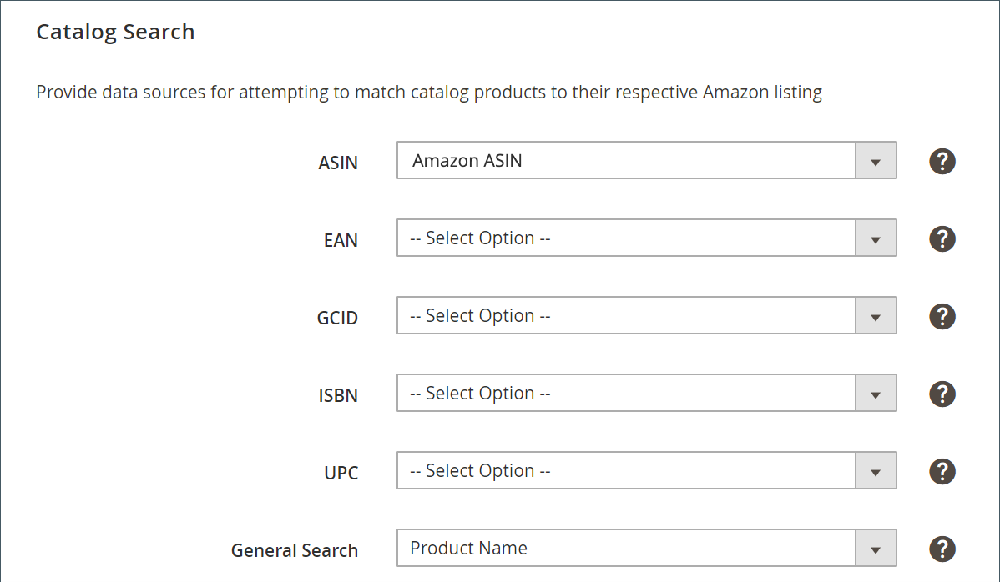

# 目錄搜索

_目錄搜索_ 設定是儲存清單設定的一部分。 從 [儲存儀表板](./amazon-store-dashboard.md)。

這些設定使您能夠設定屬性匹配，以幫助映射符合條件的 [!DNL Commerce] Amazon上市的產品。 映射後，Amazon將激活與定價、數量、改寫以及訂單和產品同步相關的操作。

定義這些映射值會增加精確匹配的可能性，從而最大限度地減少手動匹配產品清單的需要。 添加屬性作為 [預設定任務](./amazon-pre-setup-tasks.md),Amazon銷售渠道在Amazon與 [!DNL Commerce]。

如果僅建立AmazonASIN屬性（不為每個產品添加ASIN值），則 [!DNL Commerce] 產品可能不會自動匹配您的Amazon清單。 你可以 [手動分配](./creating-assigning-catalog-products.md) 你的產品。 但是，手動匹配不會建立共用和同步產品資料所需的資料元素。

>[!IMPORTANT]
>
>如果手動匹配產品，並且要更新產品的ASIN、UPC或其他資料元素，則必須在兩個位置更新資料。 在 [!DNL Commerce] 目錄和你Amazon的清單 [!DNL Amazon Seller Central] 帳戶。

映射這些屬性和值（如果可用）是最佳做法。 無需完成此映射，但有助於產品匹配，並且需要在Amazon和 [!DNL Commerce]。

如果要添加屬性，請參閱 [為Amazon匹配建立產品屬性](./ob-creating-magento-attributes.md)。

## 配置 [!UICONTROL Catalog Search] 設定

1. 按一下 **[!UICONTROL Listing Settings]** 在商店儀表板上。

1. 展開 _[!UICONTROL Catalog Search]_的子菜單。

1. 對於 **[!UICONTROL ASIN]**，選擇您為AmazonASIN值建立的產品屬性。

   ASIN([!DNL Amazon Standard Identification Number])是由十個字母和/或數字組成的唯一塊，用於標識項。 對於書籍，ASIN與ISBN號相同，但對於所有其他產品，在將項目上載到其目錄時會建立新的ASIN。 您可以在Amazon的產品詳細資訊頁面上找到項目ASIN，以及與項目相關的詳細資訊。

1. 對於 **[!UICONTROL EAN]**，選擇您為AmazonEAN值建立的產品屬性。

   歐洲商品編號(EAN)是條形碼標準，是12或13位產品標識碼。 每個EAN都唯一標識產品、製造商及其屬性；通常，EAN以條形碼形式打印在產品標籤或包裝上。 Amazon要求EAN代碼提高搜索結果的質量和目錄的質量。 您可以從製造商處獲取EAN。

1. 對於 **[!UICONTROL GCID]**，選擇您為AmazonGCIN值建立的產品屬性。

   全局目錄標識符(GCID)是沒有UPC代碼或ISBN的產品的ID。 Amazon品牌註冊處允許您註冊為品牌所有者並為產品建立唯一標識。

1. 對於 **[!UICONTROL ISBN]**，選擇您為AmazonISBN值建立的產品屬性。

   國際標準書號(ISBN)是唯一的商業書籍標識碼條形碼。 每個ISBN代碼都唯一地標識一本書。 ISBN有10或13位數。 2007年1月1日之後分配的所有ISBN都有13位數。

1. 對於 **[!UICONTROL UPC]**，選擇您為AmazonUPC值建立的產品屬性。

   通用產品代碼(UPC)是12位條形碼，廣泛用於美國的零售包裝。

1. 對於 **[!UICONTROL General Search]**，選擇要用於常規搜索匹配的產品屬性。

   此屬性是可以選擇匹配的屬性 [!DNL Commerce] 產品上市。 常規搜索使用目錄中的關鍵字搜索。 因此，建議使用 [!DNL Commerce] 包含相關關鍵字的屬性，如產品SKU或產品名稱。 常規搜索可能返回許多可能的匹配項，在這種情況下，可以從可能的匹配項中選擇相應的Amazon清單。 此欄位的常用選擇是 `Product Name`。

1. 完成後，按一下 **[!UICONTROL Save listing settings]**。

| 欄位 | 說明 |
|--- |--- |
| [!UICONTROL ASIN] | 標識項的10個字母和/或數字的唯一塊。  ASIN代表 [!DNL Amazon Standard Identification Number]。 ASIN是由10個字母和/或數字組成的唯一塊，用於標識項目。 對於書籍，ASIN與ISBN號相同，但對於所有其他產品，在將項目上載到其目錄時會建立新的ASIN。 您可以在Amazon的產品詳細資訊頁面上找到項目ASIN，以及與項目相關的詳細資訊。 |
| [!UICONTROL EAN (European Article Number)] | 12位或13位產品標識碼。 歐洲商品編號(EAN)是條形碼標準，是12或13位產品標識碼。 每個EAN都唯一標識產品、製造商及其屬性；通常，EAN以條形碼形式打印在產品標籤或包裝上。 Amazon要求EAN代碼提高搜索結果的質量和目錄的質量。 您可以從製造商處獲取EAN。 |
| [!UICONTROL GCID (Global Catalog Identifier)] | 全局目錄標識符(GCID)是沒有UPC代碼或ISBN的產品的ID。 Amazon的品牌註冊服務允許您註冊為品牌所有者，並為可能沒有UPC或ISBN的產品建立唯一ID。 |
| [!UICONTROL ISBN (International Standard Book Number)] | 10位或13位唯一商業書籍標識符條形碼。 國際標準書號(ISBN)是唯一的商業書籍標識碼條形碼。 每個ISBN代碼都唯一地標識一本書。 ISBN有10或13位數。 2007年1月1日之後分配的所有ISBN都有13位數。 |
| UPC（通用產品代碼） | 12位條形碼。 通用產品代碼(UPC)是12位條形碼，廣泛用於美國的零售包裝。 |
| [!UICONTROL General Search] | 選擇屬性。 此屬性是可以選擇匹配的屬性 [!DNL Commerce] 產品上市。 常規搜索使用目錄中的關鍵字搜索。 因此，建議使用 [!DNL Commerce] 包含相關關鍵字的屬性，如產品SKU或產品名稱。 常規搜索可能返回許多可能的匹配項，在這種情況下，可以從可能的匹配項中選擇相應的Amazon清單。 此欄位的常用選擇是 `Product Name`。 |

**快速訪問** - [!UICONTROL Listing Settings] 節

- [[!UICONTROL Product Listing Actions]](./product-listing-actions.md)
- [[!UICONTROL Third Party Listings]](./third-party-listing-settings.md)
- [[!UICONTROL Listing Price]](./listing-price.md)
- [[!UICONTROL (B2B) Business Price]](./business-pricing.md)
- [[!UICONTROL Stock / Quantity]](./stock-quantity.md)
- [[!UICONTROL Fulfilled By]](./fulfilled-by.md)
- [[!UICONTROL Catalog Search]](./catalog-search.md)
- [[!UICONTROL Product Listing Condition]](./product-listing-condition.md)
