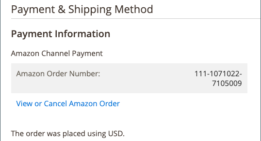

# 常見Amazon訂單處理任務

[商務訂單處理](https://experienceleague.adobe.com/docs/commerce-admin/stores-sales/order-management/orders/order-processing.html#process-an-order) 可以管理您的Amazon訂單，包括傳送電子郵件給採購員、履行訂單（出貨）、簽發銷退折讓/退款、新增註解等。 若要管理您的Amazon訂單，請 [**匯入Amazon訂單**](./order-settings.md) 設定必須設定為 `Enabled` 因此，相應 [!DNL Commerce] 訂單會在收到Amazon訂單時建立。 Amazon訂單資訊顯示在 *[!UICONTROL Recent Orders]* 區段。

啟用時，對應於 [!DNL Commerce] 系統會為Amazon訂單建立訂單，而Amazon訂單編號會顯示在 _[!UICONTROL Order Number]_欄。 若相應 [!DNL Commerce] 建立訂單後，按一下訂單編號以開啟 [商務訂單處理](https://experienceleague.adobe.com/docs/commerce-admin/stores-sales/order-management/orders/order-processing.html#process-an-order) 頁面。 您可以像管理其他訂單一樣管理訂單 [[!DNL Commerce] 訂單處理](https://experienceleague.adobe.com/docs/commerce-admin/stores-sales/order-management/orders/order-processing.html#process-an-order).

此 [!DNL Commerce] 訂單編號不會與一起顯示 _[!UICONTROL Recent Orders]_資訊。 只有當您按一下商店控制面板上的訂單編號，並在以下位置開啟訂單時，才會顯示商務訂單編號： [商務訂單處理](https://experienceleague.adobe.com/docs/commerce-admin/stores-sales/order-management/orders/order-processing.html#process-an-order). 檢視 [!DNL Commerce] 訂購，Amazon訂購編號會出現在&#x200B;*[!UICONTROL Payment & Shipping Method]*區段。 其中也包含&#x200B;*[!UICONTROL View or Cancel Amazon Order]*和&#x200B;*[!UICONTROL View all Amazon Orders]*，視訂單送貨狀態而定。

另請參閱 [取消未出貨的訂單](./cancel-unshipped-order.md).

{width="500"}

處理Amazon訂單時，Amazon銷售管道會更新訂單資訊，並將其與您的 [!DNL Amazon Seller Central] 帳戶。 您的cron設定會決定訂單資訊在Amazon和Amazon銷售管道之間同步的頻率。

通用商務 [訂單處理](https://experienceleague.adobe.com/docs/commerce-admin/stores-sales/order-management/orders/order-processing.html#process-an-order) 工作包括：

- [訂購動作](https://experienceleague.adobe.com/docs/commerce-admin/stores-sales/order-management/orders/orders.html#actions)
- [訂單搜尋](https://experienceleague.adobe.com/docs/commerce-admin/stores-sales/order-management/orders/orders.html#order-search)
- [處理訂單](https://experienceleague.adobe.com/docs/commerce-admin/stores-sales/order-management/orders/order-processing.html#process-an-order)
   - [檢視訂單](https://experienceleague.adobe.com/docs/commerce-admin/stores-sales/order-management/orders/order-processing.html#process-an-order#view-an-order)
   - [處理訂單](https://experienceleague.adobe.com/docs/commerce-admin/stores-sales/order-management/orders/order-processing.html#process-an-order#process-an-order)
   - [訂單與帳戶資訊](https://experienceleague.adobe.com/docs/commerce-admin/stores-sales/order-management/orders/order-processing.html#process-an-order#order-and-account-information)
   - [地址資訊](https://experienceleague.adobe.com/docs/commerce-admin/stores-sales/order-management/orders/order-processing.html#process-an-order#address-information)
   - [付款與送貨方式](https://experienceleague.adobe.com/docs/commerce-admin/stores-sales/order-management/orders/order-processing.html#process-an-order#payment--shipping-method)
   - [檢閱訂購的專案](https://experienceleague.adobe.com/docs/commerce-admin/stores-sales/order-management/orders/order-processing.html#process-an-order#review-items-ordered)
- [核發銷退折讓/退款](https://experienceleague.adobe.com/docs/commerce-admin/stores-sales/order-management/credit-memos/credit-memo-create.html)
- [履行/送貨訂單](https://experienceleague.adobe.com/docs/commerce-admin/stores-sales/order-management/shipments.html#create-a-shipment)
- [建立發票](https://experienceleague.adobe.com/docs/commerce-admin/stores-sales/order-management/invoices.html#create-an-invoice)
- [取消未出貨的訂單](./cancel-unshipped-order.md)

>[!NOTE]
>
>如果訂單位於 `Unshipped` 狀態，您可以 [取消Amazon訂單](./cancel-unshipped-order.md) 於 [[!UICONTROL Amazon Order Details]](./amazon-order-details.md) 頁面。 如果訂單已出貨，則無法取消。

另請參閱 [Commerce訂單管理](https://experienceleague.adobe.com/docs/commerce-admin/stores-sales/introduction.html#order-management-and-operations).
