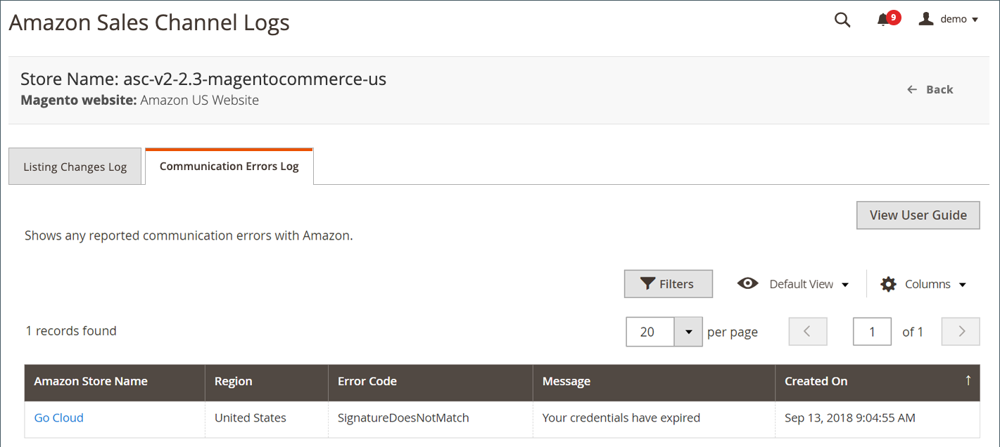

# Amazon通訊錯誤記錄

此 [!UICONTROL Communication Errors] 記錄會顯示任何回報的與Amazon的通訊錯誤。 資訊包括受影響的Amazon銷售管道商店、錯誤代碼和簡短說明，以及錯誤的日期和時間。

記錄檔沒有可用的動作。 這是僅限稽核的功能。

Amazon sales channel首頁有一些共同之處 [工作區控制項](./workspace-controls.md) 可讓您自訂顯示的資料。

{width="600" zoomable="yes"}

## 預設欄

| 欄 | 說明 |
|--------------------------------|-----------------------------------------------------------------------------------------------------------------------|
| [!UICONTROL Amazon Store Name] | 設定Amazon存放區時定義的存放區名稱。 請參閱 [存放區整合](./store-integration.md). |
| [!UICONTROL Error Code] | 從Amazon收到的用於識別錯誤型別的代碼。 |
| [!UICONTROL Message] | 說明與錯誤碼相關之錯誤的訊息。 |
| [!UICONTROL Created On] | 發生錯誤的日期和時間。 |
