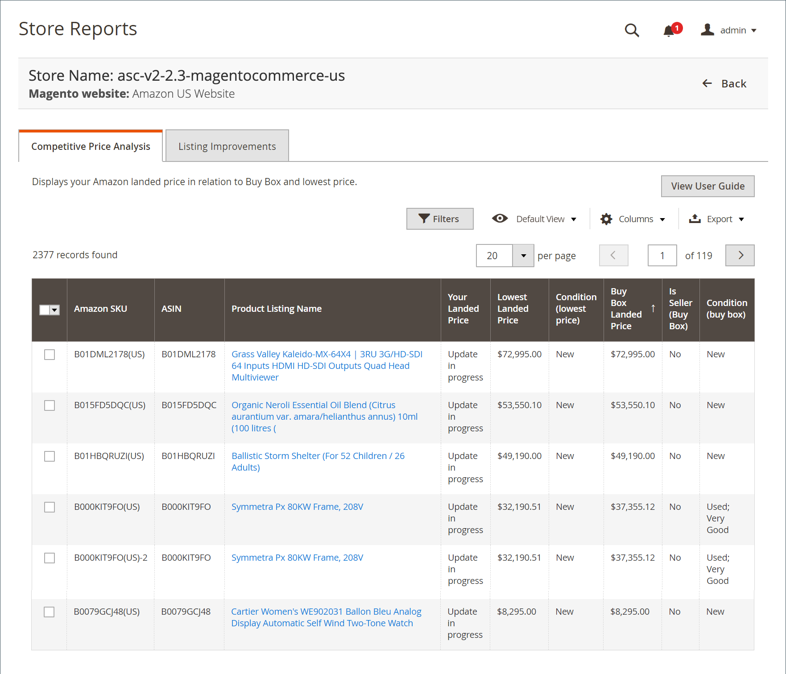

# 競爭價格分析

「競爭價格分析」報告顯示您的Amazon市場清單以及各自 [Buy Box](./buy-box-competitor-pricing.md) 價格 [最差競爭對手](./lowest-competitor-pricing.md) 價格值。 日誌沒有可用的操作。 它是僅查看功能。

## 預設列

| 列 | 說明 |
|--- |--- |
| [!UICONTROL Amazon Seller SKU] | 由Amazon分配給產品的SKU（庫存單位），以標識產品、選項、價格和製造商。 |
| [!UICONTROL ASIN] | 標識項的10個字母和/或數字的唯一塊。  ASIN代表Amazon標準標識號。 ASIN是由10個字母和/或數字組成的唯一塊，用於標識項目。 對於書籍，ASIN與ISBN號相同，但對於所有其他產品，在將項目上載到其目錄時會建立新的ASIN。 您可以在Amazon的產品詳細資訊頁面上找到項目ASIN，以及與項目相關的詳細資訊。 |
| [!UICONTROL Product Listing Name] | 產品的名稱。 |
| [!UICONTROL Your Landed Price] | 產品的上市價格加上其發運價格。 |
| [!UICONTROL Lowest Landed Price] | 您的Amazon競爭對手最低的地盤價格（上市價格加其運費價格）。 |
| [!UICONTROL Condition (lowest price)] | 產品以最低價格列出的狀況。 |
| [!UICONTROL Buy Box Landed Price] | 本集團於2014年12月31日之 [Buy Box](./buy-box-competitor-pricing.md) 職位清單。 |
| [!UICONTROL Is Seller (Buy Box)] | 指示您是否已獲得上市的Buy Box職位(NA表示沒有上市的Buy Box價格)。 |
| 條件(Buy Box) | Buy Box職位清單的條件。 |
