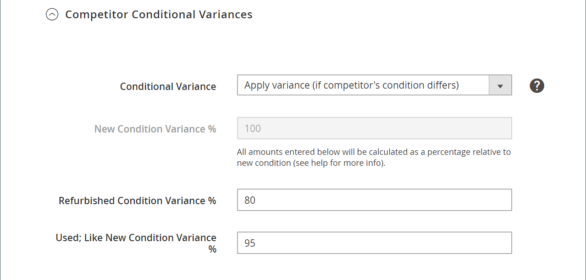
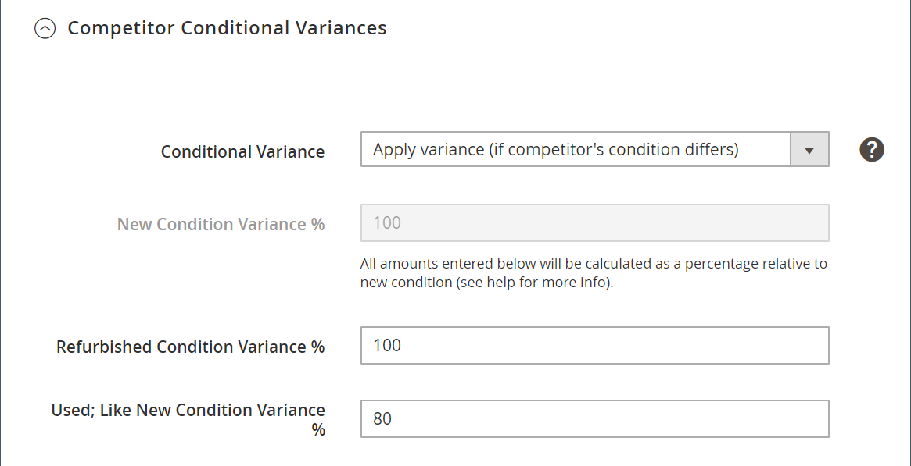

# 智慧重新定價規則：競爭者條件差異

智慧重新定價規則的章節包括：

- [[!UICONTROL Select Rule Type]](./intelligent-repricing-rules.md)
- [!UICONTROL Competitor Conditional Variances]
- [[!UICONTROL Price Adjustment]](./price-adjustment.md)
- [[!UICONTROL Floor Price]](./floor-price.md)
- [[!UICONTROL Optional Ceiling Price]](./optional-ceiling-price.md)

智慧型重新定價規則會使用Amazon競爭者的定價來決定您的上市價格。 競爭者是其他銷售者，會列出您在Amazon上列出的相同產品。

如果產品存在於相同的條件，則基本符合價格為 [最低競爭者](./lowest-competitor-pricing.md) 價格。 如果沒有競爭者產品符合您的條件，則基本匹配價格將經過其他可用競爭者條件，從「新」、「翻新」開始，然後持續到可用條件。 找到條件後，基本匹配價格將是該條件內的最低價格。

如果您有產品列於條件中 `Used; Good` 且基本匹配價格，而競爭者在相同條件下以較低的價格擁有相同產品，則使用競爭者價格。 如果競爭者不存在相同的條件，系統會檢查是否有下一個條件，即 `New`. 如果找到具有該條件的競爭者，則會使用最低價格。

## 設定競爭者條件差異

在 _[!UICONTROL Competitor Conditional Variances]_區段。

針對 **[!UICONTROL Conditional Variance]**，選擇選項：

- `Use all competitor's product conditions`  — （預設）選擇您的產品與任何可用條件進行比較的時間（如果您所列出的條件不存在相符項目）。

- `Use Only Matching Competitor's Product Condition`  — 選擇您希望產品在相同條件下僅與競爭對手的產品進行比較的時間。 若不存在相符項目，則會以 _Magento價格來源_ 定義於 [上市價](./listing-price.md).

- `Apply Variance (if competitor's product condition differs)`  — 選擇先嘗試根據您符合的產品條件進行比較。 如果沒有相符的條件，則會根據您的產品條件和最低競爭者的條件，套用變異數（百分比）。

   當 _[!UICONTROL Apply Variance]_功能，則會針對您的每個Amazon條件顯示其他變異欄位。 當您提供的產品與競爭對手的狀況不同時，此功能可讓您使用智慧型重新定價規則。 若要了解條件變異數背後的計算，您必須先了解所有變異數都是由基本符合價格決定。

   顯示的條件變異選項是根據 `Condition` 會使用 [!DNL Commerce] [產品屬性](https://docs.magento.com/user-guide/catalog/product-attributes.html){target="_blank"}. 對於所有對應的條件，您可以定義1-100的變異百分比。 例外是可收集的，在這種情況下，可以套用大於100的百分比。

| 欄位 | 說明 |
|--- |--- |
| [!UICONTROL Competitor Conditional Variances] | 選項： <ul><li>**[!UICONTROL Use all competitor's product conditions]**  — 如果您列出產品的條件不存在相符項目，則此選項會與任何可用條件相符。 它會先嘗試符合您的條件，然後從 `New` 條件 `Used; Acceptable`.</li><li>**[!UICONTROL Use only matching competitor's product condition]**  — 此選項會根據您產品的條件而相符。 若不存在相符項目，則產品價格 _[!UICONTROL Magento Price Source]_.</li><li>>**[!UICONTROL Apply variance (if competitor's product condition differs)]**  — 此選項會先嘗試根據您的產品條件進行比對。 如果沒有相符的條件，則會套用相對於您的產品條件和最低競爭者條件的變異數（百分比）。</li></ul>  根據您對「條件」的清單設定而顯示的條件變異選項，這些設定是使用 [!DNL Commerce] [產品屬性](https://docs.magento.com/user-guide/catalog/product-attributes.html){target="_blank"}. 對於所有對應的條件，您可以表示1-100的變異百分比。 例外是可收集的，在這種情況下，可以套用大於100的百分比。  當您提供的產品與競爭對手的狀況不同時，此功能可讓您使用智慧型重新定價規則。 若要了解條件變異數背後的計算，您必須先了解所有變異數都是由基本符合價格決定。 |

## 計算條件變數基數

- 基本匹配條件差異(BMC)=基本匹配價格競爭者條件的差異。 在上例中， BMC是 `New` 條件。
- 商家條件差異(MCV)=產品條件的差異。 在先前的範例中，MCV = `Used; Good` 條件。
- 基本符合價格(BMP)= $7.99（以上說明）

計算條件變數基的公式如下：

## 範例

條件變異設定如下：

- BMC = 100（競爭者條件=新）
- MCV = 80(商戶條件=已使用；好)
- BMP = $7.99（基本匹配價格=相符競爭者條件的最低價格）

使用上述的條件差異基計算，您的條件差異基= $6.39。此計算是用於價格規則活動的競爭者價格來源，有關詳細說明，請參閱 [價格調整](./price-adjustment.md).
