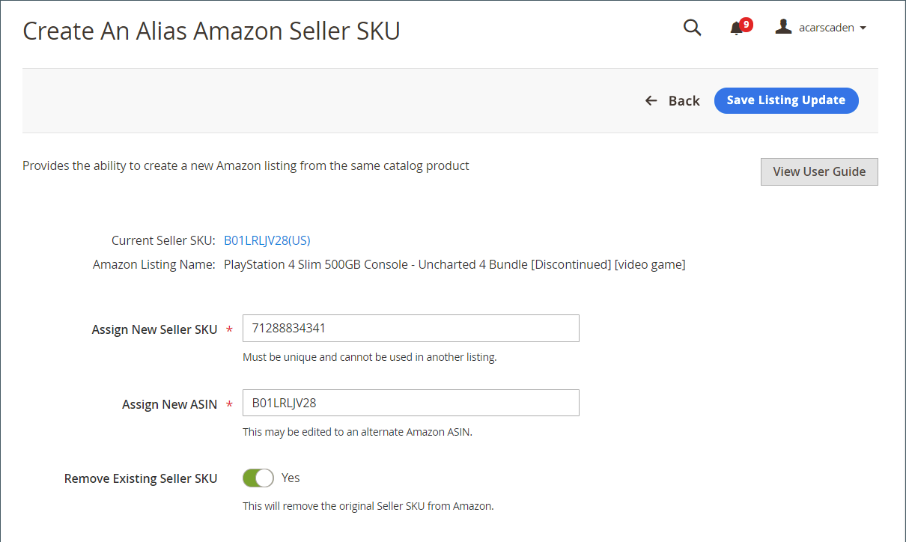

# 建立別名Amazon賣家SKU

一個 [!DNL Alias Amazon Seller SKU] 會使用從您環境中的相同產品建立Amazon清單 [!DNL Commerce] 目錄。 如果您是有經驗的Amazon銷售商，您可能熟悉 [Amazon全球SKU](https://sellercentral.amazon.com/gp/help/external/help.html?itemID=201394090){target="_blank"} 以及特定於Marketplace的SKU，用於庫存和運送。 依照Amazon銷售管道的類似原則，Amazon賣家SKU可控制多區域層級的產品清單資訊，以及 [!DNL Alias Amazon Seller SKU] 可用於控制區域特定層次的產品清單資訊。

此函式可用於執行兩個函式：

- 建立 [!DNL Alias Amazon Seller SKU] 針對您的其中一個 [!DNL Commerce] 目錄產品，以控制區域特定的清單資訊。

   **範例**：您同時在美國和加拿大地區為賣家。 請記住，在設定期間，您的每個Amazon銷售管道商店只能指派一個Amazon區域。 因此，您有一個已定義美國地區的Amazon銷售管道商店，以及另一個已定義加拿大地區的商店。 兩個商店共用您的 [!DNL Commerce] 用於跨區域列出資訊的目錄，包括Amazon賣家SKU和ASIN產品屬性。 因此，在兩個商店中，目錄產品的清單會相同，共用定價、庫存/數量和其他產品屬性。 但您的加拿大商店存貨來自加拿大地點，而您的美國商店存貨來自美國地點。 因此，您應該分別控制每個商店的清單數量。 若要完成這類地區特定控制，您可以建立Amazon賣家SKU別名。

   基本上，您可以建立連結至相同目錄產品的別名Amazon賣家SKU，並可用於在該區域重新發佈相同清單。

- 建立 [!DNL Alias Amazon Seller SKU] 並比對您的其中一個 [!DNL Commerce] 將產品目錄至兩個Amazon清單。

   **範例**：您有符合Amazon清單的目錄產品。 由於Amazon經常有多個代表相同產品的清單，因此您會發現相同產品的另一個Amazon清單，但Amazon已指派不同的ASIN給該清單。 若要增加產品的可見度，您要將目錄產品與不同的ASIN進行比對，並為兩個ASIN值建立清單。 若要完成此操作，您可以建立Amazon賣家SKU別名。

   基本上，您可以建立 [!DNL Alias Amazon Seller SKU] 可將單一目錄產品與第二個Amazon清單比對，並為新比對的ASIN建立清單。 在此案例中，您會有相同目錄產品的兩個Amazon清單。

   建立Amazon賣家SKU別名後，您可以使用清單設定、規則和覆寫來控制該地區的清單資訊。 可依區域為清單定義的產品屬性包括數量/存貨、履行方式、條件、產品資格及處理時間。

## 用於特定區域的用途 {#region-specific}

檢視以下專案的清單： _[!UICONTROL Product Listings]_頁面(_[!UICONTROL Inactive]_， _作用中_， _不合格_，或 _已結束_ 標籤)。

1. 下 _[!UICONTROL Actions]_，按一下&#x200B;**[!UICONTROL Create Alias Seller SKU]**.

1. 對象 **[!UICONTROL Assign New Seller SKU]**，請輸入唯一的英數字元值。

   此值必須是唯一的（不適用於目錄中的任何其他產品或別名）。

1. 對象 **[!UICONTROL Assign New ASIN]**，不做變更。

   此值會自動填入與目錄產品相符的產品ASIN。 變更此值會根據ASIN將您的目錄產品與兩個Amazon清單比對。

1. 切換 **[!UICONTROL Remove Existing Seller SKU]** 選項。

   - `Yes`  — 選擇刪除清單，並使用提供的新資訊建立清單。

   - `No`  — 選擇建立清單，並保持舊清單不變。

1. 按一下 **[!UICONTROL Save Listing Update]**.

## 用於將單一目錄產品與兩個Amazon清單進行比對

1. 檢視以下專案的清單： _[!UICONTROL Product Listings]_頁面(_[!UICONTROL Inactive]_， _[!UICONTROL Active]_，_[!UICONTROL Ineligible]_，或 _[!UICONTROL Ended]_標籤)。

1. 下 _[!UICONTROL Actions]_，按一下&#x200B;**[!UICONTROL Create Alias Seller SKU]**.

1. 對象 **[!UICONTROL Assign New Seller SKU]**，請輸入唯一的英數字元值。

   此值必須是唯一的（不適用於目錄中的任何其他產品或別名）。

1. 對象 **[!UICONTROL Assign New ASIN]**，請輸入唯一的英數字元值。

   此值會自動填入與目錄產品相符的產品ASIN。 變更此值會根據ASIN將您的目錄產品與兩個Amazon清單比對。

1. 切換 **[!UICONTROL Remove Existing Seller SKU]** 選項。

   - `Yes`  — 選擇刪除清單，並使用提供的新資訊建立清單。

   - `No`  — 選擇建立其他清單，並保持舊清單不變。

1. 按一下 **[!UICONTROL Save Listing Update]**.

{width="600" zoomable="yes"}

| 欄位 | 說明 |
|--- |--- |
| [!UICONTROL Assign New Seller SKU] | 輸入要連結至原始Amazon賣家SKU的新不重複英數字元值。 此數字僅供Amazon銷售管道用於比對您的目錄產品。 您可以使用任何SKU值，但值在目錄中只能使用一次。 |
| [!UICONTROL Assign New ASIN] | 輸入清單的ASIN值，您要與目錄產品相符。 只有在將單一目錄產品與ASIN比對時，才能修改此欄位，以取得相同產品的其他清單。 此值必須與Amazon指派的ASIN相符，否則Amazon不會拒絕此清單。 |
| [!UICONTROL Remove Existing Seller SKU] | 選項：<ul><li>**[!UICONTROL Yes]**  — 選擇刪除清單，並使用提供的新資訊建立清單。 新清單會出現在 _[!UICONTROL Active]_標籤，而舊清單會移至_&#x200B;已結束&#x200B;_標籤。</li><li>**[!UICONTROL No]**  — 選擇建立其他清單，並保持舊清單不變。 建立新清單後，兩個清單都會顯示在「作用中」標籤中。</li></ul> |
