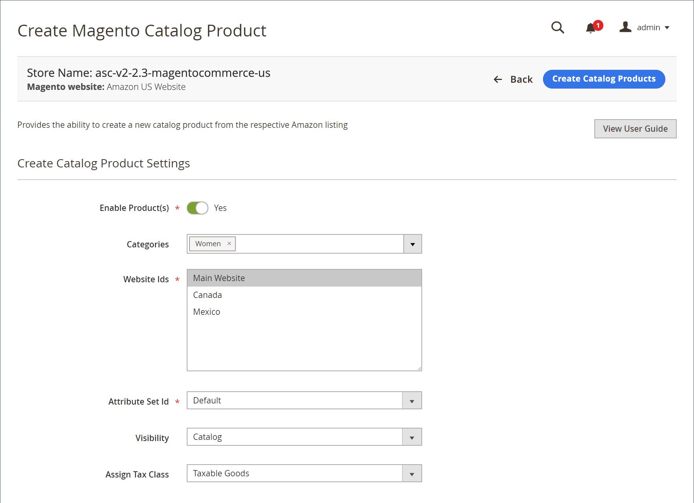

# 建立及指派產品

檢視時 _[!UICONTROL New Third Party]_標籤，您可以比對 [!DNL Commerce] 將產品目錄至現有的Amazon清單。 此比對有兩個選項。 您可以將清單指派給現有的目錄產品，也可以使用清單中的資訊來建立目錄產品。 當您的Amazon清單未自動符合您的時，這些選項會很有幫助 [!DNL Commerce] 目錄。

您必須比對（或指派）產品與Amazon清單，才能使用Amazon銷售管道的完整功能集。

當您從Amazon清單建立目錄產品時：

- 此 **ASIN** 成為 [!DNL Commerce] SKU
- 此 **產品清單名稱** 會變成「目錄清單名稱」
- 此 **價格** 和 **數量** 是從Amazon清單匯入

其餘必要設定由 [!DNL Commerce] 您在建立期間選取的產品設定。

建立並比對後，清單會從 _[!UICONTROL New Third Party]_標籤並出現在_[!UICONTROL Active]_ 標籤。

## 將單一目錄產品指派給Amazon清單

1. 檢視您的產品清單，於 [_[!UICONTROL New Third Party]_](./new-third-party-listings.md) 標籤。

1. 在清單中尋找要指派的清單，按一下 **[!UICONTROL Select]** 在 _[!UICONTROL Action]_欄，然後按一下&#x200B;**[!UICONTROL Assign Catalog Product]**.

   此動作會開啟 _[!UICONTROL Assign Magento Catalog Product]_頁面。

1. 使用瀏覽或篩選清單 [工作區控制項](./workspace-controls.md) 並找到符合清單的適當目錄產品。

1. 當正確的產品出現在清單中時，按一下 **[!UICONTROL Assign Catalog Product]** 在 _[!UICONTROL Action]_欄。

您的產品和清單現在已相符。 Amazon sales channel現在可以與Amazon共用產品和清單資料，並管理您的清單及其資訊，包括清單價格、送貨價格、存貨/數量、訂單資訊和狀態等。

## 使用Amazon清單資訊建立單一目錄產品

1. 檢視您的產品清單，於 [_[!UICONTROL New Third Party]_](./new-third-party-listings.md) 標籤。

1. 尋找您要在中建立的清單 [!DNL Commerce] 目錄，按一下 **[!UICONTROL Select]** 在 _[!UICONTROL Action]_欄，然後按一下&#x200B;**[!UICONTROL Create New Catalog Product]**.

   此動作會開啟 _[!UICONTROL Create Magento Catalog Product]_頁面。

1. 完成產品的目錄設定。

   - 設定 **[!UICONTROL Enable Product(s)]** 切換至 `Yes` 或 `No` （必要）。

     |是|選擇讓產品符合您的 [!DNL Commerce] 店面銷售。| |否|選擇讓產品不符合您的資格 [!DNL Commerce] 店面銷售。|

   - 對象 **[!UICONTROL Categories]**，指派產品的類別（選用）。

     若要選取產品類別，請按一下向下箭頭，然後選取類別核取方塊。 按一下 **[!UICONTROL Done]** 完成後。

   - 對象 **[!UICONTROL Website Ids]**，選擇要與產品相關聯的網站（店面）。

     此清單中的選項取決於 [!DNL Commerce] [存放區設定](https://experienceleague.adobe.com/docs/commerce-admin/start/setup/websites-stores-views.html) 設定。

   - 對象 **[!UICONTROL Attribute Set Id]** （必要），選擇一個選項。

     `Default` 是預設選取範圍。 此清單中的選項取決於 [!DNL Commerce] [屬性集](https://experienceleague.adobe.com/docs/commerce-admin/catalog/product-attributes/create/attribute-sets.html) 您已設定。

   - 對象 **[!UICONTROL Visibility]**，選擇新產品的選項。

     |**[!UICONTROL Not Visible Individually]** （預設）|此產品未包含在您的店面清單中，儘管它可能作為其他產品的變體提供。| |**[!UICONTROL Catalog]**|產品會出現在您的目錄清單中。| |**[!UICONTROL Search]**|產品可用於搜尋作業。| |**[!UICONTROL Catalog and Search]**|產品包含在目錄清單中，可用於搜尋作業。|

   - 對象 **[!UICONTROL Assign Tax Class]**，選擇產品的選項。

     此清單中顯示的選項取決於 [稅捐類別](https://experienceleague.adobe.com/docs/commerce-admin/stores-sales/site-store/taxes/tax-class.html) 您已設定。

   - 完成後，按一下 **[!UICONTROL Create Catalog Products]**.

目錄產品是在以下位置建立的： [!DNL Commerce] 目錄並指派給從中建立它的Amazon清單。 由於清單現在與現有的Amazon清單相符，因此該清單會從 _[!UICONTROL New Third Party]_標籤並出現在_[!UICONTROL Active]_ 標籤。

## 使用其Amazon清單資訊建立多個目錄產品

1. 檢視您的產品清單，於 [_[!UICONTROL New Third Party]_](./new-third-party-listings.md) 標籤。

1. 選取要建立目錄產品的清單。

   您可以選取左側欄中的個別核取方塊，或按一下左上方欄中的向下箭頭並選擇 **[!UICONTROL Select All]** 或 **[!UICONTROL Select All on this Page]**.

1. 下 _[!UICONTROL Actions]_，按一下&#x200B;**[!UICONTROL Create New Catalog Product(s)]**.

1. 若要接受確認訊息並開啟 _[!UICONTROL Create Magento Catalog Product]_頁面，按一下&#x200B;**[!UICONTROL OK]**.

1. 完成產品的目錄設定。

   >[!NOTE]
   >為多個選取的清單建立目錄產品時，輸入的產品設定會套用至所有清單。

   - 設定 **[!UICONTROL Enable Product(s)]** 切換至 `Yes` 或 `No` （必要）。

     |是|選擇讓產品符合您的 [!DNL Commerce] 店面銷售。| |否|選擇讓產品不符合您的資格 [!DNL Commerce] 店面銷售。|

   - 對象 **[!UICONTROL Categories]**，指派產品的類別（選用）。

     若要選取產品類別，請按一下向下箭頭，然後選取類別核取方塊。 按一下 **完成** 完成後。

   - 對象 **[!UICONTROL Website Ids]**，選擇要與產品相關聯的網站（店面）。

     此清單中的選項取決於 [!DNL Commerce] [存放區設定](https://experienceleague.adobe.com/docs/commerce-admin/start/setup/websites-stores-views.html) 設定。

   - 對象 **[!UICONTROL Attribute Set Id]** （必要），選擇一個選項。

     `Default` 是預設選取範圍。 此清單中的選項取決於 [!DNL Commerce] [屬性集](https://experienceleague.adobe.com/docs/commerce-admin/catalog/product-attributes/create/attribute-sets.html) 您已設定。

   - 對象 **[!UICONTROL Visibility]**，選擇新產品的選項。

     |**[!UICONTROL Not Visible Individually]** （預設）|此產品未包含在您的店面清單中，儘管它可能作為其他產品的變體提供。| |**[!UICONTROL Catalog]**|產品會出現在您的目錄清單中。| |**[!UICONTROL Search]**|產品可用於搜尋作業。| |**[!UICONTROL Catalog and Search]**|產品包含在目錄清單中，可用於搜尋作業。|

   - 對象 **[!UICONTROL Assign Tax Class]**，選擇產品的選項。

     此清單中顯示的選項取決於 [稅捐類別](https://experienceleague.adobe.com/docs/commerce-admin/stores-sales/site-store/taxes/tax-class.html) 您已設定。

   - 完成後，按一下 **[!UICONTROL Create Catalog Products]**.

目錄產品是在以下位置建立的： [!DNL Commerce] 目錄並指派給從中建立它的Amazon清單。 清單現在與其各自的Amazon清單相符時，該清單會從 [_[!UICONTROL New Third Party]_](./new-third-party-listings.md) 標籤並出現在 [_[!UICONTROL Active]_](./active-listings.md) 標籤。

{width="600" zoomable="yes"}

| 欄位 | 說明 |
|--------------------------------|-------------------------------------------------------------------------------------------------------------------------------------------------------------------------------------------------------------------------------------------------------------------------------------------------------------------------------------------------------------------------------------------------------------------------------------------------------------------------------------------------------------------------------------------|
| [!UICONTROL Enable Product(s)] | （必要）如果已啟用，產品會顯示在 [!DNL Commerce] 店面。 如果停用，產品將不會顯示在您的 [!DNL Commerce] 店面。 |
| [!UICONTROL Categories] | 您可以輸入新產品的類別名稱，或按一下向下箭頭以顯示選項來選取類別。 選項取決於您的 [類別](https://experienceleague.adobe.com/docs/commerce-admin/catalog/categories/create/category-create.html) 設定。 |
| [!UICONTROL Website Ids] | （必要）選擇要與產品相關聯的網站（店面）。 選項取決於您的 [!DNL Commerce] [存放區設定](https://experienceleague.adobe.com/docs/commerce-admin/start/setup/websites-stores-views.html) 設定 |
| 屬性集ID | 選擇屬性集。 選項取決於您設定的值 [!DNL Commerce] [屬性集](https://experienceleague.adobe.com/docs/commerce-admin/catalog/product-attributes/create/attribute-sets.html). |
| [!UICONTROL Visibility] | 選項：<ul><li>**[!UICONTROL Not Visible Individually]**  — 您的未檢視此產品 [!DNL Commerce] 店面（最常見於變體產品）。</li><li>**[!UICONTROL Catalog]**  — 允許透過在網站中與產品相關聯的類別來存取產品。</li><li>**搜尋**  — 僅允許透過搜尋工具找到產品。</li><li>**[!UICONTROL Catalog and Search]**  — 允許透過類別結構和使用搜尋工具來存取產品。</li></ul> |
| [!UICONTROL Assign Tax Class] | 指定新產品的稅捐類別。 選項取決於您設定的值 [稅捐類別](https://experienceleague.adobe.com/docs/commerce-admin/stores-sales/site-store/taxes/tax-class.html). |
