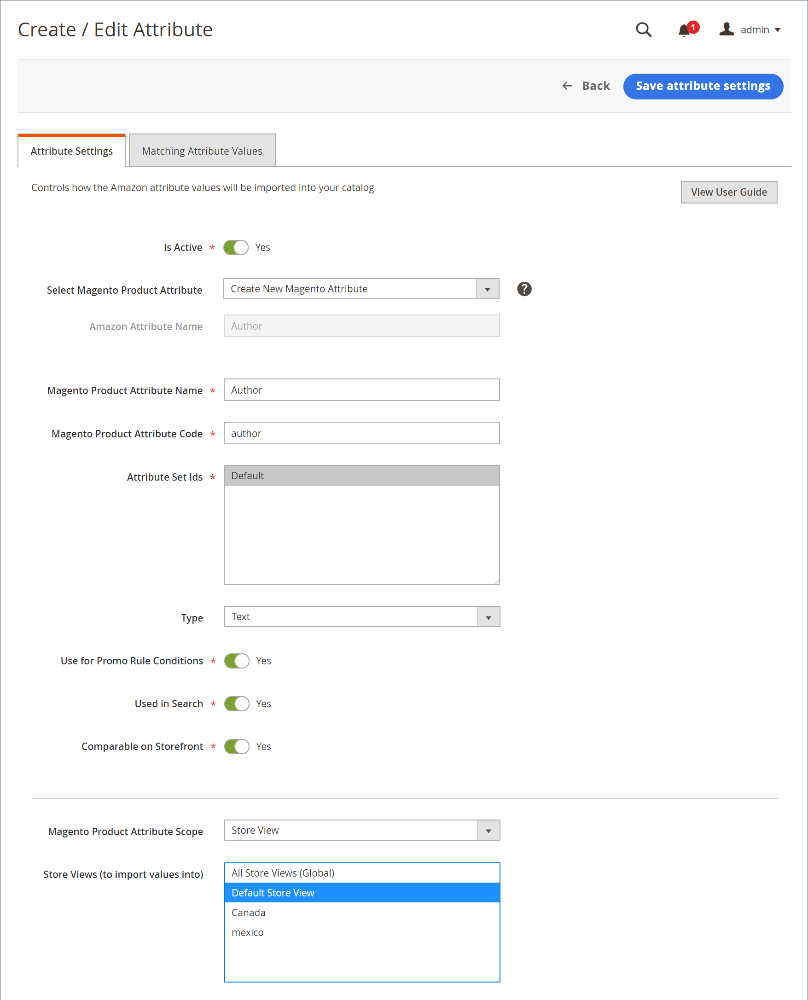

# 建立和編輯屬性

建立或更新 [!DNL Commerce] 透過Amazon銷售並更新商店時的屬性。 檢閱目前的Amazon屬性和連結 [!DNL Commerce] 屬性透過 [_[!UICONTROL Attributes]_檢視](./attributes-view.md) ，位於Amazon sales channel首頁。 此_[!UICONTROL Action]_ 欄會顯示屬性的可用動作。 您可以建立並對應新的 [!DNL Commerce] 已取消連結Amazon屬性的屬性，或是您可以編輯現有的 [!DNL Commerce] 屬性及其與Amazon屬性的對應。

當您建立和更新屬性時，您可能想要驗證下列專案的屬性值： [!DNL Commerce] 和Amazon產品。 如果您未從Amazon同步及匯入值，這些值可能會有所不同。 若要檢閱這些屬性的Amazon值，請參閱 [檢閱Amazon屬性對應](./amazon-matching-attributes-values.md). 若要變更這些值，您可以 [編輯或建立對應](./amazon-manually-update-incomplete-listing.md) 介於Amazon和 [!DNL Commerce].

## 建立屬性 {#create-an-attribute}

這些步驟會建立 [!DNL Commerce] 屬性並將其對應至Amazon屬性。 視設定而定，值可能會開始在目錄之間同步。

1. 在 _管理員_ 側欄，前往 **[!UICONTROL Marketing]** > _[!UICONTROL Channels]_>**[!UICONTROL Amazon Sales Channel]**.

1. 按一下 **[!UICONTROL Attributes]** 在左側功能表中，找出Amazon屬性，然後按一下 **[!UICONTROL Create Attribute]** 在 _[!UICONTROL Action]_欄。

1. 若要啟用Amazon值與連結專案的同步功能 [!DNL Commerce] 屬性，設定 **[!UICONTROL Is Active]** 至 `Yes`.

   當設定為 `Yes`，會根據您的設定同步值。

1. 選擇 `Create New Magento Attribute` 的 **[!UICONTROL Select Magento Product Attribute]**.

   屬性對應至所選 **[!UICONTROL Amazon Attribute Name]**.

1. 輸入 **[!UICONTROL Magento Product Attribute Name]**.

1. 輸入 **[!UICONTROL Magento Product Attribute Code]**.

   此值必須全部小寫且不加空格。

1. 的 **[!UICONTROL Attribute Set Ids]**，選擇要指派的屬性集。

   通常，屬性是屬性集的一部分，例如具有藍色、綠色、黃色和紅色屬性的顏色集。

1. 的 **[!UICONTROL Type]**，選擇屬性值的型別，例如文字和數字。

   此選項會影響屬性允許的值。

1. 的 **[!UICONTROL Use for Promo Rule Conditions]**，設定為 `Yes` 讓屬性可用於促銷條件內的引數。

1. 的 **[!UICONTROL Used in Search]**，設定為 `Yes` 屬性和值是否可用於產品搜尋。

1. 的 **[!UICONTROL Comparable on Storefront]**，設定為 `Yes` 屬性值是否可用於Amazon的「比較對象」功能。

1. 選擇 [!DNL Commerce] [範圍](https://experienceleague.adobe.com/docs/commerce-admin/start/setup/websites-stores-views.html#scope-settings) 屬性，然後選取一或多個要將Amazon值匯入的「存放區檢視」。

   如果範圍設定為 `Global`，則 _[!UICONTROL Store View]_建立屬性後即無法變更。

   如果您選擇 `All Store Views (Global)`，會同步值並儲存至所有Amazon商店檢視。 您可能只想將值同步至特定的存放區檢視。

1. 完成後，按一下 **[!UICONTROL Save Attribute Settings]**.

儲存後，您可能會想要編輯屬性以檢閱設定並比對Amazon和 [!DNL Commerce] 屬性的值。 您也可以指示Amazon值是否應覆寫 [!DNL Commerce] 值。

{width="600" zoomable="yes"}

| 欄位 | 說明 |
|-----------------------------------------------------|-----------------------------------------------------------------------------------------------------------------------------------------------------------------------------------------------------------------------------------------------------------------------------------------------------------------------|
| [!UICONTROL Is Active] | 指出此屬性是否為即時狀態，且會在Amazon與之間主動同步 [!DNL Commerce]. 將設為 `Yes` 確保Amazon的屬性值和 [!DNL Commerce] 讓選取的屬性保持同步。 |
| 選取Magento產品屬性 | 表示您要連結至所列「Amazon屬性名稱」的選取屬性。 建立屬性時，選擇 `Create New Magento Attribute`. |
| [!UICONTROL Amazon Attribute Name] | 顯示您選擇的Amazon屬性名稱。 選取的屬性會連結至此Amazon屬性。 您無法透過編輯此值 [!DNL Commerce]. |
| [!UICONTROL Magento Product Attribute Name] | 表示屬性名稱或「標籤」。 |
| [!UICONTROL Magento Product Attribute Code] | 指示屬性代碼，全部以小寫字元表示，不含空格。 |
| [!UICONTROL Attribute Set Ids] | 指示要指派屬性的「屬性集」。 屬性往往是屬性集的一部分，例如具有藍色、綠色、黃色和紅色屬性的顏色集。 |
| [!UICONTROL Type] | 指示屬性值的值型別，例如文字和數字。 選取範圍會影響屬性的允許值。 |
| [!UICONTROL Use for Promo Rule Conditions] | 切換至 `Yes` 讓屬性可用於促銷條件內的引數。 |
| [!UICONTROL Used in Search] | 表示屬性和值是否可用於產品搜尋。 |
| [!UICONTROL Comparable on Storefront] | 指出屬性值是否可用於Amazon的「比較依據」功能。 |
| [!UICONTROL Magento Product Attribute Scope] | 指示 [範圍](https://experienceleague.adobe.com/docs/commerce-admin/start/setup/websites-stores-views.html#scope-settings) 屬性的。 選項：全域/存放區檢視 當設定為 `Global`，建立屬性後即無法編輯存放區檢視。 |
| [!UICONTROL Store Views (to import values into to)] | 僅在範圍設定為時顯示 `Store View`. 選擇 [存放區檢視](https://experienceleague.adobe.com/docs/commerce-admin/start/setup/websites-stores-views.html) Amazon屬性值會同步至該處。 選擇 `All Store Views (Global)` 更新全部的值 [!DNL Commerce] 存放區檢視。 |

## 編輯屬性 {#edit-an-attribute}

1. 在 _管理員_ 側欄，前往 **[!UICONTROL Marketing]** > _[!UICONTROL Channels]_>**[!UICONTROL Amazon Sales Channel]**.

1. 按一下 **[!UICONTROL Attributes]** 在左側功能表中，找出Amazon屬性，然後按一下 **[!UICONTROL Edit]** 在 _[!UICONTROL Action]_欄。

1. 啟用或停用將Amazon值同步至連結的專案： [!DNL Commerce] 屬性，設定 **已啟用** 至 `Yes` 或 `No`.

   當設定為 `Yes`，會根據您的設定同步值。

1. 的 **[!UICONTROL Select Magento Product Attribute]**，驗證或更新屬性以對應至所選的 **[!UICONTROL Amazon Attribute Name]**.

1. 指示您是否希望傳入的Amazon屬性值覆寫現有的屬性值。

   例如，您可能不想將Amazon的價格覆寫為 [!DNL Commerce].

   - **[!UICONTROL Do Not Overwrite Existing Magento Values]**  — 保留值，為您的保留不同值 [!DNL Commerce] 和Amazon商店。

   - **[!UICONTROL Overwrite Existing Magento Values]**  — 覆寫 [!DNL Commerce] 具有傳入Amazon值的產品目錄。

1. 如果可以編輯，請選擇一或多個 **[!UICONTROL Store Views (to import Amazon values into)]**.

   如果屬性是使用 `Global` 範圍， _存放區檢視_ 建立屬性後即無法變更。

   如果您選擇 `All Store Views (Global)`，則會同步值並儲存至所有存放區檢視。 您可能只想將值同步至特定的存放區檢視。

1. 完成後，按一下 **[!UICONTROL Save Attribute Settings]**.

{width="600" zoomable="yes"}

| 欄位 | 說明 |
|-----------------------------------------------------|----------------------------------------------------------------------------------------------------------------------------------------------------------------------------------------------------------------------------------------------------------------------------------------------------------------------------------------------------------------------------------------------------------------------------------------------------------------------------|
| [!UICONTROL Is Active] | 指出此屬性是否為即時狀態，且會在Amazon與之間主動同步 [!DNL Commerce]. 將設為 `Yes` 確保Amazon的屬性值和 [!DNL Commerce] 讓選取的屬性保持同步。 |
| [!UICONTROL Select Magento Product Attribute] | 表示選取的專案 [!DNL Commerce] 要連結至列出Amazon屬性名稱的屬性。 如果您想要變更連結的 [!DNL Commerce] 屬性，從下拉式清單中選擇不同的屬性。 值會根據設定同步。 |
| [!UICONTROL Amazon Attribute Name] | 顯示中定義的Amazon屬性名稱 [!DNL Amazon Seller Central]. 選取的 [!DNL Commerce] 屬性連結至此Amazon屬性。 您無法透過編輯此值 [!DNL Commerce]. |
| [!UICONTROL Overwrite Existing Value] | 指示Amazon屬性值是否會覆寫現有的 [!DNL Commerce] 值，影響所有具有此功能的產品： [!DNL Commerce] 屬性。<ul><li>**不要覆寫現有的Magento值** - （預設）保留 [!DNL Commerce] 值，保留不同的值 [!DNL Commerce] 和Amazon商店。</li><li>**覆寫現有的Magento值**  — 將Amazon值儲存至 [!DNL Commerce] 中的值 [!DNL Commerce] 產品目錄。</li></ul> |
| [!UICONTROL Magento Product Attribute Scope] | 如果屬性是使用，編輯屬性時不會顯示 `Global` 範圍。 指示 [!DNL Commerce] [範圍](https://experienceleague.adobe.com/docs/commerce-admin/start/setup/websites-stores-views.html#scope-settings) 已建立並設為 `Store View`. |
| [!UICONTROL Store Views (to import values into to)] | 選擇您的 [!DNL Commerce] [存放區檢視](https://experienceleague.adobe.com/docs/commerce-admin/start/setup/websites-stores-views.html) ，以同步Amazon屬性值。 選擇 `All Store Views (Global)` 會更新所有商店檢視的值。 |
