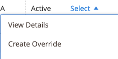
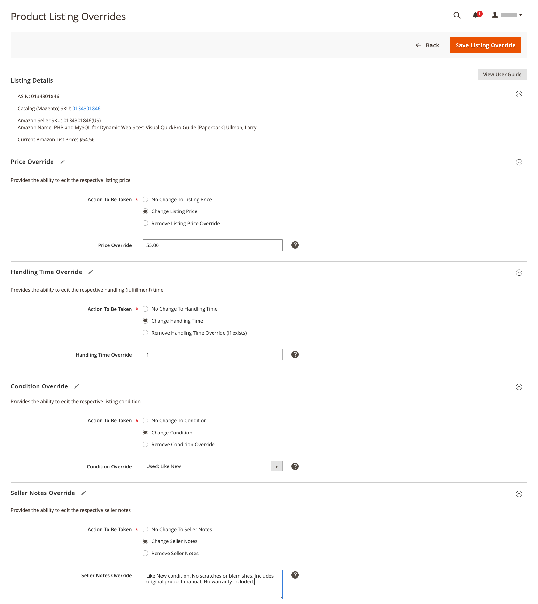
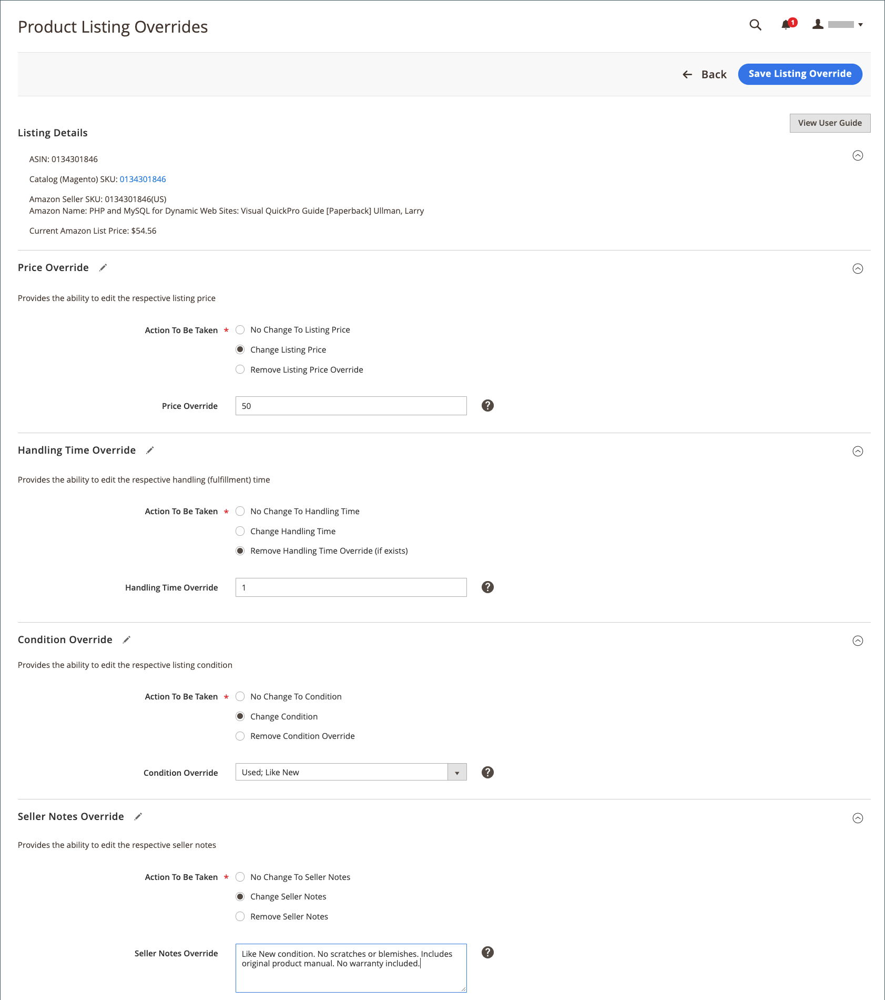

# 建立和編輯覆寫

您可以建立及覆寫清單，或編輯或移除已套用至清單的覆寫。 覆寫為特定清單設定定義的值。

## 為單一清單建立覆寫

此 _[!UICONTROL Create Override]_可在檢視清單時執行動作_[!UICONTROL Inactive]_， _[!UICONTROL Active]_、和_[!UICONTROL Ineligible]_ 索引標籤。

1. 檢視上的清單 _[!UICONTROL Products Listings]_頁面(_[!UICONTROL Inactive]_， _[!UICONTROL Active]_、和_[!UICONTROL Ineligible]_ 標籤)。

1. 在 _[!UICONTROL Action]_欄，按一下&#x200B;**[!UICONTROL Select]**>**[!UICONTROL Create Override]**以開啟「產品清單修訂」頁面。

   {width="220"}

1. 為確保您檢視的清單正確無誤，請確認 _[!UICONTROL Listing Details]_.

1. 決定您正在建立的覆寫型別。

   您可以定義清單的單一覆寫型態或任何型態組合（「價格」、「處理時間」、「條件」、「賣方備註」）。

   - **價格**  — 按一下 **[!UICONTROL Change Listing Price]** 並輸入您定義的價格值 **[!UICONTROL Price Override]**.
   - **處理時間**  — 按一下 **[!UICONTROL Change Handling Time]** 並輸入定義的時間值（以天為單位） **[!UICONTROL Handling Time Override]**.
   - **條件**  — 按一下 **[!UICONTROL Change Condition]** 並選擇正確的選項 **[!UICONTROL Condition Override]**.
   - **賣家筆記**  — 按一下 **[!UICONTROL Change Seller Notes]** 並輸入您的附註文字 **[!UICONTROL Seller Notes Override]**.

1. 按一下 **[!UICONTROL Save Listing Override]**.

   此 _[!UICONTROL Product Listing Overrides]_頁面關閉。 清單的狀態變更為 `Relist in Progress`. 此次變更將會發佈至Amazon，並包含您下次的資料同步處理作業（如您的cron設定中所設定）。 此清單也會新增至_[!UICONTROL Overrides]_ 標籤。

下列範例顯示定義新價格的覆寫 `$55`，的新處理時間 `1 day`，的新條件 `Used; Like New`和新的賣家備註文字。

{width="600" zoomable="yes"}

## 編輯或移除單一清單的覆寫 {#edit-override-single-listing}

此 _[!UICONTROL Edit Overrides]_可在檢視清單時執行動作_[!UICONTROL Overrides]_ 標籤。

1. 檢視清單于 _[!UICONTROL Product Listings]_頁面(_[!UICONTROL Overrides]_ 標籤)。

1. 在 _[!UICONTROL Action]_欄，按一下&#x200B;**[!UICONTROL Select]**>**[!UICONTROL Edit Overrides]**.

   此 _[!UICONTROL Product Listing Overrides]_頁面隨即開啟。

   {width="125"}

1. 為確保您覆寫正確的清單，請確認 _[!UICONTROL Listing Details]_.

1. 若要編輯您的 _[!UICONTROL Override]_設定，定義您要變更的型別（價格、處理時間、條件、賣家備註）的區段。

   若要保持覆寫型別相同，請選取 `No Change To <override type>` （預設）。 此設定保留先前定義的覆寫值不變。

   - **價格**  — 按一下 **[!UICONTROL Change Listing Price]** 並輸入您定義的價格值 **[!UICONTROL Price Override]**.
   - **處理時間**  — 按一下 **[!UICONTROL Change Handling Time]** 並輸入定義的時間值（以天為單位） **[!UICONTROL Handling Time Override]**.
   - **條件**  — 按一下 **[!UICONTROL Change Condition]** 並選擇正確的選項 **[!UICONTROL Condition Override]**.
   - **賣家筆記**  — 按一下 **[!UICONTROL Change Seller Notes]** 並輸入您的附註文字 **[!UICONTROL Seller Notes Override]**.

1. 若要移除覆寫型別，請按一下 **移除** 針對您想要移除的每種型別。 如果未移除，先前定義的值會保留在覆寫中。

1. 按一下 **[!UICONTROL Save Listing Override]**.

   此 _[!UICONTROL Product Listing Overrides]_頁面關閉。 清單的狀態變更為 `Relist in Progress`. 此次變更將會發佈至Amazon，並包含您下次的資料同步處理作業（如您的cron設定中所設定）。 如果清單尚未列出，也會新增至_[!UICONTROL Overrides]_ 標籤。

搭配 _建立覆寫_ 範例。 下列範例顯示編輯先前建立的覆寫，其定義的新價格為 `$50`，會移除「處理時間」覆寫，並保留先前的「條件」和「賣家備註」覆寫。

{width="600" zoomable="yes"}
__

## 編輯或移除多個清單的覆寫 {#edit-override-multiple-listings}

此 _[!UICONTROL Edit Listing Overrides]_動作可在_[!UICONTROL Inactive]_， _[!UICONTROL Active]_，_[!UICONTROL Overrides]_、和 _[!UICONTROL Ineligible]_索引標籤。

>[!NOTE]
>
>由於您正在修改多個清單的覆寫，因此 _[!UICONTROL Listing Details]_區段不會像修改單一清單時一樣顯示。

1. 檢視上的清單 _[!UICONTROL Products Listings]_頁面(_[!UICONTROL Inactive]_， _[!UICONTROL Active]_，_[!UICONTROL Overrides]_、和 _[!UICONTROL Ineligible]_標籤)。

1. 選取左欄中每個要修改清單的核取方塊。

1. 在 _[!UICONTROL Actions]_，按一下&#x200B;**[!UICONTROL Edit Listing Overrides]**.

   此 _[!UICONTROL Product Listing Overrides]_頁面隨即開啟。

   {width="200"}

1. 若要編輯您的 _[!UICONTROL Override]_設定，定義您要變更的型別（價格、處理時間、條件、賣家備註）的區段。

   若要保持覆寫不變，請選取 `No Change To <override type>` （預設）。 此設定保留先前定義的覆寫值不變。

   - **價格**  — 按一下 **[!UICONTROL Change Listing Price]** 並輸入您定義的價格值 **[!UICONTROL Price Override]**.
   - **處理時間**  — 按一下 **[!UICONTROL Change Handling Time]** 並輸入定義的時間值（以天為單位） **[!UICONTROL Handling Time Override]**.
   - **條件**  — 按一下 **[!UICONTROL Change Condition]** 並選擇正確的選項 **[!UICONTROL Condition Override]**.
   - **賣家筆記**  — 按一下 **[!UICONTROL Change Seller Notes]** 並輸入您的附註文字 **[!UICONTROL Seller Notes Override]**.

1. 若要移除覆寫型別，請按一下 **[!UICONTROL Remove]** 針對您想要移除的每種型別。 如果未移除，先前定義的值會保留在覆寫中。

1. 按一下 **[!UICONTROL Save Listing Override]**.

   此 _[!UICONTROL Product Listing Overrides]_頁面關閉。 清單的狀態變更為 `Relist in Progress`. 此次變更將會發佈至Amazon，並包含您下次的資料同步處理作業（如您的cron設定中所設定）。 如果清單尚未列出，也會新增至_[!UICONTROL Overrides]_ 標籤。

### 覆寫型別

| 覆寫 | 說明 |
|-------------------------------------|-------------------------------------------------------------------------------------------------------------------------------------------------------------------------------------------------------------------------------------------------------------------------------------------------------------------------------------------------------------------------------------------------------------------------------------------------------------------------------------------------------------------------------------------------------------------------------------------------------------------------------------------------------------------------------------------------------------------------------------------------|
| [!UICONTROL Price Override] | 價格修訂會定義清單的價格。 此覆寫優先於所有自動設定，直到移除覆寫為止。  若要覆寫產品的價格，請選擇 **[!UICONTROL Change Listing Price]** 並輸入新的價格 **[!UICONTROL Price Override]**. |
| [!UICONTROL Handling Time Override] | 處理時間覆寫會定義處理和出貨產品所需的時間（以天為單位）。 處理時間覆寫優先於所有自動化和預設的處理時間設定，直到覆寫被移除為止。  存在於中的值 _[!UICONTROL Handling Time Override]_方塊是您在中定義的預設處理時間。 [清單設定](./listing-settings.md) 或您定義的覆寫處理時間。 如果您移除處理時間覆寫，清單會預設為您清單設定中定義的處理時間。  若要定義處理時間覆寫，請選擇&#x200B;**[!UICONTROL Change Handling Time]**並輸入新的處理時間（以天為單位）**[!UICONTROL Handling Time Override]**. |
| [!UICONTROL Condition Override] | 若要覆寫「清單條件」，請選擇 **[!UICONTROL Change Condition]** 並從中選擇新條件 **條件覆寫**. |
| [!UICONTROL Seller Notes Override] | 對於目錄中的產品，其定義條件不是 `New`，您可新增賣家備註，向潛在買家進一步詳細說明您的產品及其狀態。 您可以為輸入銷售者備註覆寫 `New` 條件產品，但Amazon未顯示附註。  若要覆寫賣家備註，請選擇 **[!UICONTROL Change Seller Notes]** 並輸入的新附註 **[!UICONTROL Seller Notes Override]**. |
