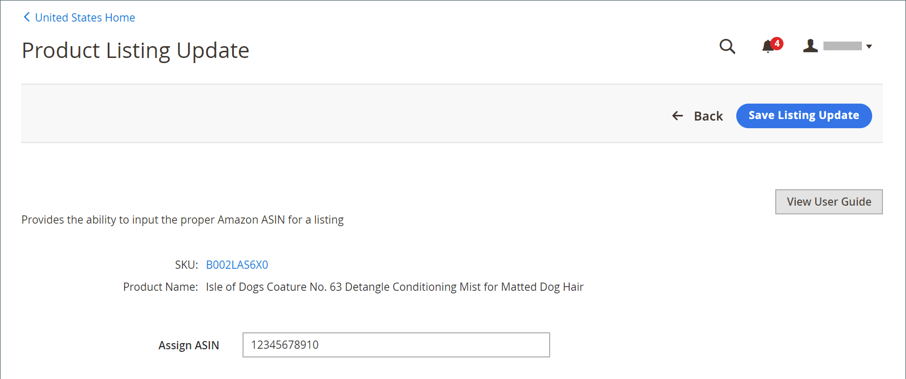

# 編輯指派的ASIN

您可以在[!DNL Commerce]目錄中編輯指派給產品的Amazon ASIN值。 如果目錄產品與您的其中一個Amazon清單不正確比對，這項功能會很有幫助。 變更清單中指派的ASIN不會變更Amazon指派給產品的ASIN。 它只會變更您的目錄產品相符的Amazon清單。

當指派的ASIN變更時：

- [!DNL Commerce]結束您附加到舊ASIN的Amazon清單
- 使用Amazon驗證ASIN
- 建立已更新ASIN的清單
- 更新Amazon sales channel中的清單資訊

**_若要編輯指派的ASIN：_**

1. 檢視&#x200B;_[!UICONTROL Product Listings]_頁面（_[!UICONTROL Inactive]_、_[!UICONTROL Active]_或_[!UICONTROL Ineligible]_&#x200B;索引標籤）上的清單。

1. 在&#x200B;_[!UICONTROL Actions]_底下，按一下&#x200B;**[!UICONTROL Edit Assigned ASIN]**。

   此動作會開啟&#x200B;_[!UICONTROL Product Listing Update]_頁面。

1. 針對&#x200B;**[!UICONTROL Assign ASIN]**，輸入新的ASIN值。

1. 若要儲存變更，請按一下&#x200B;**[!UICONTROL Save Listing Update]**。

{width="600" zoomable="yes"}
