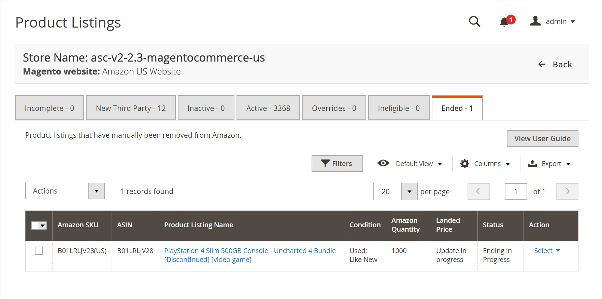

# 已結束清單

的 _[!UICONTROL Ended]_頁籤顯示已從您的 [!DNL Amazon Seller Central] 帳戶。 這些產品符合所有清單要求，可隨時重新發佈，不需要其他資訊。 如果產品位於_[!UICONTROL Ineligible]_ 頁籤 [清單設定](./listing-settings.md) 以便您的產品符合清單資格。

>[!NOTE]
>
>如果正在處理清單，則清單數將顯示在頁籤上方的消息中。

下 _[!UICONTROL Actions]_:

- **[!UICONTROL Publish Product to Amazon]**:選擇將清單重新發佈到 [!DNL Amazon Marketplace]。 請參閱 [發佈Amazon清單](./publish-listings-manually.md)

下 **[!UICONTROL Select]** 的 _[!UICONTROL Action]_列：

- **[!UICONTROL View Details]**：選擇查看清單詳細資訊，包括 [列出活動日誌](./product-listing-details.md#listing-activity-log)。 [Buy Box競爭對手定價](./product-listing-details.md#buy-box-competitor-pricing), [最低競爭對手定價](./product-listing-details.md#lowest-competitor-pricing)。 此操作僅用於查看。 無法在清單詳細資訊中進行更改。 請參閱 [查看詳細資訊](./product-listing-details.md)。

- **[!UICONTROL Publish On Amazon]**:選擇將清單重新發佈到 [!DNL Amazon Marketplace]。 請參閱 [發佈Amazon清單](./publish-listings-manually.md)。

- **[!UICONTROL Create Alias Seller SKU]**：選擇建立別名SKU，該別名SKU可用於從同一目錄產品建立Amazon清單。 請參閱 [建立別名銷售商SKU](./create-alias-seller-sku.md)。

有關結束清單，請參閱 [結束Amazon上市](./end-listings-manually.md)。

有關發佈清單，請參見 [手動發佈Amazon清單](./publish-listings-manually.md)。

Amazon銷售渠道首頁共用一些共同的 [工作區控制項](./workspace-controls.md) 允許您自定義顯示的資料。

| 列 | 說明 |
|--- |--- |
| [!UICONTROL Amazon Seller SKU] | 由Amazon分配給產品的SKU（庫存單位），以標識產品、選項、價格和製造商。 |
| [!UICONTROL ASIN] | 標識項的10個字母和/或數字的唯一塊。  ASIN代表Amazon標準標識號。 ASIN是由10個字母和/或數字組成的唯一塊，用於標識項目。 對於書籍，ASIN與ISBN號相同，但對於所有其他產品，在將項目上載到其目錄時會建立新的ASIN。 您可以在Amazon的產品詳細資訊頁面上找到項目ASIN，以及與項目相關的詳細資訊。 |
| [!UICONTROL Product Listing Name] | 產品的名稱。 |
| [!UICONTROL Condition] | 的 [條件](./product-listing-condition.md) 產品。 |
| [!UICONTROL Landed Price] | 產品的上市價格加其發運價格。 |
| [!UICONTROL Amazon Quantity] | 當產品在Amazon主動列出時可用的數量。 |
| [!UICONTROL Status] | 上市狀態，由Amazon定義。 |
| [!UICONTROL Action] | 可應用於特定清單的可用操作的清單。 要應用操作，請按一下 **[!UICONTROL Select]** 的 _[!UICONTROL Action]_列，然後選擇項：<ul><li>[[!UICONTROL View Details]](./product-listing-details.md)</li><li>[[!UICONTROL Publish On Amazon]](./publish-listings-manually.md)</li><li>[[!UICONTROL Create Alias Seller SKU]](./create-alias-seller-sku.md#region-specific)</li></ul> |
