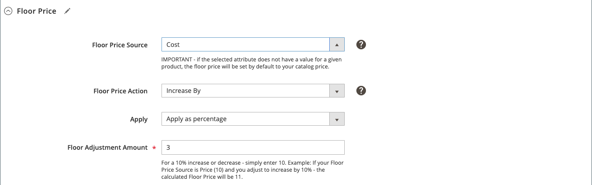

# 智慧重新定價規則：底價

智慧重新定價規則的章節包括：

- [[!UICONTROL Select Rule Type]](./intelligent-repricing-rules.md)
- [[!UICONTROL Competitor Conditional Variances]](./competitor-conditional-variances.md)
- [[!UICONTROL Price Adjustment]](./price-adjustment.md)
- [!UICONTROL Floor Price]
- [[!UICONTROL Optional Ceiling Price]](./optional-ceiling-price.md)

[底價](./floor-price.md)設定會自動保護您的最低產品價格不受智慧定價規則的影響。 使用這些設定為智慧定價規則設定下限（最低價格），確保您的產品不會以低於所需價格的價格列出。

如果您的[!DNL Commerce]商店使用網站定價範圍，則底價屬性會根據網站範圍。 請參閱[價格範圍](./price-scope.md)。

當&#x200B;**[!UICONTROL Rule Type]**&#x200B;設為`Intelligent repricing rule`時，才使用底價。

## 配置底價

在&#x200B;_[!UICONTROL Floor Price]_區段中定義您的最低價格設定。

1. 對於&#x200B;**[!UICONTROL Floor Price Source]**，選擇價格源屬性。

   選擇[!DNL Commerce] [product屬性](https://docs.magento.com/user-guide/catalog/product-attributes.html){target=&quot;_blank&quot;}，以指示您的相對下限。 例如，如果您不希望Amazon清單價格低於項目成本，則可選擇&#x200B;*Cost*&#x200B;屬性。

1. 對於&#x200B;**[!UICONTROL Floor Price Action]**，選擇一個選項。

   - `Decrease By`  — 在列入Amazon之 _[!UICONTROL Floor Price Source]_前，選擇要向下調整定義的值，為規則建立較低的底價。

   - `Increase By`  — 在列入Amazon之 _[!UICONTROL Floor Price Source]_前，選擇要調整定義值的時間，為規則建立較高的底價。

   - `Match`  — 選擇不希望上市價格低於定義值的時 _[!UICONTROL Floor Price Source]_間。設為`Match`時，會停用_[!UICONTROL Apply]_&#x200B;和&#x200B;_[!UICONTROL Floor Adjustment Amount]_欄位。

1. 將&#x200B;**[!UICONTROL Apply]**&#x200B;預設值保留為`Apply as percentage`。

1. 對於&#x200B;**[!UICONTROL Floor Adjustment Price]**，輸入百分比的數值以調整&#x200B;_[!UICONTROL Floor Price Source]_值。

在此範例中，底價設為高於項目成本的3%。

| 欄位 | 說明 |
|--- |--- |
| [!UICONTROL Floor Price Source] | 選擇[!DNL Commerce]屬性，以指示您的相對下限（最低價格）限制。 例如，如果您不希望Amazon清單價格低於項目成本，則會選擇`Cost`屬性。 |
| [!UICONTROL Floor Price Action] | 選擇定價調整活動。 選項：<ul><li>**[!UICONTROL Decrease By]**  — 在列入Amazon之 _[!UICONTROL Floor Price Source]_前，選擇要向下調整定義的值，為規則建立較低的底價。</li><li>**[!UICONTROL Increase By]**  — 在列入Amazon之 _[!UICONTROL Floor Price Source]_前，選擇要調整定義值的時間，為規則建立較高的底價。</li><li>**[!UICONTROL Match]**  — 選擇不希望上市價格低於定義值的時 _[!UICONTROL Floor Price Source]_間。選擇後，將禁用_[!UICONTROL Apply]_&#x200B;和&#x200B;_[!UICONTROL Floor Adjustment Amount]_欄位。</li></ul> |
| [!UICONTROL Apply] | **[!UICONTROL Apply as percentage]**  — 相對於值的百分比調 _[!UICONTROL Floor Price Source]_整。 |
| [!UICONTROL Floor Adjustment Amount] | 輸入百分比的數值以調整&#x200B;_[!UICONTROL Floor Price Source]_值。 |
