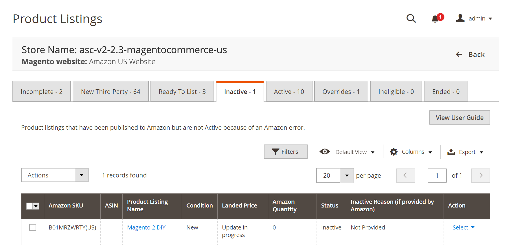

# 非作用中的Amazon清單

此 _[!UICONTROL Inactive]_索引標籤會顯示您已發佈至Amazon但在上未啟用的產品。 [!DNL Amazon Marketplace]. 您的清單可能由於幾個不同原因而處於非使用中狀態。 例如，您可能有資格列出該特定品牌。 非作用中清單取決於Amazon的清單標準和 [!DNL Amazon Seller Central] 帳戶許可權。

在 _[!UICONTROL Actions]_：

- **[!UICONTROL End Listing(s) on Amazon]**：選擇以從移除所有選取的清單 [!DNL Amazon Marketplace]. 另請參閱 [結束Amazon清單](./end-listings-manually.md).

- **[!UICONTROL Edit Listing Overrides]**：選擇以變更清單的覆寫設定。 另請參閱 [覆寫](./overrides.md) 或 [編輯或移除覆寫](./creating-editing-overrides.md#edit-override-single-listing).

在 **[!UICONTROL Select]** 在 _[!UICONTROL Action]_欄：

- **[!UICONTROL View Details]**：選擇檢視清單詳細資訊，包括 [列出活動記錄](./product-listing-details.md#listing-activity-log)， [Buy Box競爭者定價](./product-listing-details.md#buy-box-competitor-pricing)、和 [最低競爭者定價](./product-listing-details.md#lowest-competitor-pricing). 此動作僅供檢視。 清單詳細資料不可變更。 另請參閱 [檢視詳細資料](./product-listing-details.md).

- **[!UICONTROL Create Override]**：選擇建立覆寫並將其套用至此清單。 另請參閱 [建立覆寫](./creating-editing-overrides.md).

- **[!UICONTROL Edit Assigned ASIN]**：選擇以修改指派給目錄產品的ASIN。 如果目錄中的產品符合錯誤的ASIN，則會使用此動作。 另請參閱 [編輯指派的ASIN](./edit-assigned-asin.md).

- **[!UICONTROL Create Alias Seller SKU]**：選擇建立別名SKU （庫存單位），此SKU可用來從相同目錄產品建立Amazon清單。 另請參閱 [建立別名賣家SKU](./create-alias-seller-sku.md).

- **[!UICONTROL Switch to Fulfilled by Amazon/Merchant]**：選擇以變更與訂單相關聯的履行方法。 另請參閱 [設定履行者設定](./fulfilled-by.md#configure-fulfilled-by-settings).

- **[!UICONTROL End Listing]**：選擇以從以下專案移除清單： [!DNL Amazon Marketplace]. 另請參閱 [結束Amazon清單](./end-listings-manually.md).

>[!NOTE]
>
>如果您有處理中的清單，標籤上方會出現一則訊息，指出清單數目。

{width="600" zoomable="yes"}

Amazon sales channel首頁有一些共同之處 [工作區控制項](./workspace-controls.md) 可讓您自訂顯示的資料。

| 欄 | 說明 |
|------------------------------------------------------|--------------------------------------------------------------------------------------------------------------------------------------------------------------------------------------------------------------------------------------------------------------------------------------------------------------------------------------------------------------------------------------------------------------------------------------------------------------------------------------------------------------------------------------------------------------------------------------------------------------------------------------------------------------------------------------|
| [!UICONTROL Amazon Seller SKU] | Amazon指派給產品的SKU （庫存單位），用於識別產品、選項、價格和製造商。 |
| [!UICONTROL ASIN] | 識別專案的10個字母和/或數字的唯一區塊。  ASIN代表Amazon標準識別碼。 ASIN是識別專案的10個字母和/或數字的唯一區塊。 對於書籍，ASIN與ISBN編號相同，但對於所有其他產品，當專案上傳到它們的目錄時會建立新的ASIN。 您可以在Amazon的產品詳細資料頁面上找到專案ASIN，以及與此專案相關的其他詳細資料。 |
| [!UICONTROL Product Listing Name] | 產品的名稱。 |
| [!UICONTROL Condition] | 此 [條件](./product-listing-condition.md) 產品的。 |
| [!UICONTROL Landed Price] | 產品的上市價格加上其送貨價格。 |
| [!UICONTROL Amazon Quantity] | 產品在Amazon上主動列出時的可用數量。 |
| [!UICONTROL Status] | 清單的狀態，由Amazon定義。 |
| [!UICONTROL Inactive Reason (if provided by Amazon)] | Amazon不一定會提供不活躍清單的原因，您可以聯絡客戶支援以解決清單問題。 在某些情況下，Amazon會通知您原因。 若要檢視這些回應，請按一下 **[!UICONTROL View Details]** 在 _[!UICONTROL Action]_欄。 如果這些問題已解決且Amazon移除錯誤，產品會移至_[!UICONTROL Active]_ 標籤。 |
| 動作 | 可套用至特定清單的可用動作清單。 若要套用動作，請按一下 **[!UICONTROL Select]** 在 _[!UICONTROL Action]_欄並選取選項：<ul><li>[[!UICONTROL View Details]](./product-listing-details.md)</li><li>[[!UICONTROL Create Override]](./creating-editing-overrides.md)</li><li>[[!UICONTROL Edit Assigned ASIN]](./edit-assigned-asin.md)</li><li>[[!UICONTROL Create Alias Seller SKU]](./create-alias-seller-sku.md#region-specific)</li><li>[[!UICONTROL Switch to Fulfilled By Amazon/Merchant]](./fulfilled-by.md#configure-fulfilled-by-settings)</li><li>[[!UICONTROL End Listing]](./end-listings-manually.md)</li></ul> |
