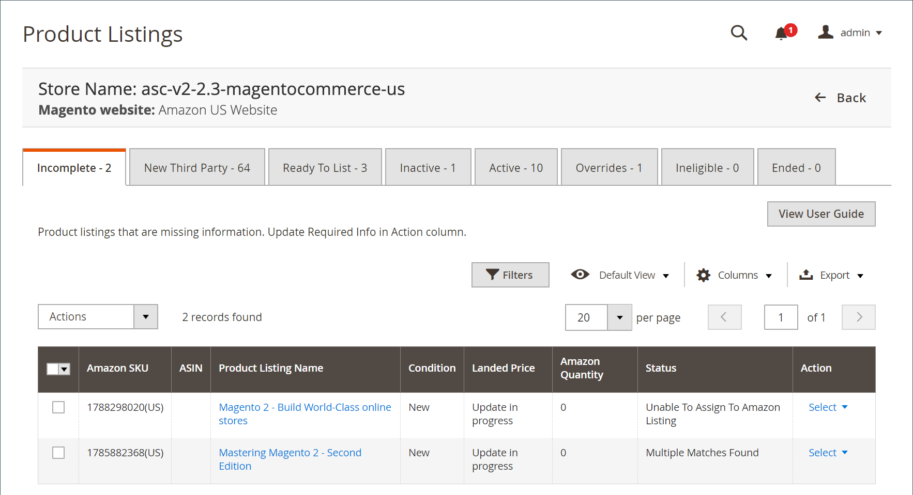

# 不完整的Amazon清單

此 _[!UICONTROL Incomplete]_索引標籤會列出 [!DNL Commerce] 符合您Amazon資格要求的目錄產品(定義於 [清單規則](./listing-rules.md))，但遺失Amazon所需的資訊(例如Amazon ASIN或定義的產品條件)。

清單不完整的可能原因有四種，每種原因都由其狀態來識別。

| 狀態 | 原因 | 動作 |
|--- |--- |--- |
| 缺少條件 | Amazon接受以各種條件列出(例如 _新增_， _整修_， _已使用：如新_)清單需有定義的條件。 | 更新必要資訊並手動 [指派條件](./amazon-manually-update-incomplete-listing.md#update-required-info-missing-condition) 加入清單。 |
| 無法指派至Amazon清單 | 此清單自動比對至您的目錄失敗。 如果找不到相符專案，清單就無法由AmazonSales Channel管理 | 更新必要資訊並手動 [指派ASIN](./amazon-manually-update-incomplete-listing.md#update-required-info-unable-to-assign-to-amazon-listing) 與清單比對的目錄產品。 |
| 找到多個相符專案 | 此清單自動比對至您的目錄失敗。 如果找到多個可能的相符專案，您必須為您的產品選取正確的相符專案。 | 更新必要資訊並手動 [選擇產品相符專案](./amazon-manually-update-incomplete-listing.md#update-required-info-multiple-matches-found) 用於產品和清單。 |
| 具有變體 | 如果您的產品有變體，例如可用不同大小或顏色的T恤，您必須選擇目錄中的變體以正確指派並符合清單 | 更新必要資訊並手動 [選擇正確的變體](./amazon-manually-update-incomplete-listing.md#update-required-info-has-variants) 以指派並比對此清單。 |

>[!NOTE]
>當不完整的清單與您的目錄產品正確比對時，清單會從 _[!UICONTROL Incomplete]_索引標籤和已發佈至Amazon，根據您的 [_[!UICONTROL Product Listing Actions]_](./product-listing-actions.md) 設定。

上的可用動作 _[!UICONTROL Incomplete]_索引標籤包括：

下 _[!UICONTROL Actions]_：

- **[!UICONTROL Re-attempt to auto match to Amazon listings]**：選擇以啟動自動程式，將您的Amazon清單資料與您的 [!DNL Commerce] 目錄。 如果產品未自動比對，請重新造訪您的 [_[!UICONTROL Catalog Search]_](./catalog-search.md) 清單授權中的選項。 如果清單在更新後未自動符合 _[!UICONTROL Catalog Search]_選項，您可以手動比對 [[!UICONTROL Update Required Info]](./amazon-manually-update-incomplete-listing.md#update-required-info-multiple-matches-found) 動作。

下 **[!UICONTROL Select]** 在 _[!UICONTROL Action]_欄：

- **[!UICONTROL Update Required Info]**：選擇清單未自動符合您的目錄時。 您可以手動 [比對目錄產品與清單](./amazon-manually-update-incomplete-listing.md#update-required-info-multiple-matches-found)，手動 [指派ASIN](./amazon-manually-update-incomplete-listing.md#update-required-info-unable-to-assign-to-amazon-listing) 至相符的目錄，或 [指派缺少的條件](./amazon-manually-update-incomplete-listing.md#update-required-info-missing-condition) 以取得清單。

- **[!UICONTROL View Details]**：選擇檢視清單詳細資訊，包括 [列出活動記錄](./product-listing-details.md#listing-activity-log)， [Buy Box競爭者定價](./product-listing-details.md#buy-box-competitor-pricing)、和 [最低競爭者價格](./product-listing-details.md#lowest-competitor-pricing). 此動作僅供檢視。 清單詳細資料無法變更。 另請參閱 [檢視詳細資料](./product-listing-details.md).

>[!NOTE]
>
>如果您有處理中的清單，清單的數量會顯示在標籤上方的訊息中。

{width="600" zoomable="yes"}

Amazon銷售管道首頁有一些共同之處 [工作區控制項](./workspace-controls.md) 可讓您自訂顯示的資料。

| 欄 | 說明 |
|--- |--- |
| [!UICONTROL Amazon Seller SKU] | Amazon指派給產品的SKU （庫存單位），用於識別產品、選項、價格和製造商。 |
| [!UICONTROL ASIN] | 識別專案的10個字母和/或數字的唯一區塊。  ASIN代表 [!DNL Amazon Standard Identification Number]. ASIN是識別專案的10個字母和/或數字的唯一區塊。 對於書籍，ASIN與ISBN編號相同，但對於所有其他產品，當專案上傳到其目錄時會建立新的ASIN。 您可以在Amazon的產品詳細資訊頁面上找到專案ASIN，以及與該專案相關的進一步詳細資訊。 |
| [!UICONTROL Product Listing Name] | 產品的名稱。 |
| [!UICONTROL Condition] | 此 [條件](./product-listing-condition.md) 產品的。 |
| [!UICONTROL Landed Price] | 產品的清單價格加上其送貨價格。 |
| [!UICONTROL Amazon Quantity] | 產品在Amazon上積極列出時的可用數量。 |
| [!UICONTROL Status] | 清單的狀態，由Amazon定義。 請參閱上方的「狀態」表格。 |
| [!UICONTROL Action] | 可套用至特定清單的可用動作清單。 若要套用動作，請按一下 **[!UICONTROL Select]** 在 _[!UICONTROL Action]_欄並選取一個選項：<ul><li>[[!UICONTROL Update Required Info]](./amazon-manually-update-incomplete-listing.md)</li><li>[[!UICONTROL View Details]](./product-listing-details.md)</li></ul> |
