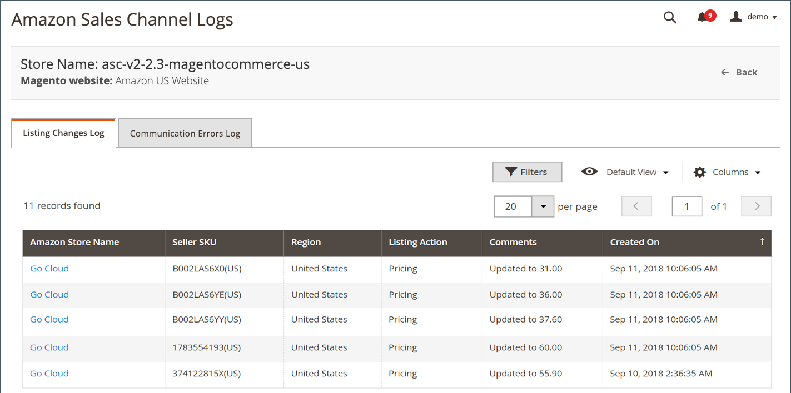

# 列出變更記錄

「清單變更記錄」會顯示您專案中所發生的變更。 [!DNL Amazon Seller Account] 以反映您的Amazon銷售管道設定。 此記錄會指出已在Amazon和Amazon銷售管道之間同步的全域變更。 此記錄包含產品SKU的變更清單，例如動作型別（變更）、變更的簡短說明以及變更日期。

記錄檔沒有可用的動作。 這是僅限稽核的功能。

Amazon銷售管道首頁有一些共同之處 [工作區控制項](./workspace-controls.md) 可讓您自訂顯示的資料。

## 預設欄

| 欄 | 說明 |
|--- |--- |
| [!UICONTROL Amazon Store Name] | 設定Amazon存放區時定義的存放區名稱。 請參閱 [存放區整合](./store-integration.md). |
| [!UICONTROL Seller SKU] | Amazon指派給產品的SKU （庫存單位），用於識別產品、選項、價格和製造商。 |
| [!UICONTROL Listing Action] | 對清單所做的變更型別。 |
| [!UICONTROL Comments] | 有關清單變更的其他資訊。 |
| [!UICONTROL Created On] | 進行變更的日期和時間。 |
