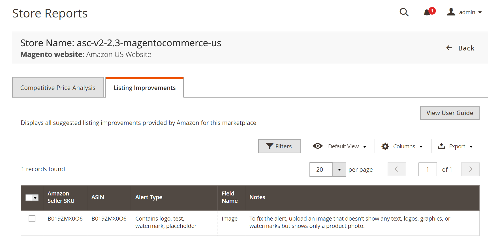

# [!UICONTROL Listing Improvements]

此 [!UICONTROL Listing Improvements] 報表顯示包含Amazon建議以改善清單品質的產品。 您可以檢閱這些建議，以協助提高Amazon清單中產品的效能。 記錄檔沒有可用的動作。 這是僅限稽核的功能。

從Amazon收到的清單改善不會阻止您的產品與Amazon一起列出。

{width="600" zoomable="yes"}

## 預設欄

| 欄 | 說明 |
|--- |--- |
| [!UICONTROL Amazon Seller SKU] | Amazon指派給產品的SKU （庫存單位），用於識別產品、選項、價格和製造商。 |
| [!UICONTROL ASIN] | 識別專案的10個字母和/或數字的唯一區塊。  ASIN代表 [!DNL Amazon Standard Identification Number]. ASIN是識別專案的10個字母和/或數字的唯一區塊。 對於書籍，ASIN與ISBN編號相同，但對於所有其他產品，當專案上傳到其目錄時會建立新的ASIN。 您可以在Amazon的產品詳細資訊頁面上找到專案ASIN，以及與該專案相關的進一步詳細資訊。 |
| [!UICONTROL Alert Type] | 說明清單的問題型別。 例如，「遺失」表示遺失必要屬性。 |
| [!UICONTROL Field Name] | Amazon賣方清單中建議改善的詳細資料欄位名稱。 |
| [!UICONTROL Notes] | 說明從Amazon收到的建議改善。 |
