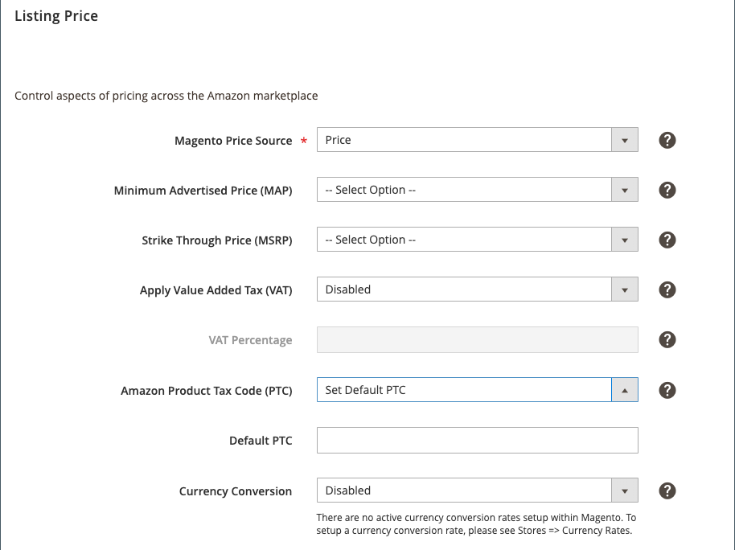

# [!UICONTROL Listing Price]

[!UICONTROL Listing Price] 設定是商店清單設定的一部分。 清單設定可從以下位置存取： [存放區儀表板](./amazon-store-dashboard.md).

這些設定會定義 [!DNL Commerce] 作為價格來源使用的訂價屬性，這是Amazon清單的基底（預設）價格值。 這些設定由您的 [pricing rules （定價規則）](./pricing-rule-general-settings.md) 若要自動調整相對於所設定值的Amazon上市價格 _[!UICONTROL Magento Price Source]_.

您可以設定 [定價範圍](./price-scope.md) 全球或網站。 如果您的定價範圍設為 `Global`，您的所有商店/網站都有一個單一價格來源。 如果您的定價範圍設為 `Website`，價格來源會使用網站價格的遞補邏輯（如果有的話），後面接著預設（全域）價格。

如果清單規則設為套用至多個網站，則使用網站價格的順序會由「 」中定義的網站優先順序設定決定。 [清單規則](./listing-rules.md). 這些規則可讓您定義目錄中的產品定價。 若要檢視您是否使用網站價格範圍，請參閱 [目錄價格範圍](https://experienceleague.adobe.com/docs/commerce-admin/catalog/products/pricing/catalog-price-scope.html).

下列專案中所列的選項 _[!UICONTROL Magento Price Source]_，_[!UICONTROL Minimum Advertised Price (Map)]_、和 _[!UICONTROL Strike Through Price (MSRP)]_包含您設定的「訂價」屬性。 訂價屬性為 [!DNL Commerce] 「商店擁有者」值的「目錄輸入型別」設定為的產品屬性 `Price`. 另請參閱 [屬性輸入型別](https://experienceleague.adobe.com/docs/commerce-admin/catalog/product-attributes/attributes-input-types.html).

## 設定清單價格設定 {#configure-listing-price-settings}

1. 按一下 **[!UICONTROL Listing Settings]** 在商店控制面板上。

1. 展開 _[!UICONTROL Listing Price]_區段。

1. 的 **[!UICONTROL Magento Price Source]** （必要），選擇一個選項。

   預設值為 `Price`. 此設定會決定您Amazon清單所使用的價格來源。 如果您建立 [pricing rules （定價規則）](./pricing-products.md)，則規則會套用至在此處選取的屬性所定義的值。 您可以選取任何已設定的訂價屬性。 不過，若未填入產品的所選屬性，產品的價格來源會預設回 `Price` 套用定價規則以決定公佈的Amazon上市價格時。

1. 適用於**[!UICONTROL Minimum Advertised Price (MAP)**]，選擇一個選項。

   預設為無選取範圍。 此設定可啟用產品的最低廣告價格(MAP)。 當您定義訂價屬性，且產品的清單價格低於您決定的最低價格（根據您的訂價來源與規則）時，此值會成為清單的MAP。 此設定可讓您實作 [pricing rules （定價規則）](./pricing-products.md)，同時仍可控制您產品的最低價格。 若要避免清單價格過低，請選擇訂價屬性做為您的MAP。 不過，如果沒有為產品定義選取的定價欄位，則不會使用MAP。

1. 的 **[!UICONTROL Strike Through Price (MSRP)]**，選擇一個選項。

   預設為無選取範圍。 此設定會決定使用哪個訂價屬性作為產品的製造商建議零售價(MSRP)。 如果您的刊登價格低於定義的MSRP，則會以較低刊登價格的MSRP價格刪除線，連同計算的「您儲存」金額和百分比來顯示您的Amazon刊登價格。 不過，如果沒有為產品定義選取的定價欄位，則不會計算MSRP。

   >[!NOTE]
   >
   >此設定僅適用於已贏取的清單 [Buy Box](./buy-box-competitor-pricing.md) 位置。 此Buy Box由Amazon授予通常以最佳價格列出產品的賣家，以及其他因素，例如提供的FBA/Prime運送、可用性和賣家的績效。

1. 的 **沖銷增值稅(VAT)**，選擇一個選項：

   - `Disabled` - （預設）選擇您不想將VAT套用至價目表價格的時間。

   - `Enabled`  — 選擇您要將加值稅套用至價目表價格的時間。 VAT通常會在歐洲國家/地區作為銷售稅使用，並新增至Amazon中的最終定價。 VAT不適用於智慧型訂價規則中所使用之清單的最終價格，除非 [底價](./floor-price.md) 為點選。

   >[!NOTE]
   >
   >歐盟(EU)的企業必須傳送商業發票給商業採購員，以便客戶可以匯出稅捐。 您可以自行產生這些商業發票並計算稅捐，或使用稅捐計算服務，例如Amazon的「VAT計算服務」。 Amazon建議註冊 [Amazon VAT計算服務](https://sell.amazon.co.uk/learn/vat-resources?ref_=asuk_soa_rd&amp;). 若您選擇不同的方式，則您需負責VAT規定。>
   >
   >Amazon可能需要10到14天的時間來驗證及啟用您的VAT計算服務帳戶。

1. 的 **[!UICONTROL VAT Percentage]**，輸入VAT稅率的值。

   預設值為 `0.00`. 此值用於計算要新增至清單價格的VAT金額。 如果 `10.2` 輸入時，系統會將10.20%的加值稅套用至您的定價。 當「沖銷增值稅(VAT)」欄位設定為時，此欄位會停用 `Disabled`.

1. **（僅限英國商店）** 的 **[!UICONTROL Amazon Product Tax Code (PTC)]**，選擇一個選項：

   - `Do Not Manage PTC` - （預設）選擇您是否使用協力廠商稅捐計算服務，或已在您的系統中設定所有稅捐計算 [!DNL Amazon Seller Central] 帳戶。 一旦選定，Amazon銷售管道就不會傳送任何產品稅捐代碼資訊給您的 [!DNL Amazon Seller Central] 帳戶。

   - `Set Default PTC`  — 選擇您是否要將通用產品稅捐代碼(PTC)用於所有產品。 選擇後，您必須完成 _[!UICONTROL Default PTC]_.

      - 的 **[!UICONTROL Default PTC]**，輸入用於所有合格Amazon清單的預設PTC。 若您的預設PTC設定於 [!DNL Amazon Seller Central] 帳戶，將此欄位留空。 對此欄位進行的變更不會影響現有的Amazon清單。 若要變更現有清單的「預設PTC」，清單必須是 [已結束](./end-listings-manually.md) 並建立新清單。

   >[!NOTE]
   >
   >如果您使用Amazon的「VAT計算服務」，就必須知道產品的稅捐類別。 PTC是Amazon在歐盟購買B2B時的稅捐類別ID代碼。 另請參閱 [Amazon的產品稅捐代碼](https://sellercentral.amazon.com/gp/help/help.html?itemID=G200794510&amp;language=en_US){target="_blank"}.

1. 的 **[!UICONTROL Currency Conversion]**，選擇一個選項。

   預設值為 `Disabled`. 這些選項取決於您的 [!DNL Commerce] [貨幣](https://experienceleague.adobe.com/docs/commerce-admin/config/general/currency-setup.html) 設定。 如果沒有可用選項，請設定您的貨幣設定。

1. 完成後，按一下 **[!UICONTROL Save listing settings]**.

{width="500" zoomable="yes"}

| 欄位 | 說明 |
|---------------------------------------------|------------------------------------------------------------------------------------------------------------------------------------------------------------------------------------------------------------------------------------------------------------------------------------------------------------------------------------------------------------------------------------------------------------------------------------------------------------------------------------------------------------------------------------------------------------------------------------------------------------------------------------------------------------------------------------------------------------------------------------------------------------------------------------------------------------------------------------------------------------------------------------------------------------------------------------------------------------------------------------------------------------------------|
| [!UICONTROL Magento Price Source] | 決定建立Amazon清單時使用的價格來源。 預設值為 `Price`. 如果您選擇其他屬性，例如 `Amazon Price` 或 `Special Price`，屬性的已定義值會用於您的Amazon清單。 但是，如果未定義選取的屬性， `Price` 已使用。 |
| [!UICONTROL Minimum Advertised Price (MAP)] | 此 [!DNL Commerce] MAP定價的屬性。 如果選擇MAP選項，當上市價格低於MAP價格時，系統會自動將您的Amazon上市價格設為MAP價格。 |
| [!UICONTROL Strike Through Price (MSRP)] | 此 [!DNL Commerce] 代表MSRP定價的屬性。 如果您的Amazon上市價格低於MSRP，則會顯示MSRP價格與上市價格的刪除線。 此設定也可用來計算「您儲存」的金額和百分比，但此功能僅適用於已贏得的清單。 [Buy Box](./buy-box-competitor-pricing.md) 位置。 |
| [!UICONTROL Apply Value Added Tax (VAT)] | VAT由歐盟的賣家使用。  選擇 `Disabled` 如果您不想要將VAT加到價目表中。  選擇 `Enabled` 然後輸入「VAT百分比」，以將VAT套用至您的定價。 |
| [!UICONTROL VAT Percentage] | 定義百分比以用來計算Amazon清單中VAT金額的加價金額。   如果您輸入 `5`，則在套用所有訂價規則後，將會以5%的VAT套用至最終的上市價格。 VAT稅捐不適用於智慧型訂價規則中所使用之清單的最終價格，除非 [floor](./floor-price.md) 或 [上限](./optional-ceiling-price.md) 為點選。 |
| [!UICONTROL Amazon Product Tax Code (PTC)] | （僅針對英國商店顯示）決定Amazon銷售管道是否要將產品稅捐代碼資訊傳送至您的 [!DNL Amazon Seller Central] 帳戶。   選取 **不管理PTC** 若您使用協力廠商稅捐計算服務，或已在您的帳號中設定所有稅捐計算 [!DNL Amazon Seller Central] 帳戶。 設定為此選項時，Amazon銷售管道不會傳送任何產品稅捐代碼資訊給您的 [!DNL Amazon Seller Central] 帳戶。  選取 **設定預設PTC** 如果您有通用產品稅捐代碼，則您想要用於所有產品。  另請參閱 [Amazon的產品稅捐代碼](https://sellercentral.amazon.com/gp/help/help.html?itemID=G200794510&amp;language=en_US){target="_blank"}. |
| [!UICONTROL Default PTC] | 僅出現於 **Amazon產品稅捐代碼(PTC)** 設為 `Set Default PTC`. 輸入要用於所有合格Amazon清單的預設PTC。 若您的預設PTC設定於 [!DNL Amazon Seller Central] 帳戶，將此欄位留空。   對此欄位所做的變更不會影響現有清單。 清單必須 [已結束](./end-listings-manually.md) 以及已建立的新清單，讓變更生效。 |
| [!UICONTROL Currency Conversion] | 允許您的 [!DNL Commerce] 店面預設貨幣，以精確轉換為您的預設Amazon貨幣，以適當貨幣發佈您的掛牌價格。 貨幣轉換一律以您的 [!DNL Commerce] 預設貨幣。  您仍可檢視預設值 [!DNL Commerce] 和Amazon貨幣。 若您的預設值 [!DNL Commerce] 貨幣與您預設的Amazon貨幣相符，請停用「貨幣轉換」。  例如，如果您的 [!DNL Commerce] 預設貨幣為CAD （加元），而您的Amazon預設貨幣為USD，您必須啟用「貨幣轉換」並選擇「兌換率CAD轉換為USD」。 提供的選項是根據內建的 [!DNL Commerce] 貨幣轉換。 如果您沒有看見要尋找的選項， [在中設定貨幣 [!DNL Commerce]](https://experienceleague.adobe.com/docs/commerce-admin/stores-sales/site-store/currency/currency-configuration.html). |

**快速存取** - [!UICONTROL Listing Settings] 區段

- [[!UICONTROL Product Listing Actions]](./product-listing-actions.md)
- [[!UICONTROL Third Party Listings]](./third-party-listing-settings.md)
- [[!UICONTROL Listing price]](./listing-price.md)
- [[!UICONTROL (B2B) Business Price]](./business-pricing.md)
- [[!UICONTROL Stock / Quantity]](./stock-quantity.md)
- [[!UICONTROL Fulfilled By]](./fulfilled-by.md)
- [[!UICONTROL Catalog search]](./catalog-search.md)
- [[!UICONTROL Product Listing Condition]](./product-listing-condition.md)
