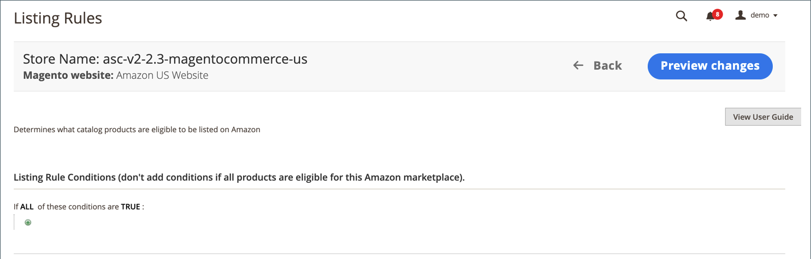
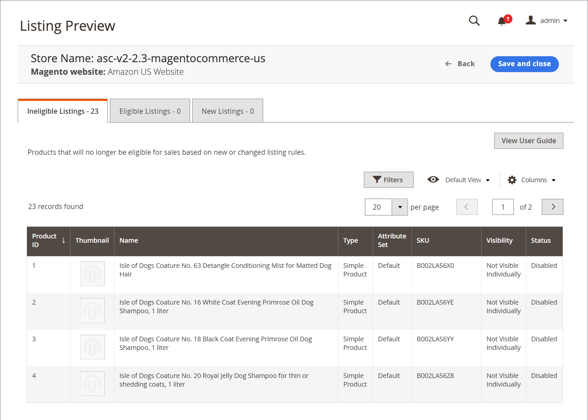

# 上市規則

您可以存取儲存於 [儲存儀表板](./amazon-store-dashboard.md).

上市規則會定義規則，以決定要發佈至Amazon的產品。 這些規則提供許多選項，可建立簡單到複雜的規則，以將產品納入或排除為清單。 每個規則都包含設定產品清單資格要求的條件。

您的上市規則會持續與您的 [!DNL Commerce] 目錄。 新增 [!DNL Commerce] 符合上市規則所設定資格要求的產品，產品會自動處理以於Amazon上市。

- 如果您希望所有產品都發佈至Amazon清單，請勿為上市規則定義任何條件。

- 如果您想要限制發佈至Amazon的目錄產品，請定義清單規則條件。 定義您的Amazon清單規則的條件時，遵循定義 [購物車價格規則](https://docs.magento.com/user-guide/marketing/price-rules-cart.html){target=&quot;_blank&quot;}。

- 如果您的清單規則排除產品，該產品的資格狀態會變更為 `Ineligible`. 不符合資格的產品不會發佈至Amazon。

- 如果Amazon上已列出不符合資格的產品，且您將Amazon清單與 [!DNL Commerce] 目錄產品，Amazon清單的數量變更為 `0` 防止產品銷售。 Amazon清單可以 [手動移除](./end-listings-manually.md).

數量和資格狀態的變更會影響相同地區商店銷售所存在市場中共用Amazon賣方SKU的所有清單(定義於 _[!UICONTROL Amazon Marketplace Country]_期間 [商店整合](./store-integration.md))。 不過，對共用 [!DNL Amazon Seller SKU] 在某個地區，不會影響產品在不同國家/地區的Amazon清單。

## 配置清單規則設定

1. 按一下 **[!UICONTROL Listing Rules]** 在商店控制面板上。

1. 為要在Amazon上列出的產品資格定義您想要的條件。

請參閱 [範例：定義條件](./ob-define-condition-example.md).

| 欄位 | 說明 |
|---|---|
| [!UICONTROL Websites] | 可用的選項取決於 [網站](https://docs.magento.com/user-guide/stores/websites-stores-views.html){target=&quot;_blank&quot;}您已在 [!DNL Commerce] 設定。 針對列於Amazon的合格產品選取網站。 只能選取一個網站，因為每個網站都需要在Amazon銷售管道中建立的唯一Amazon商店。 |
| [!UICONTROL Conditions] | 用於定義 [!DNL Commerce] Amazon地區內產品資格的屬性。 請參閱 [範例：定義條件](./ob-define-condition-example.md). |

## 條件工作區

條件中任何粗體的區域都可點選，以查看各種選項。

- 如果所選網站中的所有產品都符合資格，請勿新增條件。
- 有一組複雜的後端程式可直接與Amazon的系統通訊。 根據您嘗試列出的項目數，以及Amazon系統可能有多忙（例如黑色星期五），您的項目可能需要一些時間才會列在Amazon上。

如需條件的詳細資訊，請參閱 [說明條件](https://docs.magento.com/user-guide/marketing/price-rules-cart.html){target=&quot;_blank&quot;}。

## 清單規則預覽

修改清單規則的條件定義時，您可以按一下 **[!UICONTROL Preview Changes]** 以套用規則變更並檢視清單受到的影響。 在保存清單規則更改之前，驗證此清單預覽功能中的清單。

您的Amazon清單會與您的規則和定義的條件進行比較。 然後，您可以檢閱：

- 哪些產品會根據您目前的 [!DNL Amazon Seller Central] 帳戶
- 哪些產品從不合格狀態移回合格狀態
- 哪些產品是新Amazon清單，並從符合資格的 [!DNL Commerce] 產品

「清單預覽」可讓您預覽潛在的Amazon清單，並對清單規則進行任何必要的調整。

您可能的Amazon清單會填入 _[!UICONTROL Listing Preview]_頁面（位於三個索引標籤之一中）:

- **[!UICONTROL Ineligible Listings]**  — 根據您目前的上市規則和條件，所列產品不符合Amazon上市資格。

   不符合資格的產品不會發佈至Amazon。 如果Amazon上已列出不符合資格的產品，且您將Amazon清單與 [!DNL Commerce] 目錄產品，Amazon清單的數量變更為 `0` 防止產品銷售。 要手動刪除清單，請參閱 [結束Amazon清單](./end-listings-manually.md). 不符合Amazon要求的產品不會列於此處。 這些產品列於 [「非活動清單」頁簽](./inactive-listings.md).

- **[!UICONTROL Eligible Listings]**  — 根據您目前的上市規則及條件，所列產品符合Amazon上市資格，亦符合Amazon規定。 此清單包含您匯入的現有Amazon清單(若您有 **匯入第三方清單** 設為 `Import Listing` in [清單設定](./third-party-listing-settings.md))。

- **[!UICONTROL New Listings]**  — 列出的產品包括 [!DNL Commerce] 根據您目前的上市規則和條件，將新符合Amazon上市資格的產品編目，並建立及發佈新的Amazon清單。

### 檢視清單預覽

1. 按一下 **[!UICONTROL Listing Rules]** 在商店控制面板上。

1. 檢視或新增您的 [清單規則](./listing-rules.md).

1. 修改您的 [清單規則條件](./ob-define-condition-example.md).

1. 按一下 **[!UICONTROL Preview Changes]**.

1. 在 _[!UICONTROL Ineligible Listings]_,_[!UICONTROL Eligible Listings]_，和 _[!UICONTROL New Listings]_標籤。

1. 如果您的清單符合您的期望，請按一下 **[!UICONTROL Save and close]**.

   如果您的清單未如預期顯示，請按一下 **[!UICONTROL Back]** 並修改您的規則和條件，直到清單符合您的期望。

### 列出預覽記錄

| 欄位 | 說明 |
|--- |--- |
| [!UICONTROL Product ID] | 分配給的唯一的連續編號 [!DNL Commerce] 新增目錄產品時。 |
| [!UICONTROL Thumbnail] | 顯示主要產品影像的縮圖。 |
| [!UICONTROL Name] | 在 [!DNL Commerce] [產品網格](https://docs.magento.com/user-guide/catalog/products.html){target=&quot;_blank&quot;}。 |
| [!UICONTROL Type] | 在 [!DNL Commerce] 產品格線。 |
| [!UICONTROL Attribute Set] | 作為產品範本使用的屬性集名稱，在 [!DNL Commerce] 產品格線。 |
| [!UICONTROL SKU] | 分配給產品的唯一庫存保持單位，在 [!DNL Commerce] 產品格線。 |
| [!UICONTROL Visibility] | 指出產品的可見位置，並在 [!DNL Commerce] 產品格線。 選項：<ul><li>`Not visible individually`</li><li>`Catalog`</li><li>`Search`</li><li>`Catalog, Search`</li></ul> |
| 狀態 | 指出產品的狀態，在 [!DNL Commerce] 產品格線。 選項： `Enabled` / `Disabled` |

