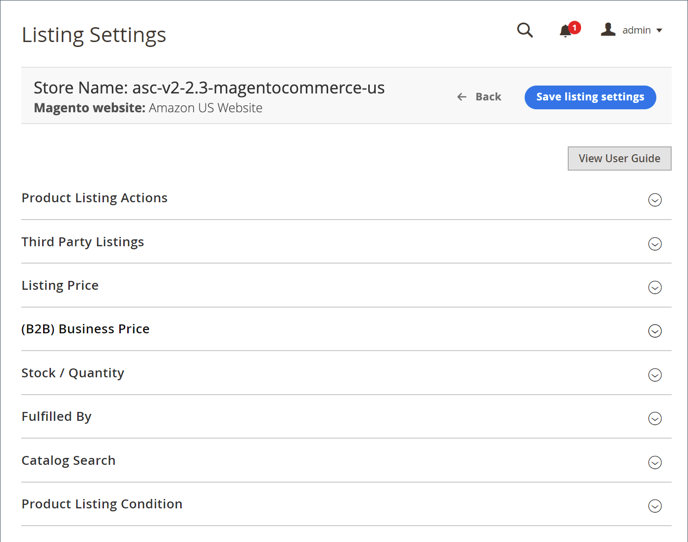

# 檢視清單設定

清單設定可從[存放區儀表板](./amazon-store-dashboard.md)存取。

這些設定會定義您的[!DNL Commerce]目錄產品在Amazon上的列出方式。 您的清單設定包含數個類別，可讓您定義Amazon銷售管道與您個別[!DNL Amazon Seller Central]帳戶之間的互動和通訊。

在設定清單設定時，您可以決定一些基本功能引數：

- 定義您的[!DNL Commerce]目錄產品適用性規則，以自動發佈至Amazon作為新清單
- 根據您的[!DNL Commerce]目錄或競爭者定價設定您的Amazon清單價格
- 定義您的履行方式

展開每個區段，並視需要設定。

## 管理清單設定

1. 檢視存放區[儀表板](./amazon-store-dashboard.md)，然後按一下左側功能表中的&#x200B;**[!UICONTROL Listing Settings]**。

1. 展開每個區段以檢閱及設定您的清單設定。 完成所有必填欄位以繼續。

   - [[!UICONTROL Product Listing Actions]](./product-listing-actions.md)：定義符合資格的[!DNL Commerce]產品是否自動發佈至Amazon，以及出貨的預設處理時間。
   - [[!UICONTROL Third Party Listings]](./third-party-listing-settings.md)：定義是否應該將[!DNL Amazon Seller Account]產品清單匯入您的[!DNL Commerce]目錄。
   - [[!UICONTROL Listing Price]](./listing-price.md)：定義[!DNL Commerce]訂價屬性並設定訂價設定。
   - [[!UICONTROL (B2B) Business Price]](./business-pricing.md)：在向其他企業銷售時，定義您的階層式定價設定。
   - [[!UICONTROL Stock / Quantity]](./stock-quantity.md)：定義存貨管理的存貨管理臨界值。
   - [[!UICONTROL Fulfilled By]](./fulfilled-by.md)\：定義履行訂單的人員。
   - [[!UICONTROL Catalog Search]](./catalog-search.md)：定義您的搜尋引數，以確保將[!DNL Commerce]目錄產品與Amazon產品清單相符的可靠程式。
   - [[!UICONTROL Product Listing Condition]](./product-listing-condition.md)：定義產品「條件」的設定和值。 條件是Amazon所需的產品詳細資料，但您的[!DNL Commerce]目錄產品不需要。

1. 按一下&#x200B;**[!UICONTROL Save]**。

{width="600" zoomable="yes"}
