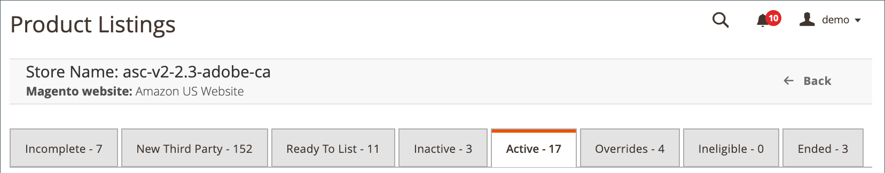

# 依狀態/索引標籤管理產品清單

_[!UICONTROL Product Listings]_頁面包含數個索引標籤，您可從這些索引標籤檢視所有清單的狀態，並將產品與Amazon清單相符。

每個標籤上可用的清單任務稍有不同，但[workspace控制項](./workspace-controls.md)是相同的，允許您自訂顯示清單的資料。

**[!UICONTROL Actions]**&#x200B;下的選項可以將操作應用於多個清單，而&#x200B;_[!UICONTROL Action]_列中&#x200B;**[!UICONTROL Select]**下的選項僅將操作應用於單個清單。

另請參閱[依動作管理清單](./managing-listings-by-action.md)。

| 標籤 | 說明 | 動作 |
|--- |--- |--- |
| [[!UICONTROL Incomplete]](./incomplete-listings.md) | 顯示符合您定義之清單設定的[!DNL Commerce]目錄產品，但缺少Amazon要求的清單資訊。  如果 _[!UICONTROL Automatic List Action]_在您的設 `Automatically List Eligible Products` 定中 [_[!UICONTROL Product Listing Actions]_](./product-listing-actions.md) 設為，這些項目就是您的&#x200B;**[!UICONTROL In Progress Listings]**項目。 | [!UICONTROL Reattempt auto match to Amazon Listing] [[!UICONTROL Update Required Info]](./amazon-manually-update-incomplete-listing.md) [[!UICONTROL View Details]](./product-listing-details.md) |
| [[!UICONTROL New Third Party]](./new-third-party-listings.md) | 顯示與[!DNL Commerce]目錄中的產品不相符的現有Amazon清單(根據從Amazon收到的資訊)。 | [[!UICONTROL Create New Catalog Product(s)]](./creating-assigning-catalog-products.md) 嘗試自動匹配 [[!UICONTROL Assign Catalog Product]](./creating-assigning-catalog-products.md) [[!UICONTROL Create New Catalog Product]](./creating-assigning-catalog-products.md) [[!UICONTROL View Details]](./product-listing-details.md) |
| [[!UICONTROL Ready to List]](./ready-to-list.md) | 顯示已準備好建立Amazon清單的目錄產品，但您的商店設定為不會自動發佈新清單。 此索引標籤可用來手動發佈新清單。  如果 _[!UICONTROL Automatic List Action]_在您的設 `Do Not Automatically List Eligible Products` 定中 [_[!UICONTROL Product Listing Actions]_](./product-listing-actions.md) 設為，這些項目就是您的&#x200B;**[!UICONTROL In Progress Listings]**項目。 | [[!UICONTROL Publish Product to Amazon]](./publish-listings-manually.md) [[!UICONTROL Publish On Amazon]](./publish-listings-manually.md) [[!UICONTROL View Details]](./product-listing-details.md) |
| [[!UICONTROL Inactive]](./inactive-listings.md) | 顯示已發佈至Amazon，但Amazon尚未核准「作用中」狀態清單的目錄產品。 | [ AmazonSwitch上的EndListing(s)](./end-listings-manually.md) [[!UICONTROL Edit Listing Overrides]](./creating-editing-overrides.md) [[!UICONTROL View Details]](./product-listing-details.md) [[!UICONTROL Create Override]](./creating-editing-overrides.md) [[!UICONTROL Edit Assigned ASIN]](./edit-assigned-asin.md) [[!UICONTROL Create Alias Seller SKU]](./create-alias-seller-sku.md#region-specific) 到由Amazon/Merchant履行 [[!UICONTROL End Listing]](./end-listings-manually.md) |
| [[!UICONTROL Active]](./active-listings.md) | 顯示與[!DNL Commerce]目錄中的產品相符、已發佈至Amazon且由Amazon顯示為「作用中」狀態的Amazon清單。 | [[!UICONTROL End Listing(s) on Amazon]](./end-listings-manually.md) [[!UICONTROL Edit Listing Overrides]](./creating-editing-overrides.md) [[!UICONTROL View Details]](./product-listing-details.md) [[!UICONTROL Create Override]](./creating-editing-overrides.md) [[!UICONTROL Edit Assigned ASIN]](./edit-assigned-asin.md) [[!UICONTROL Create Alias Seller SKU]](./create-alias-seller-sku.md#region-specific) 切換至由Amazon/Merchant履行 [[!UICONTROL End Listing]](./end-listings-manually.md) |
| [[!UICONTROL Overrides]](./overrides.md) | 顯示符合已定義覆寫條件且已套用覆寫的Amazon清單。 優先順序高於任何其他帳戶設定。 | [[!UICONTROL Edit Listing Overrides]](./creating-editing-overrides.md) [[!UICONTROL Edit Overrides]](./creating-editing-overrides.md) [[!UICONTROL View Details]](./product-listing-details.md) |
| [[!UICONTROL Ineligible]](./ineligible-listings.md) | 根據您定義的[listing settings](./listing-settings.md)，顯示不再符合資格的現有Amazon清單。 | [[!UICONTROL End Listing(s) on Amazon]](./end-listings-manually.md) [[!UICONTROL Edit Listing Overrides]](./creating-editing-overrides.md) [[!UICONTROL View Details]](./product-listing-details.md) [[!UICONTROL Create Override]](./creating-editing-overrides.md) [[!UICONTROL Edit Assigned ASIN]](./edit-assigned-asin.md) [[!UICONTROL Create Alias Seller SKU]](./create-alias-seller-sku.md#region-specific) 切換至由Amazon/Merchant履行 [[!UICONTROL End Listing]](./end-listings-manually.md) |
| [[!UICONTROL Ended]](./ended-listings.md) | 顯示已從Amazon手動結束（移除）的Amazon清單。 | [[!UICONTROL Publish Product to Amazon]](./publish-listings-manually.md) [[!UICONTROL View Details]](./product-listing-details.md) [[!UICONTROL Publish On Amazon]](./publish-listings-manually.md) [[!UICONTROL Create Alias Seller SKU]](./create-alias-seller-sku.md#region-specific) |

## 存取產品清單

1. 在&#x200B;_Admin_&#x200B;側欄中，前往&#x200B;**[!UICONTROL Marketing]** > _[!UICONTROL Channels]_>**[!UICONTROL Amazon Sales Channel]**。

1. 按一下儲存卡上的&#x200B;**[!UICONTROL View Store]**。

1. 在存放區控制面板上，按一下&#x200B;_[!UICONTROL Store Listings]_區段中的&#x200B;**[!UICONTROL Manage Listings]**。
