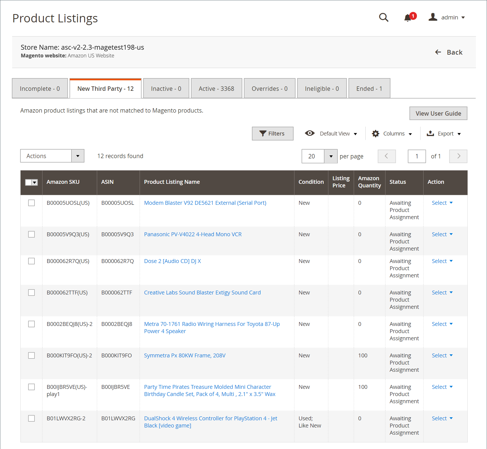

# 新的協力廠商Amazon清單

_[!UICONTROL New Third Party]_索引標籤顯示您現有的Amazon清單，這些清單尚未與您[!DNL Commerce]目錄中的產品相符。 若要針對數量、價格、處理時間等使用清單管理，您的每個Amazon清單都必須與您[!DNL Commerce]目錄中的產品比對（指派）。 您有幾個選項可以將清單指派給您[!DNL Commerce]目錄中的產品。

在&#x200B;_[!UICONTROL Actions]_下：

- **[!UICONTROL Create New Catalog Product(s)]**：選擇使用Amazon清單中的資訊，在您的[!DNL Commerce]目錄中自動建立產品。 此程式會自動比對Amazon清單與新目錄產品。 請參閱[建立和指派目錄產品](./creating-assigning-catalog-products.md)。

- **[!UICONTROL Attempt Automatic Match]**：選擇以根據清單設定中目前的[目錄搜尋](./catalog-search.md)選項，嘗試將選取的清單自動比對到您的目錄。 如果您修改您的&#x200B;_[!UICONTROL Catalog Search]_選項，此動作可讓您再次嘗試比對程式。

在&#x200B;_[!UICONTROL Select]_下：

- **[!UICONTROL Assign Catalog Product]**：選擇手動將清單與[!DNL Commerce]目錄中的產品比對。 請參閱[建立和指派目錄產品](./creating-assigning-catalog-products.md)。

- **[!UICONTROL Create New Catalog Product]**：選擇使用Amazon清單中的資訊，在您的[!DNL Commerce]目錄中自動建立產品。 此程式會自動比對Amazon清單與新目錄產品。 請參閱[建立和指派目錄產品](./creating-assigning-catalog-products.md)。

- **[!UICONTROL View Details]**：選擇檢視清單詳細資料，包括[清單活動記錄](./product-listing-details.md#listing-activity-log)、[Buy Box競爭者定價](./product-listing-details.md#buy-box-competitor-pricing)和[最低競爭者定價](./product-listing-details.md#lowest-competitor-pricing)。 此動作僅供檢視。 清單詳細資料不可變更。 檢視[檢視詳細資料](./product-listing-details.md)。

>[!NOTE]
>
>如果您有處理中的清單，標籤上方會顯示一則訊息，指出清單數目。

{width="600" zoomable="yes"}

Amazon sales channel首頁共用一些常見的[工作區控制項](./workspace-controls.md)，可讓您自訂顯示的資料。

## 預設欄

| 欄 | 說明 |
|---|---|
| [!UICONTROL Amazon Seller SKU] | Amazon指派給產品的SKU （庫存單位），用於識別產品、選項、價格和製造商。 |
| [!UICONTROL ASIN] | 識別專案的10個字母和/或數字的唯一區塊。  ASIN代表[!DNL Amazon Standard Identification Number]。 ASIN是識別專案的10個字母和/或數字的唯一區塊。 對於書籍，ASIN與ISBN編號相同，但對於所有其他產品，當專案上傳到它們的目錄時會建立新的ASIN。 您可以在Amazon的產品詳細資料頁面上找到專案ASIN，以及與此專案相關的其他詳細資料。 |
| [!UICONTROL Product Listing Name] | 產品的名稱。 |
| [!UICONTROL Condition] | 產品的[狀況](./product-listing-condition.md)。 |
| [!UICONTROL Listing Price] | 依價格來源與任何適用的訂價規則所定義，識別料號的上市價格。 |
| [!UICONTROL Amazon Quantity] | 產品在Amazon上主動列出時的可用數量。 |
| [!UICONTROL Status] | 清單的狀態，由Amazon定義。 |
| [!UICONTROL Action] | 可套用至特定清單的可用動作清單。 若要套用動作，請按一下&#x200B;_[!UICONTROL Action]_欄中的&#x200B;**[!UICONTROL Select]**並選擇選項：<ul><li>[[!UICONTROL Assign Catalog Product]](./creating-assigning-catalog-products.md)</li><li>[[!UICONTROL Create New Catalog Product]](./creating-assigning-catalog-products.md)</li><li>[[!UICONTROL View Details]](./product-listing-details.md)</li></ul> |
