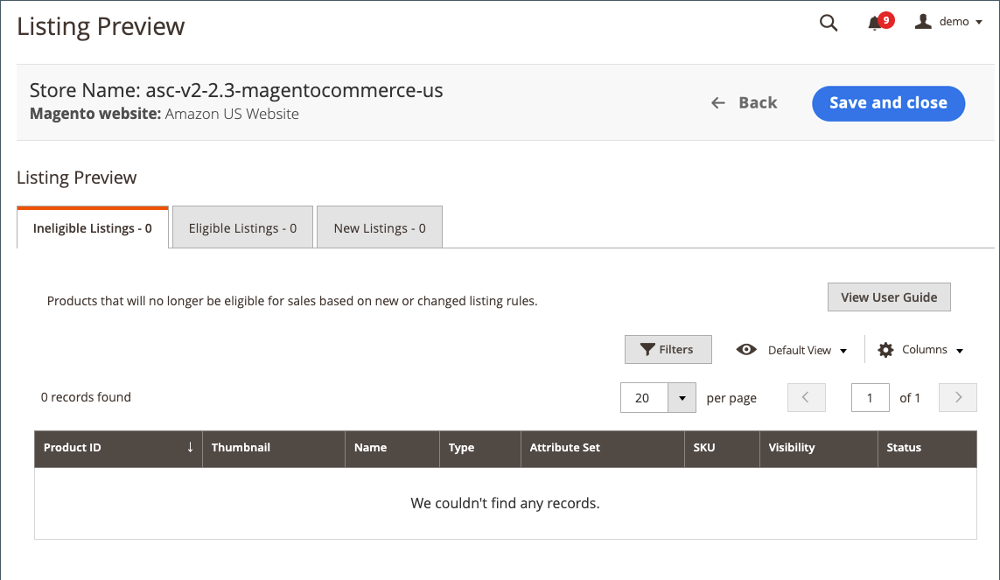

# 建立Amazon清單規則

清單規則可在上線期間定義，但亦可隨時修改。 上線後，您可以在商店[儀表板](./amazon-store-dashboard.md)上存取[清單規則](./listing-rules.md)。

## 上線期間建立清單規則

1. 在連線您的商店後，按一下新增商店的&#x200B;**[!UICONTROL View Store]**。

   存放區[儀表板](./amazon-store-dashboard.md)出現並顯示`No products listed to Amazon`訊息。

1. 按一下&#x200B;**[!UICONTROL Preview and List Eligible Products]**。

   _[!UICONTROL Listing Rules]_頁面隨即顯示。

1. 定義您想要的條件以符合Amazon上列出的產品資格，然後按一下「**[!UICONTROL Preview changes]**」，或按一下「**[!UICONTROL Preview changes]**」以略過此步驟。

   請參閱[範例：定義條件](./ob-define-condition-example.md)。

1. 在「清單預覽」中檢閱您的清單：

   {width="600" zoomable="yes"}

   - **[!UICONTROL Ineligible Listings]** — 根據您目前的清單規則設定，此標籤上列出的產品不符合Amazon清單的資格。

     不符合資格的產品不會發佈至Amazon。 如果不符合資格的產品已經列在Amazon上，並且您將Amazon清單與您的[!DNL Commerce]目錄產品相符，則Amazon清單的數量將變更為`0`以防止產品銷售。 若要從Amazon手動移除清單，請參閱[結束Amazon清單](./end-listings-manually.md)。 不符合Amazon要求的產品在此不列出。 這些產品列在[[!UICONTROL Inactive Listings]標籤](./inactive-listings.md)上。

     若要將`Ineligible`清單變更為`Eligible`清單，請重複此程式並修改您的清單規則。

   - **[!UICONTROL Eligible Listings]** — 根據您目前的清單規則設定，此標籤上列出的產品符合Amazon清單的資格，且符合Amazon的要求。 此索引標籤包含已匯入的現有Amazon清單（如果您在[清單設定](./listing-settings.md)中將&#x200B;**[!UICONTROL Import Third Party Listings]**&#x200B;設定為`Import Listing`）。

   - **[!UICONTROL New Listings]** — 此標籤上列出的產品包含您的[!DNL Commerce]目錄產品，這些產品最近根據您目前的清單規則設定和建立Amazon清單而符合Amazon清單的資格。

1. 完成時，按一下&#x200B;**[!UICONTROL Save and Close]**。

   已開啟存放區[儀表板](./amazon-store-dashboard.md)。

上線商店完成之後，會啟動[!DNL Commerce]與Amazon之間的資訊同步。 您的Amazon清單已匯入至[!DNL Commerce]，並嘗試比對您[!DNL Commerce]目錄中的產品。

您可以在商店儀表板的&#x200B;_[!UICONTROL Recent Orders]_區段中檢視您的Amazon訂單資訊。 檢視[存放區儀表板](./amazon-store-dashboard.md)或[管理訂單](./managing-orders.md)。

>[!IMPORTANT]
>
>有些重要的商店設定（清單、定價、規則、履行等等）具有新商店的預設值。 若要確定您的商店已針對您的特定需求進行設定，請檢閱您的[商店設定](./default-store-settings.md) 。

 [**繼續預設商店設定**](./default-store-settings.md)
