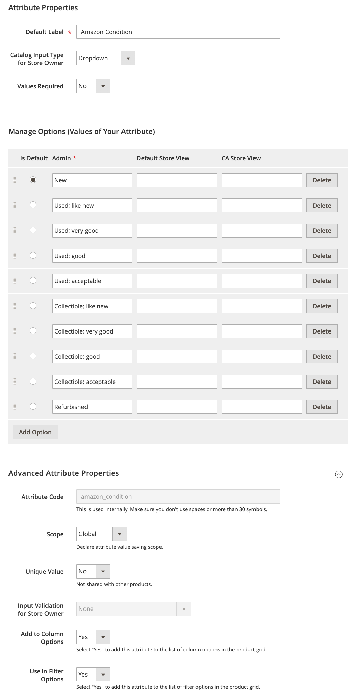

# 為Amazon建立Commerce屬性

上線您的[!DNL Amazon Seller Central]帳戶之前，最佳作法是新增[!DNL Commerce] [產品屬性](https://experienceleague.adobe.com/docs/commerce-admin/catalog/product-attributes/product-attributes.html)以對應您的產品清單。 完成入門後，您可以透過[Amazon銷售管道首頁](./amazon-sales-channel-home.md)頁面的[屬性](./managing-attributes.md)標籤管理您的產品屬性。

這些指示詳細說明如何為Amazon ASIN和Amazon條件建立[!DNL Commerce]屬性。 建議建立其他屬性，包括Amazon EAN、Amazon ISBN和Amazon UPC。 如果您想要使用Amazon上市價格作為定價規則的價格來源，您也可以建立Amazon價格屬性。 在上線期間設定您的清單和定價設定時，會使用這些屬性。 在建立Amazon清單以及更新您的[!DNL Commerce]目錄並將其與您的Amazon清單同步時，也使用這些屬性。

目錄搜尋設定可讓您設定相符的搜尋引數，協助將合格的[!DNL Commerce]產品與Amazon清單對應。 對應後，Amazon會啟動與定價、數量、覆寫以及訂單和產品同步化相關的動作。

定義這些值會增加完全相符的可能性，減少稍後手動相符產品清單的需求。 將屬性加入您上線[預先設定工作](./amazon-pre-setup-tasks.md)中，Amazon銷售管道在上線期間自動比對您產品的可能性較高，並在上線後在Amazon和[!DNL Commerce]之間同步產品資料。

如果您只建立Amazon ASIN屬性（未新增每個產品的ASIN值），則您的[!DNL Commerce]產品可能不會自動符合您的Amazon清單。 您可以透過&#x200B;_商店評論_&#x200B;手動比對您的產品。 不過，手動比對不會建立共用和同步產品資料所需的資料元素。

>[!IMPORTANT]
>
>如果您更新手動比對產品的ASIN、UPC或其他資料元素，則必須更新兩個位置的資料：您的[!DNL Commerce]目錄和[!DNL Amazon Seller Central]帳戶中的清單。

## 建立Amazon ASIN產品屬性

1. 登入您的[!DNL Commerce]管理員。

1. 按一下左側功能表中的&#x200B;**[!UICONTROL Stores]**。

1. 在&#x200B;_[!UICONTROL Attributes]_區段中，按一下&#x200B;**[!UICONTROL Product]**。

1. 若要開啟屬性屬性，請按一下&#x200B;**[!UICONTROL Add New Attribute]**。

1. 針對&#x200B;**[!UICONTROL Default Label]**，輸入`Amazon ASIN` （您屬性的名稱）。

1. 針對&#x200B;**[!UICONTROL Catalog Input Type for Store Owner]**，請選擇`Text Field`。

1. 針對&#x200B;**[!UICONTROL Values Required]**，請選擇`No`。

   雖然在Amazon上列出產品需要Amazon ASIN，但您的部分目錄產品可能未在Amazon上列出。

1. 展開&#x200B;_[!UICONTROL Advanced Attribute Properties]_區段並設定選項：

   - 針對&#x200B;**[!UICONTROL Attribute Code]**，輸入`amazon_asin`。

   - 針對&#x200B;**[!UICONTROL Scope]**，請選擇`Global`。

   - 針對&#x200B;**[!UICONTROL Unique Value]**，請選擇`No`。

   - 針對&#x200B;**[!UICONTROL Input Validation for Store Owner]**，請選擇`None`。

   - 針對&#x200B;**[!UICONTROL Add to Column Options]**，請選擇`Yes`。

   - 針對&#x200B;**[!UICONTROL Use in Filter Options]**，請選擇`Yes`。

1. 按一下&#x200B;**[!UICONTROL Save Attribute]**。

{width="600" zoomable="yes"}

## 建立Amazon條件產品屬性

1. 登入您的[!DNL Commerce]管理員。

1. 按一下左側功能表中的&#x200B;**[!UICONTROL Stores]**。

1. 在&#x200B;_[!UICONTROL Attributes]_區段中，按一下&#x200B;**[!UICONTROL Product]**。

1. 若要開啟屬性屬性，請按一下&#x200B;**[!UICONTROL Add New Attribute]**。

1. 針對&#x200B;**[!UICONTROL Default Label]**，輸入`Amazon Condition` （您屬性的名稱）。

1. 針對&#x200B;**[!UICONTROL Catalog Input Type for Store Owner]**，請選擇`Dropdown`。

   _[!UICONTROL Manage Options (Values of your Attribute)]_區段隨即顯示。

1. 針對&#x200B;**[!UICONTROL Values Required]**，請選擇`No`。

1. 針對&#x200B;**[!UICONTROL Manage Options (Values for your Attribute)]**，新增您的每個條件選項。

   標準Amazon條件包括：

   - `New: Refurbished: Used`
   - `Like New: Used`
   - `Very Good: Used`
   - `Good: Used`
   - `Acceptable: Collectible`
   - `Like New; Collectible`
   - `Very Good: Collectible`
   - `Good: Collectible; Acceptable`

1. 按一下&#x200B;**[!UICONTROL Add Option]**。

1. 針對您想要作為預設選取專案的條件，選取&#x200B;**[!UICONTROL Is Default]**&#x200B;選項。

1. 在&#x200B;_[!UICONTROL Admin]_欄中，輸入您要新增之條件的標籤文字（例如`New`、`Used`和`Used-Like New`）

1. 視需要按一下&#x200B;**[!UICONTROL Add Option]**&#x200B;以新增更多選項。

1. 展開&#x200B;_[!UICONTROL Advanced Attribute Properties]_區段並設定選項。

   - 針對&#x200B;**[!UICONTROL Attribute Code]**，輸入`amazon_condition`。

   - 針對&#x200B;**[!UICONTROL Scope]**，請選擇`Global`。

   - 針對&#x200B;**[!UICONTROL Unique Value]**，請選擇`No`。

   - 針對&#x200B;**[!UICONTROL Input Validation for Store Owner]**，請選擇`None`。

   - 針對&#x200B;**[!UICONTROL Add to Column Options]**，請選擇`Yes`。

   - 針對&#x200B;**[!UICONTROL Use in Filter Options]**，請選擇`Yes`。

1. 按一下&#x200B;**[!UICONTROL Save Attribute]**。

{width="600" zoomable="yes"}

 [**繼續新增或驗證API金鑰**](./amazon-verify-api-key.md)
