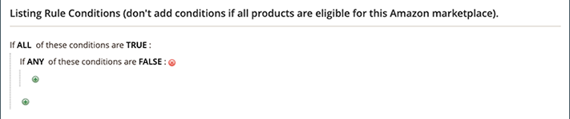
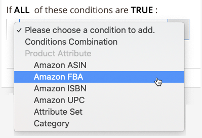

# 範例：定義條件

## 條件

條件中任何粗體的區域都可點選，以查看各種選項。

**如果所選網站中的所有產品都符合資格，請勿新增條件。**

>[!NOTE]
>
>有一組複雜的後端程式可直接與Amazon的系統通訊。 根據您嘗試列出的項目數，以及Amazon系統可能有多忙（例如黑色星期五），您的項目可能需要一些時間才會列在Amazon上。

請參閱[建立購物車價格規則](https://docs.magento.com/user-guide/marketing/price-rules-catalog-create.html){:target=&quot;_blank&quot;}的「條件」區段。

## 定義條件

此程式可能簡單或詳細，視您的目錄設定而定。 您可以設定條件，當定義條件的`ALL`或`ANY`對於產品為`TRUE`或`FALSE`時，產品即有資格列於Amazon。

條件以現有產品屬性值為基礎。 若要將規則套用至所有產品，請將條件區段保留空白。

>[!NOTE]
>
>如果要根據特定產品屬性定義條件，請將屬性的&#x200B;**[!UICONTROL Use for Promo Rule Conditions]**&#x200B;設定設為`Yes`。 您可以在屬性的[Storefront屬性](https://docs.magento.com/user-guide/catalog/product-attributes-add.html){:target=&quot;_blank&quot;}頁面上訪問此設定。

此範例中的規則定義了一個規則，該規則會將Amazon資格設為所有將&#x200B;_Amazon FBA_&#x200B;屬性設為`Yes`的目錄產品。

規則語句有兩個粗體連結，按一下後，該連結將顯示該語句部分的選項。 如果您儲存條件而未變更粗體選項，規則會套用至所有產品。

- 按一下&#x200B;**[!UICONTROL ALL]**&#x200B;並選擇`ALL`或`ANY`。
- 按一下&#x200B;**[!UICONTROL TRUE]**，然後選擇`TRUE`或`FALSE`。
- 若要將規則套用至所有產品，請維持條件不變。

您可以變更這些值的組合，以建立不同的條件。 在此範例中，會使用下列條件：

`If ALL of these conditions are TRUE:`

1. 按一下條件行開頭的「添加」（）表徵圖，並選擇要作為條件基礎的屬性，如條件組合或產品屬性。

   - **[!UICONTROL Conditions Combination]**  — 選擇允許在現有集內建 `All/Any` 立另 `True/False` 一組和條件。

      

   - **[!UICONTROL Product Attribute]**  — 產品屬性取決於屬性的設定。要讓屬性顯示在清單中，必須將其設定為在促銷規則條件中使用。 請參閱[產品屬性](https://docs.magento.com/user-guide/stores/attributes-product.html){target=&quot;_blank&quot;}中的&#x200B;_使用促銷規則條件_。

      在&#x200B;**[!UICONTROL Product Attribute]**&#x200B;下的清單中，選擇要用作條件基礎的屬性。 在此範例中，選取的條件為`Amazon FBA`。

      

      選取的條件會出現在陳述式中，後面接著兩個粗體連結。 選項會依您選取的產品屬性而有所不同。

      設定屬性後，即無法變更。 若要變更屬性，您必須刪除該行並新增新屬性。 您可以按一下條件行結尾的「刪除」（）圖示來刪除條件行。

      1. 按一下&#x200B;**[!UICONTROL is]**&#x200B;並選擇描述產品要滿足條件的比較運算子。

         在此範例中，比較運算子為`is`。 可用選項取決於上一步中選取的屬性。 選項可以包括不同的比較選項，例如匹配值，不包括或包括值中的至少一個，以及大於、等於和小於數值量。 在此範例中，選項為`is`和`is not`。

      1. 按一下&#x200B;**[!UICONTROL ...]**&#x200B;並選擇條件所依據的屬性值。

         選項取決於屬性的設定。 系統可能會提示您選取選項，或輸入條件的文字或數值。 在此範例中，選取的項目為`Yes`。

         所選項將出現在語句中以完成條件。

         
   此條件已完成。 如前所述，此條件表示[!DNL Commerce]目錄中將Amazon FBA屬性設為`Yes`值的任何產品都符合列入Amazon地區和商店的資格。 您可以新增更多條件行，進一步縮小符合條件的產品。

1，若要將另一個條件行新增至陳述式，請返回步驟1並重複此程式，直到所有需要的條件完成為止。

您隨時可以按一下條件陳述式結尾的「刪除」（）圖示來刪除該條件陳述式的一行。
