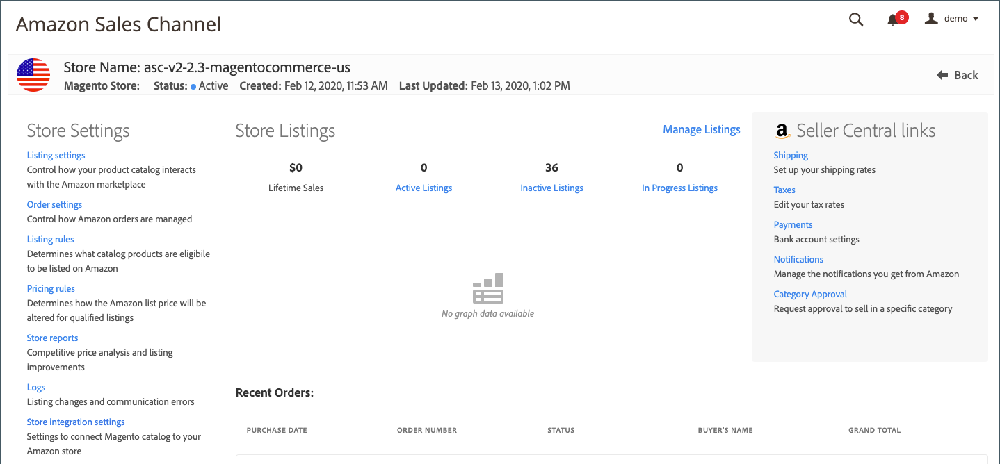

# 檢閱Amazon銷售管道的商店設定

在您建立並整合Amazon銷售管道商店後，請檢閱商店預設設定，以確保您的產品、清單、定價和其他設定正確無誤。

1. 於 _管理員_ 側欄，前往 **[!UICONTROL Marketing]** > _[!UICONTROL Channels]_>**[!UICONTROL Amazon Sales Channel]**.

1. 選取您要檢視的商店，然後按一下 **[!UICONTROL View Store]**.

1. 在商店控制面板上，按一下左側功能表中的商店設定。

   - [**[!UICONTROL Listing settings]**](./listing-settings.md)  — 控制產品目錄與 [!DNL Amazon Marketplace].
   - [**[!UICONTROL Order settings]**](./order-settings.md)  — 控制Amazon訂單的管理方式。
   - [**[!UICONTROL Listing rules]**](./listing-rules.md)  — 定義哪些目錄產品符合在Amazon上列出的資格。
   - [**[!UICONTROL Pricing rules]**](./pricing-products.md)  — 定義合格清單的Amazon定價。
   - **[!UICONTROL Store reports]** - [具競爭力的價格分析](./competitive-price-analysis.md) 和 [清單改善](./listing-improvements.md).
   - **[!UICONTROL Logs]** - [清單變更](./listing-changes-log.md) 和 [通訊錯誤](./communication-errors-log.md).
   - [**[!UICONTROL Store integration setting]s **](./store-integration-settings.md)— 檢閱中的電子郵件和Amazon銷售管道商店名稱設定 [!DNL Commerce] 管理員。

{width="600" zoomable="yes"}
