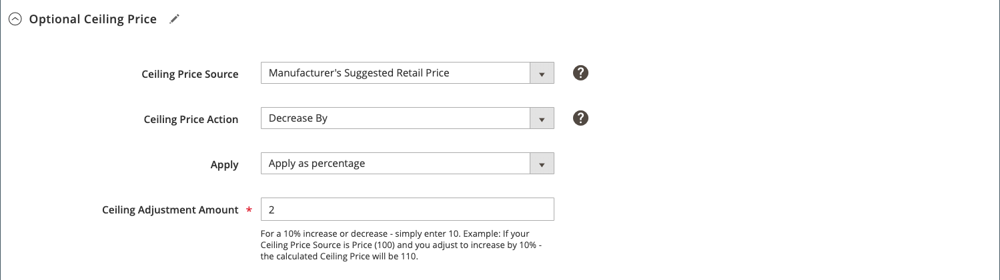

# 智慧型重新訂價規則：選擇性上限價格

智慧型重新訂價規則的區段包括：

- [選取規則型別](./intelligent-repricing-rules.md)
- [競爭者條件差異](./competitor-conditional-variances.md)
- [價格調整](./price-adjustment.md)
- [底價](./floor-price.md)
- 選擇性最高價格

自動上限價格設定會自動根據智慧型訂價規則保護您的最高產品價格，讓您為智慧型訂價規則設定上限（最高價格）。

## 設定可選的上限價格

在「 」中定義您選擇性的最高價格設定 _[!UICONTROL Optional Ceiling Price]_區段。

1. 的 **[!UICONTROL Ceiling Price Source]**，選擇屬性。

   選取您的 [!DNL Commerce] [產品屬性](https://experienceleague.adobe.com/docs/commerce-admin/catalog/product-attributes/product-attributes.html) 表示您的相對上限限制。 例如，如果您不希望Amazon清單價格高於專案的MSRP，您可選擇 `Manufacturer's Suggested Retail Price` 屬性。

1. 的 **[!UICONTROL Ceiling Price Action]**，選擇一個選項。

   - `Decrease By`  — 選擇您想要定義何時 _[!UICONTROL Ceiling Price Source]_值會向下調整，為規則建立較低的上限，然後才列為Amazon。

   - `Increase By`  — 選擇您想要定義何時 _[!UICONTROL Ceiling Price Source]_要調整的值，在列為Amazon之前，為規則建立更高的最高價格。

   - `Match`  — 選擇您不想讓價目表價格波動超過定義的時間 _[!UICONTROL Ceiling Price Source]_值。 當設定為 `Match`，則_[!UICONTROL Apply]_ 和 _[!UICONTROL Ceiling Adjustment Amount]_欄位已停用。

1. 離開 **[!UICONTROL Apply]** 預設為 `Apply as percentage`.

1. 的 **[!UICONTROL Ceiling Adjustment Price]**，輸入百分比的數值，以調整 _[!UICONTROL Ceiling Price Source]_值。

在此範例中，最高價格設定為比料號的MSRP低2%。

{width="600" zoomable="yes"}

| 欄位 | 說明 |
|---------------------------------------|-----------------------------------------------------------------------------------------------------------------------------------------------------------------------------------------------------------------------------------------------------------------------------------------------------------------------------------------------------------------------------------------------------------------------------------------------------------------------------------------------------------------------------------------------------------------------------------------------------------------------------------------------------------------------------------------------------------------------------------------------------------|
| [!UICONTROL Ceiling Price Source] | 選擇 [!DNL Commerce] [產品屬性](https://experienceleague.adobe.com/docs/commerce-admin/catalog/product-attributes/product-attributes.html) 表示您的相對上限限制。 例如，如果您不希望產品清單價格高於專案的MSRP，您可以選擇 `Manufacturer's Suggested Retail Price` 屬性。 |
| [!UICONTROL Ceiling Price Action] | 選擇訂價調整作業。 選項：<ul><li>**[!UICONTROL Decrease By]**  — 選擇您想要定義何時 _[!UICONTROL Ceiling Price Source]_值會向下調整，為規則建立較低的上限，然後才列為Amazon。</li><li>**[!UICONTROL Increase By]**  — 選擇您想要定義何時 _[!UICONTROL Ceiling Price Source]_要調整的值，在列為Amazon之前，為規則建立更高的最高價格。</li><li>**[!UICONTROL Match]**  — 選擇您不想讓價目表價格波動超過定義的時間 _[!UICONTROL Ceiling Price Source]_值。 當設定為 `Match`，則_[!UICONTROL Apply]_ 和 _[!UICONTROL Ceiling Adjustment Amount]_欄位已停用。</li></ul> |
| [!UICONTROL Apply] | **[!UICONTROL Apply as percentage]**  — 相對於 _[!UICONTROL Ceiling Price Source]_值。 |
| [!UICONTROL Ceiling Price Adjustment] | 輸入百分比的數值，以調整您的 _[!UICONTROL Ceiling Price Source]_值。 |
