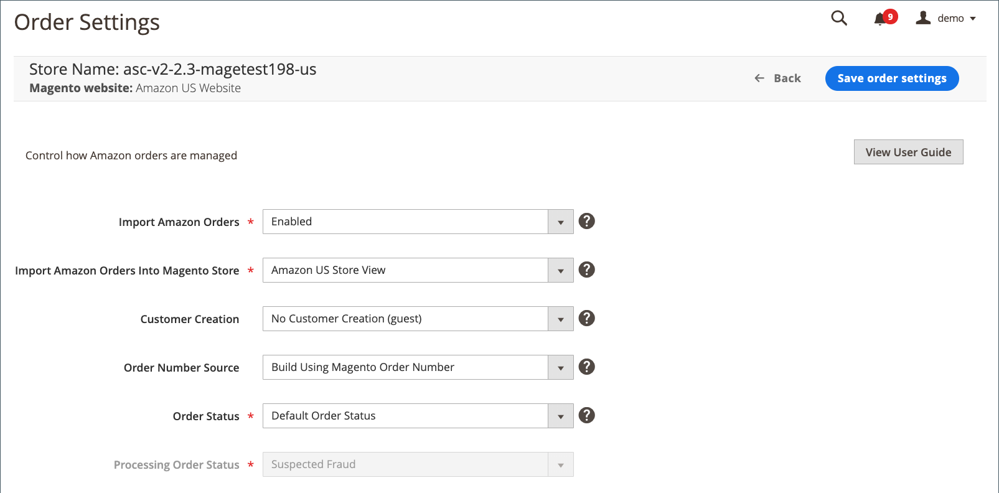

# Amazon訂單設定

訂單設定會定義是否以及如何將Amazon訂單匯入到[!DNL Commerce]中並進行處理，以及可在[商店儀表板](./amazon-store-dashboard.md)上存取。

訂單匯入設定預設為`Enabled`，表示您的Amazon訂單會出現在商店儀表板上，並建立對應的[!DNL Commerce]個訂單。 可以在[!DNL Commerce] [訂單](https://experienceleague.adobe.com/docs/commerce-admin/stores-sales/order-management/orders/orders.html)工作流程中管理匯入的訂單。

>[!NOTE]
>
>無論您的訂單設定為何，系統都不會匯入您商店整合前已有的Amazon訂單。

[商店整合](./store-integration.md)完成後，您可以變更訂單設定。 如果您將訂單設定設為`Disabled`，Amazon訂單會顯示在商店儀表板上，但必須在您的[!DNL Amazon Seller Central]帳戶中進行管理。

在Amazon上建立訂單時，不會立即匯入[!DNL Commerce]。 Amazon會指派`Pending`狀態給新建立的訂單。 在Amazon驗證訂單和付款方式後，訂單的狀態會變更為`Unshipped`。 此狀態變更會觸發訂單匯入，且[!DNL Commerce]會建立相符的對應訂單。

從Amazon匯入的訂單可在[!DNL Commerce] [訂單工作流程](https://experienceleague.adobe.com/docs/commerce-admin/stores-sales/order-management/orders/orders.html)中進行管理。 另請參閱[管理訂單](./managing-orders.md)。

## 配置訂單設定 {#configure-order-settings}

1. 按一下商店儀表板上的&#x200B;**[!UICONTROL Order Settings]**。

1. 針對&#x200B;**[!UICONTROL Import Amazon Orders]** （必要），請選擇選項：

   - `Disabled` — 當您從Amazon收到新訂單時，選擇您不想在[!DNL Commerce]中建立對應的訂單的時間。 選擇後，此頁面上的所有其他欄位都會停用。

   - `Enabled` - （預設）當您從Amazon收到新訂單時，選擇您要建立對應的[!DNL Commerce]訂單。 已根據Amazon狀態和庫存等級建立[!DNL Commerce]個訂單。

     >[!NOTE]
     >
     >匯入Amazon訂單必須設定為`Enabled`，才能在[!DNL Commerce] [訂單](https://experienceleague.adobe.com/docs/commerce-admin/stores-sales/order-management/orders/orders.html)工作流程中管理Amazon訂單。 設定為`Disabled`時，您的Amazon訂單沒有對應的[!DNL Commerce]訂單編號，因此無法在[!DNL Commerce]中管理。 您在您的[!DNL Amazon Seller Central]帳戶中管理這些訂單。

1. 針對&#x200B;**[!UICONTROL Import Amazon Orders Into Magento Store]**，選擇在[!DNL Commerce]中建立對應訂單時，與Amazon訂單相關聯的[!DNL Commerce]存放區。

   當您[新增Amazon市集](./store-integration.md)時，此設定預設為所選網站的市集檢視。 若要變更此設定，選項清單會依據您在設定中設定的[!DNL Commerce]存放區而定。 請參閱[商店](https://experienceleague.adobe.com/docs/commerce-admin/stores-sales/site-store/store-views.html)。

1. 針對&#x200B;**[!UICONTROL Customer Creation]**，選擇一個選項：

   - `No Customer Creation (guest)` - （預設）當您不想使用從Amazon訂單匯入的客戶資料在[!DNL Commerce]中建立客戶帳戶時，請選擇此選項。 選擇後，[!DNL Commerce]處理匯入的Amazon訂單的方式與在[!DNL Commerce]中處理來賓結帳的方式相同。

   - `Build New Customer Account` — 選擇您要使用隨Amazon訂單匯入的客戶資料，在[!DNL Commerce]中建立新客戶帳戶的時間。 此選項可協助您從Amazon訂單建立客戶資料庫。

1. 針對&#x200B;**[!UICONTROL Order Number Source]**，選擇一個選項：

   - `Build Using Magento Order Number` - （預設）當您想要使用[!DNL Commerce]增量指派的訂單ID為對應的Amazon訂單建立唯一的[!DNL Commerce]訂單編號時，請選擇此選項。

   - `Build Using Amazon Order Number` — 選擇您要使用對應的Amazon指派訂單編號來建立[!DNL Commerce]訂單編號的時間。

   >[!NOTE]
   >
   >匯入訂單後，Amazon訂單編號會顯示在商店控制面板的&#x200B;_[!UICONTROL Recent Orders]_清單中。 在[!DNL Commerce] [訂單](https://experienceleague.adobe.com/docs/commerce-admin/stores-sales/order-management/orders/orders.html)工作區中檢視訂單詳細資料時，會顯示[!DNL Commerce]訂單編號。

1. 針對&#x200B;**[!UICONTROL Order Status]** （必要），請選擇選項：

   - `Default Order Status` - （預設）選擇何時要將從Amazon匯入的新建立訂單指派給您定義的新訂單預設訂單狀態。 新訂單的預設狀態（除非您已為新訂單建立自訂訂單狀態）為`Pending`。 請參閱[處理訂單](https://experienceleague.adobe.com/docs/commerce-admin/stores-sales/order-management/orders/order-processing.html#process-an-order)。

   - `Custom Order Status` — 選擇何時要將從Amazon匯入的新建立訂單指派給預設以外的狀態。

   - `Processing Order Status` — 當&#x200B;**[!UICONTROL Order Status]**&#x200B;設定為`Custom Order Status`時啟用。 選擇您要用於從Amazon匯入之新建立訂單的狀態。 此欄位中的選項是根據[!DNL Commerce]中的預設狀態選項。 檢視[訂單狀態](https://experienceleague.adobe.com/docs/commerce-admin/stores-sales/order-management/orders/order-status.html)。 您也可以建立自訂訂單狀態，顯示於此處以供選取。 若要建立自訂訂單狀態，請參閱[自訂訂單狀態](https://experienceleague.adobe.com/docs/commerce-admin/stores-sales/order-management/orders/order-status.html#custom-order-status)。

1. 完成時，按一下&#x200B;**[!UICONTROL Save order settings]**。

{width="600" zoomable="yes"}

| 欄位 | 說明 |
|------------------------------------------------------|-------------------------------------------------------------------------------------------------------------------------------------------------------------------------------------------------------------------------------------------------------------------------------------------------------------------------------------------------------------------------------------------------------------------------------------------------------------------------------------------------------------------------------------------------------------------------------------------------------------------------------------------------------------------------------------------------------------------------------------------------------------------------------------------------------------|
| [!UICONTROL Import Amazon Orders] | 選項：<ul><li>**[!UICONTROL Disabled]** — 當您從Amazon收到新訂單時，選擇您不想在[!DNL Commerce]中建立對應的訂單的時間。 選擇後，此頁面上的所有其他欄位都會停用。</li><li>**[!UICONTROL Enabled]** - （預設）當您從Amazon收到新訂單時，選擇您要建立對應的[!DNL Commerce]訂單。 已根據Amazon狀態和庫存等級建立[!DNL Commerce]個訂單。</li></ul>必須選擇  `Enabled`才能在[!DNL Commerce]中管理Amazon訂單。 選擇`Disabled`時，您的Amazon訂單會顯示在商店儀表板上，但訂單必須在您的[!DNL Amazon Seller Central]帳戶中進行管理。 |
| [!UICONTROL Import Amazon Orders Into Magento Store] | 選擇在[!DNL Commerce] [訂單](https://experienceleague.adobe.com/docs/commerce-admin/stores-sales/order-management/orders/orders.html)工作區中建立Amazon訂單時，與哪個[!DNL Commerce]商店建立關聯。 當您[新增Amazon市集](./store-integration.md)時，此設定預設為所選[!DNL Commerce]網站的市集檢視。 若要變更此設定，選項清單會依據您在設定中設定的[!DNL Commerce]存放區而定。 請參閱[商店](https://experienceleague.adobe.com/docs/commerce-admin/stores-sales/site-store/stores.html)。 |
| [!UICONTROL Customer Creation] | 選項：<ul><li>**[!UICONTROL No Customer Creation (guest)]** - （預設）當您不想使用從Amazon訂單匯入的客戶資料在[!DNL Commerce]中建立客戶帳戶時，請選擇此選項。 選擇此選項後，此選項會通知[!DNL Commerce]以處理訪客結帳的方式處理匯入的Amazon訂單。</li><li>**[!UICONTROL Build New Customer Account]** — 選擇您要在何時使用隨Amazon訂單匯入的客戶資料，在您的[!DNL Commerce]客戶資料庫中建立新的客戶帳戶。 此選項可協助您根據您的Amazon訂單建立您的[!DNL Commerce]客戶資料庫。</li></ul> |
| 訂單編號Source | 選項：<ul><li>**[!UICONTROL Build Using Magento Order Number]** - （預設）當您想要使用[!DNL Commerce]增量指派的訂單ID為對應的Amazon訂單建立唯一的[!DNL Commerce]訂單編號時，請選擇此選項。 </li><li>**使用Amazon訂單編號建立** — 選擇您要使用對應的Amazon指派訂單編號建立[!DNL Commerce]訂單編號的時間。</li></ul> |
| 待處理訂單 | 選項：<ul><li>**[!UICONTROL Do Not Reserve Quantity]** — 當您不想讓[!DNL Commerce]庫存數量受到您的Amazon訂單影響時，請選擇此選項。 選擇您是否將Amazon用於履行流程(FBA)。 當您選擇並收到Amazon訂單時，訂購數量不會影響您的[!DNL Commerce]庫存數量。</li><li>**[!UICONTROL Reserve Quantity]** — 選擇您希望Amazon訂單中的訂單數量在您的[!DNL Commerce]庫存數量中為「預留」的時間。 當您選擇並收到Amazon訂單時，訂購的數量將「預留」在您的[!DNL Commerce]庫存數量中，以防止您的[!DNL Commerce]庫存「過度銷售」。 「預留」數量無法透過您的[!DNL Commerce]店面購買。</li></ul> |
| [!UICONTROL Order Status] | 選項：<ul><li>**[!UICONTROL Default Order Status]** - （預設）選擇何時要將從Amazon匯入的新建立訂單指派給新訂單的預設訂單狀態。 新訂單的預設狀態（除非您已為新訂單建立自訂訂單狀態）為`Pending`。 請參閱[處理訂單](https://experienceleague.adobe.com/docs/commerce-admin/stores-sales/order-management/orders/order-processing.html#process-an-order)。</li><li>**[!UICONTROL Custom Order Status]** — 選擇何時要將從Amazon匯入的新建立訂單指派給預設以外的狀態。 選擇後，**[!UICONTROL Processing Order Status]**&#x200B;可讓您選擇要用於從Amazon匯入之新建立訂單的狀態。</li></ul> |
| [!UICONTROL Processing Orders Status] | 當&#x200B;_[!UICONTROL Order Status]_設定為`Custom Order Status`時啟用。 選擇您要指定給新訂單的訂單狀態。 此欄位中的選項取決於[!DNL Commerce]中的預設狀態選項。 檢視[訂單狀態](https://experienceleague.adobe.com/docs/commerce-admin/stores-sales/order-management/orders/order-status.html)。 您也可以建立自訂訂單狀態以顯示於此處。 若要建立自訂訂單狀態，請參閱[自訂訂單狀態] |

## [!DNL Commerce]訂單建立

根據下列狀態和存貨條件，為Amazon訂單建立[!DNL Commerce]個訂單。

### 使用Inventory management建立訂單

>[!NOTE]
>
>僅支援Adobe Commerce和Magento Open Source 2.3.x的整合。

| 履行管道 | [!DNL Commerce]詳細目錄狀態 | Amazon訂單狀態 | [!UICONTROL Create Magento Order]設定 | 庫存預留 |
|---------------------|-------------------------------------------|---------------------|-------------------------------------------|--------------------|
| FBA | 缺貨 缺貨 不管理 | 擱置中 | 否 | 否 |
| FBA | 缺貨 缺貨 不管理 | 擱置可用性 | 否 | 否 |
| FBA | 缺貨 缺貨 不管理 | 已取消 | 否 | 否 |
| FBA | 缺貨 缺貨 不管理 | 錯誤 | 否 | 否 |
| FBA | 缺貨 缺貨 不管理 | 未送出 | 否 | 否 |
| FBA | 缺貨 缺貨 不管理 | 已部分出貨 | 否 | 否 |
| FBA | 有庫存 不管理 | 已送出 | 是 | 否 |
| FBA | 無庫存 | 已送出 | 否 | 否 |
| FBM | 缺貨 缺貨 不管理 | 擱置中 | 否 | 否 |
| FBM | 缺貨 缺貨 不管理 | 擱置可用性 | 否 | 否 |
| FBM | 缺貨 缺貨 不管理 | 已取消 | 否 | 否 |
| FBM | 缺貨 缺貨 不管理 | 錯誤 | 否 | 否 |
| FBM | 有庫存 不管理 | 未送出 | 是 | 是 |
| FBM | 無庫存 | 未送出 | 否 | 否 |
| FBM | 有庫存 不管理 | 已部分出貨 | 是 | 是 |
| FBM | 無庫存 | 已部分出貨 | 否 | 否 |
| FBM | 有庫存 不管理 | 已送出 | 是 | 是 |
| FBM | 無庫存 | 已送出 | 否 | 否 |

>[!NOTE]
>如果Amazon訂單是以`Partially Shipped`或`Shipped`狀態匯入，則建立的存貨預留是針對訂單中的所有專案。 Amazon sales channel不會補償先前已出貨的專案。
>
>如果訂單已由Amazon (FBA)履行，但專案處於`out of stock`狀態，[!DNL Commerce]無法建立對應的訂單。 這是Inventory management整合的限制。
