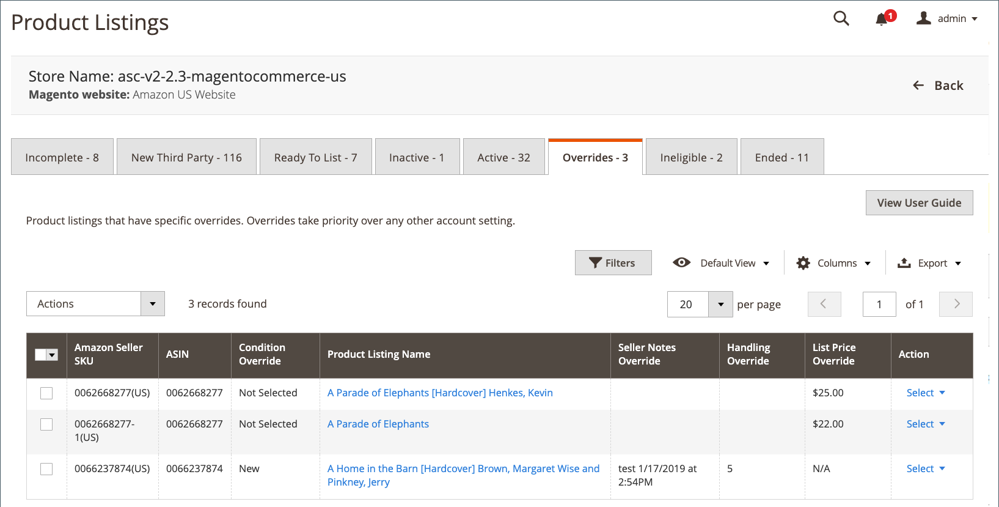

# 覆寫

此 _[!UICONTROL Overrides]_索引標籤會顯示您已套用覆寫的Amazon清單。 覆寫是清單特定的設定，可用來將定義的值設定為清單。 套用至清單的覆寫會定義清單的設定，無論其他已定義的清單設定或清單適用的規則為何。 當覆寫套用至清單時，該清單會出現在_[!UICONTROL Overrides]_ 標籤。 覆寫中定義的值會出現在清單的適當欄中。 有四種覆寫型別可以套用：價格、處理時間、條件和賣家備註。

## 覆寫型別

| 型別 | 說明 |
|---|---|
| 價格 | 設定清單價格的覆寫，略過清單的所有其他價格設定。   **範例**：您已定義20%折扣價格規則，此規則會套用至目錄之特定類別中的所有產品。 您有新產品，而且需求量高，因此即使產品屬於該類別，您也不希望將折扣價格套用至清單。 您可以選取清單， [建立價格覆寫](./creating-editing-overrides.md#edit-override-single-listing)，並在價格覆寫中定義清單價格。 |
| 處理時間 | 設定清單處理時間的覆寫，忽略清單設定中設定的預設處理時間。  **範例**：您清單的預設處理時間設為2天。 您的產品很脆弱，需要額外的一天時間才能確保運送時的特殊包裝。 您可以檢視清單， [建立處理時間覆寫](./creating-editing-overrides.md#edit-override-single-listing)，並將處理時間定義為三天。  **注意：** 不可用於設定為的產品 `Fulfilled by Amazon`. |
| 條件 | 設定清單之條件值的覆寫，無論指派給清單的條件屬性為何。  **範例**：目錄中的大部分產品都是新狀態，但您的產品處於翻新狀態。 您可以檢視清單， [建立條件覆寫](./creating-editing-overrides.md#edit-override-single-listing)，並定義清單的「整修」條件。  **注意：** 不可用於設定為的產品 `Fulfilled by Amazon`. |
| 賣家備註 | 定義 _賣家備註_ 區段。 此欄位可用於新增與產品或套用覆寫相關的其他資訊，通常用於說明「非新」產品的條件。 此欄位中的文字會顯示購物者的清單。 無法為條件值為的清單新增賣家備註 `New`.   **範例**：您有個產品正在使用 `Refurbished` 條件。 一般而言，在此狀況下的產品不包含任何手冊或檔案，但您對此產品有不同的供應商，其中包括手冊。 您可以檢視清單， [建立賣家筆記覆寫](./creating-editing-overrides.md#edit-override-single-listing)，並新增此手冊清單獨有的文字備註，讓購物者知道手冊包含在內。  **注意**：如果產品有一個已定義的條件 `New`，您可以輸入賣家備註覆蓋，但Amazon不會顯示賣家備註的 `New` 產品。 |

您可以建立、編輯或移除的覆寫 [單一清單](./creating-editing-overrides.md#edit-override-single-listing). 於 _[!UICONTROL Inactive]_，_[!UICONTROL Active]_、和 _[!UICONTROL Ineligible]_標籤，您可以按一下&#x200B;**[!UICONTROL Select]**在_[!UICONTROL Action]_ 欄並選擇 **[!UICONTROL Create Override]**. 此 _[!UICONTROL Edit Overrides]_動作僅適用於已套用覆寫並在以下位置檢視的清單：_[!UICONTROL Overrides]_ 標籤。

您也可以建立、編輯或移除覆寫 [多個清單](./creating-editing-overrides.md#edit-override-multiple-listings). 於 _[!UICONTROL Inactive]_，_[!UICONTROL Active]_、和 _[!UICONTROL Ineligible]_標籤，您可以按一下&#x200B;**[!UICONTROL Select]**在_[!UICONTROL Action]_ 欄並選擇 **[!UICONTROL Edit Listing Overrides]**.

移除覆寫會讓清單使用清單設定和規則所定義的值。

定義覆寫時，您也可以選擇輸入單一型別的覆寫或任一型別的組合。

另請參閱 [建立和編輯覆寫](./creating-editing-overrides.md).

>[!NOTE]
>
>如果您有處理中的清單，清單數量會顯示在標籤上方的訊息中。

Amazon銷售管道首頁有一些共同之處 [工作區控制項](./workspace-controls.md) 可讓您自訂顯示的資料。

## 預設欄

| 欄 | 說明 |
|---|---|
| [!UICONTROL Amazon Seller SKU] | Amazon指派給產品的SKU （庫存單位），用於識別產品、選項、價格和製造商。 |
| [!UICONTROL ASIN] | 識別專案的10個字母和/或數字的唯一區塊。  ASIN代表Amazon標準識別碼。 ASIN是識別專案的10個字母和/或數字的唯一區塊。 對於書籍，ASIN與ISBN編號相同，但對於所有其他產品，當專案上傳到其目錄時會建立新的ASIN。 您可以在Amazon的產品詳細資訊頁面上找到專案ASIN，以及與該專案相關的進一步詳細資訊。 |
| [!UICONTROL Condition Override] | 覆寫中定義的新條件。 如果套用至清單的覆寫不是條件覆寫， `Not Selected` 會顯示在此欄中。 |
| [!UICONTROL Product Listing Name] | 產品的名稱。 |
| [!UICONTROL Seller Notes Override] | 覆寫中定義的新賣家備註。 如果套用至清單的覆寫不是這種覆寫型別，則此欄為空白。 |
| [!UICONTROL Handling Override] | 覆寫中定義的新處理時間（以天為單位）。 如果套用至清單的覆寫不是處理時間覆寫，則此欄為空白。 |
| [!UICONTROL List Price Override] | 覆寫中定義的新上市價格。 如果套用至清單的修訂不是價格修訂， `N/A` 會顯示在此欄中。 |
| [!UICONTROL Action] | 可套用至特定清單的可用動作清單。 若要套用動作，請在 _[!UICONTROL Action]_欄，按一下&#x200B;**[!UICONTROL Select]**並選擇一個選項：<ul><li>[[!UICONTROL Edit Overrides]](./creating-editing-overrides.md#edit-override-single-listing)</li><li>[[!UICONTROL View Details]](./product-listing-details.md)</li></ul> |
