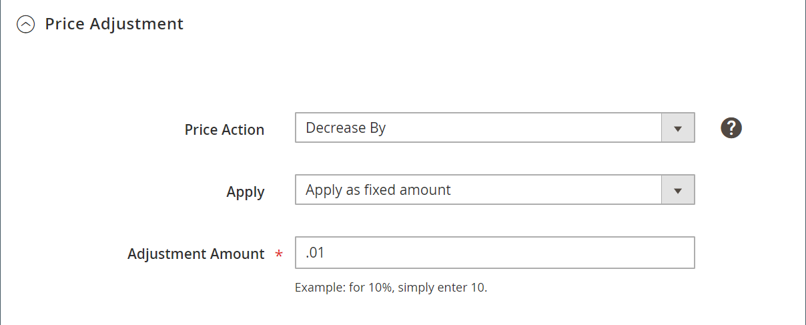

# 價格調整

>[!NOTE]
>
>「價格調整」區段與「標準」和「智慧型」重新定價規則略有不同。 **[!UICONTROL Match Competitor Price]** 僅可在 _[!UICONTROL Price Action]_when **[!UICONTROL Rule Type]**設為 `Intelligent repricing rule`.

智慧重新定價規則的章節包括：

- [選擇規則類型](./intelligent-repricing-rules.md)
- [競爭者條件差異](./competitor-conditional-variances.md)
- 價格調整
- [最低價格](./floor-price.md)
- [可選最高價格](./optional-ceiling-price.md)

價格調整會在您確定競爭者價格來源時定義價格計算。

## 配置價格調整

在 _[!UICONTROL Price Adjustment]_區段。

1. 針對 **[!UICONTROL Price Action]**，選擇選項：

   - `Decrease By`  — 選擇在將定義的價格來源值下調後，為規則建立較低的價格，然後再將其上市至Amazon。

   - `Increase By`  — 選擇何時要調整定義的價格來源值，為規則建立較高的價格，然後再上市至Amazon。

   - `Match Competitor Price`  — （僅限智慧型重新定價規則）選擇您要變更Amazon上市價格以符合 [最低競爭者](./lowest-competitor-pricing.md) 價格，根據您的競爭者意見和變異參數。 設為時 `Match Competitor Price`, _[!UICONTROL Apply]_和_[!UICONTROL Adjustment Amount]_ 欄位已移除。

1. 針對 **[!UICONTROL Apply]**，選擇選項：

   - `Apply as percentage`  — 選擇要定義的時間 **[!UICONTROL Magento Price Source]** 定義於 [上市價](./listing-price.md) 百分比調整。

   - `Apply as fixed amount`  — 選擇要定義的時間 **[!UICONTROL Magento Price Source]** 定義於 [上市價](./listing-price.md) 以固定金額調整。

1. 針對 **[!UICONTROL Adjustment Amount]** （必要），輸入價格調整的數值。

   - 當 **[!UICONTROL Apply]** 設為 `Apply as percentage`，請輸入百分比值(範例：輸入 `25` 25%的調整)。

   - 當 **[!UICONTROL Apply]** 設為 `Apply as fixed amount`，輸入固定金額的數值(例如：輸入 `25` 25美元固定調整)。

| 欄位 | 說明 |
|---|---|
| [!UICONTROL Price Action] | 選擇定價調整活動。 選項： **[!UICONTROL Decrease By]**— 選擇要定義的時間 _[!UICONTROL Magento Price Source]_定義於 [上市價](./listing-price.md) 在上市至Amazon之前，先向下調整，為規則創造較低價格。 **[!UICONTROL Increase By]**— 選擇要定義的時間_[!UICONTROL Magento Price Source]_ 定義於 [上市價](./listing-price.md) 以調整，在上市至Amazon之前，為規則創造更高價格。 **[!UICONTROL Match Competitor Price]**— （僅限智慧型重新定價規則）選擇您要變更Amazon上市價格以符合 [最低競爭者](./lowest-competitor-pricing.md) 價格，根據您的競爭者意見和變異參數。 選擇後， _套用_ 和 _調整金額_ 欄位已移除。 |
| [!UICONTROL Apply] | 選項： **[!UICONTROL Apply as percentage]**— 選擇要定義的時間 _[!UICONTROL Magento Price Source]_定義於 [上市價](./listing-price.md) 百分比調整。 **[!UICONTROL Apply as fixed amount]**— 選擇要定義的時間_[!UICONTROL Magento Price Source]_ 定義於 [上市價](./listing-price.md) 以固定金額調整。 |
| [!UICONTROL Adjustment Amount] | 必填。 如果您選擇 `Apply as percentage` for **[!UICONTROL Apply]**，請輸入百分比值(範例：輸入 `25` 25%的調整)。 如果您選擇 `Apply as fixed amount` for **[!UICONTROL Apply]**，輸入固定金額的數值(例如：輸入 `25` 25美元固定調整)。 |
