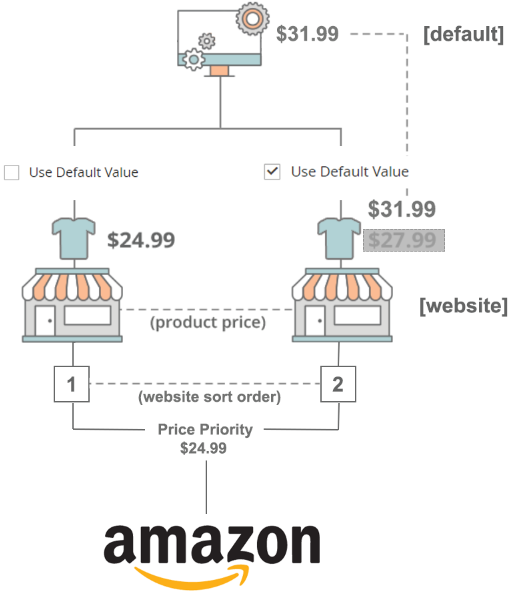

# 價格優先順序邏輯

在以下範例中，系統如何判斷您應發佈$31.99、$24.99或$27.99?

若要在兩個網站上使用產品且每個網站的價格不同時，決定使用的價格，請使用價格優先順序邏輯(由 [排序順序](https://docs.magento.com/user-guide/stores/stores-all-create-view.html){target="_blank"} 值)。

要查看商店的排序順序，請轉至 **[!UICONTROL Stores]** > **[!UICONTROL All Stores]** 在 _管理_ 邊欄。 在 _[!UICONTROL Web Site]_欄，按一下網站名稱。 此_[!UICONTROL Web Site Information]_ 頁面顯示 _[!UICONTROL Sort Order]_為網站設定，決定網站的優先順序。 值 `1` 表示最高優先順序。

如果產品價格設為 `Use Default`，則會回復為預設價值，而非網站價值。

## 範例1

|  | 網站優先順序 | 價格（網站） | 使用預設值 |
|---|---|---|---|
| 預設 | 0 | $31.99 | -- |
| 商店1 | 1 | $24.99 | 否 |
| 商店2 | 2 | $27.99 | 是 |

- 此 **[!UICONTROL Magento Price Source]** (定義於 [上市價](./listing-price.md) 設為 `Price` 屬性。
- 查看網站優先順序最高的網站，即第1商店(由 [排序順序](https://docs.magento.com/user-guide/stores/stores-all-create-view.html){target="_blank"} 值)。
- 由於Store 1設定為使用網站價格（使用預設值=否），因此發佈的價格為$24.99。

## 範例2

|  | 網站優先順序 | 價格網站 | 使用預設值 |
|---|---|---|---|
| 預設 | 0 | $31.99 | -- |
| 商店1 | 1 | $24.99 | 是 |
| 商店2 | 2 | $27.99 | 否 |

- 此 **[!UICONTROL Magento Price Source]** (定義於 [上市價](./listing-price.md) 設為 `Price` 屬性。
- 查看網站優先順序最高的網站，即第1商店(由 [排序順序](https://docs.magento.com/user-guide/stores/stores-all-create-view.html){target="_blank"} 值)。
- 自儲存1起 **不是** 設為使用網站價格（使用預設值=是），請依排序順序查看下一個網站。
- 自儲存2起 **is** 設為使用網站價格（使用預設值=否），則發佈價格為$27.99。

## 範例3

|  | 網站優先順序 | 價格網站 | 使用預設值 |
|---|---|---|---|
| 預設 | 0 | $31.99 | $30.00 |
| 商店1 | 1 | $24.99 | -- |
| 商店2 | 2 | $27.99 | $20.00 |

此範例會新增非價格值，如果您為_選取其他值，則會使用此值[!UICONTROL Magento Price Source_] (定義於 [上市價](./listing-price.md) 設定)。 非價格值一律以價格作為備援價格。

- 此 **[!UICONTROL Magento Price Source]** (定義於 [[!UICONTROL Listing Price]](./listing-price.md) 設定)設為 `Non-Price`.
- 查看網站優先順序最高的網站，即 `Store 1`(由 [排序順序](https://docs.magento.com/user-guide/stores/stores-all-create-view.html){target="_blank"} 值)。
- 自儲存1起 **不是** 設為使用 `Non-Price` 屬性，依排序順序查看下一個網站。
- 自儲存2起 **is** 設為使用 `Non-Price` 屬性（非價格） [網站] = $20.00)，則發佈價格為$20.00。
