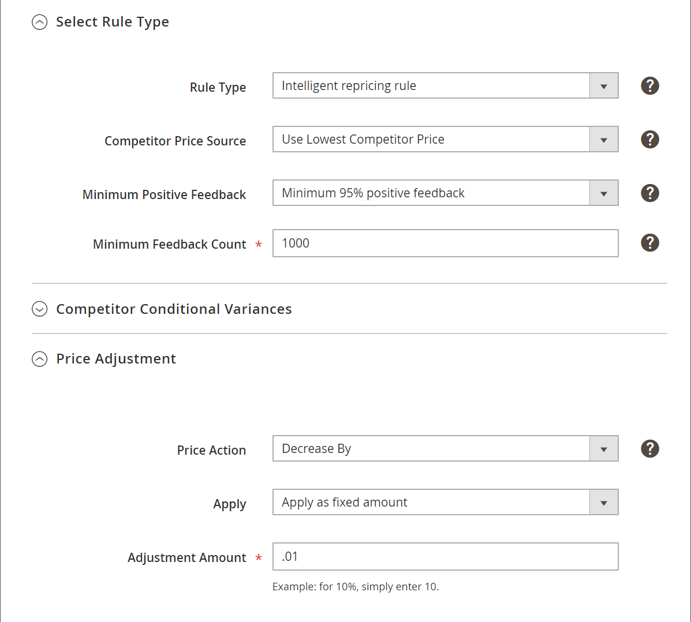

# 價格規則範例

## 標準價格規則範例

### 捨棄後續規則

捨棄後續規則的能力，是定價規則中的絕佳功能，可防止多個定價規則堆疊，並提供非預期的額外折扣。 若要捨棄後續規則，定價規則必須使用 _[!UICONTROL Priority]_區段 [定價規則一般設定](./pricing-rule-general-settings.md).

若 **[!UICONTROL Discard Subsequent Rules]** 設為 `Yes`，優先順序較低的規則（數字較高）不適用於符合條件的產品。

例如，假設有三個定價規則：

| 範例 | 規則名稱 | 優先順序 | 捨棄後續規則 |
|----------|----|----|----|
| 1 | 銷售產品優惠10% | 1 | 否 |
| 2 | $2銷售產品 | 2 | 是 |
| 3 | 佔所有產品的5% | 3 | 否 |

在此案例中，#1和#2則適用於合格產品。 規則#3僅適用於規則中未包含的#2合格產品，因為其優先順序低於範例#2和 **[!UICONTROL Discard Subsequent Rules]** 設為 `Yes`. 因此，銷售類別中的合格產品將獲得10%的折扣，並獲得Amazon上市價格的2美元折扣。

### 應用兩個標準價格規則

| 欄位 | 設定 — 規則1 | 設定 — 規則2 |
|----------|----|----|
| [!UICONTROL Rule Name] | 規則1 | 規則2 |
| [!UICONTROL Priority] | 1 | 2 |
| [!UICONTROL Rule Type] | 標準價格規則 | 標準價格規則 |
| [!UICONTROL Price action] | 減少者 | 減少者 |
| [!UICONTROL Apply] | 以百分比方式應用 | 以固定金額應用 |
| [!UICONTROL Adjustment Amount] | 10 | 10 |

#### 產品1

價格：US$45.49

規則1已應用：$45.49 x(0.9)= $40.94

第2條適用：40.94美元 — 10.00美元= 30.94美元

適用規則1和規則2之後的最終價格：US$30.94

#### 產品2

價格：US$47.76

規則1已應用：$47.76 x(0.9)= $42.98

第2條適用：42.98美元 — 10.00美元= 32.98美元

適用規則1和規則2之後的最終價格：US$32.98

## 智慧重新定價規則範例

### Buy Box價格（含底價來源）=價格

| 欄位 | 設定 |
|----------|----|
| [!UICONTROL Rule Name] | 規則1 |
| [!UICONTROL Priority] | 1 |
| [!UICONTROL Rule Type] | 智慧重新定價規則 |
| [!UICONTROL Competitor Price Source] | 使用「Buy Box」價格 |
| [!UICONTROL Price Action] | 符合競爭者價格 |
| [!UICONTROL Floor Price Source] | 價格 |
| [!UICONTROL Floor Price Action] | 符合 |

#### 產品1

價格：15美元

[Buy Box](./buy-box-competitor-pricing.md) Amazon價格：10美元

因為 [Buy Box](./buy-box-competitor-pricing.md) 價格低於原價，產品按原價上市。

套用規則後的最終價格：15美元

#### 產品2

價格：5美元

[Buy Box](./buy-box-competitor-pricing.md) Amazon價格：10美元

因為 [Buy Box](./buy-box-competitor-pricing.md) 價格大於原始價格，產品按 [Buy Box](./buy-box-competitor-pricing.md) 價格。

套用規則後的最終價格：10美元

### Buy Box價格與最低價格來源=價格和20%的降價

| 欄位 | 設定 |
|----------|----|
| [!UICONTROL Rule Name] | 規則1 |
| [!UICONTROL Priority] | 1 |
| [!UICONTROL Rule Type] | 智慧重新定價規則 |
| [!UICONTROL Competitor Price Source] | 使用「Buy Box」價格 |
| [!UICONTROL Price Action] | 符合競爭者價格 |
| [!UICONTROL Floor Price Source] | 價格 |
| [!UICONTROL Floor Price Action] | 減少者 |
| [!UICONTROL Apply] | 以百分比形式應用 |
| [!UICONTROL Floor Adjustment Amount] | 20 |

#### 產品1

價格：20美元

計算底價：16美元

[Buy Box](./buy-box-competitor-pricing.md) Amazon價格：15美元

因為 [Buy Box](./buy-box-competitor-pricing.md) 價格小於計算 [最低價格](./floor-price.md)，則產品會列於 [最低價格](./floor-price.md).

套用規則後的最終價格：16美元

#### 產品2

價格：15美元

計算 [最低價格](./floor-price.md):12美元

[Buy Box](./buy-box-competitor-pricing.md) Amazon價格：15美元

因為 [Buy Box](./buy-box-competitor-pricing.md) 價格大於計算 [最低價格](./floor-price.md)，則產品會列於 [Buy Box](./buy-box-competitor-pricing.md) 價格。

套用規則後的最終價格：15美元

#### 產品3

價格：17美元

計算底價：US$13.60

[Buy Box](./buy-box-competitor-pricing.md) Amazon價格：15美元

因為 [Buy Box](./buy-box-competitor-pricing.md) 價格大於計算 [最低價格](./floor-price.md)，則產品會列於 [Buy Box](./buy-box-competitor-pricing.md) 價格。

套用規則後的最終價格：15美元

### 所有競爭者的價格的最低價格和使用所有競爭者的產品條件

| 欄位 | 設定 |
|----------|-----|
| [!UICONTROL Rule Name] | 規則1 |
| [!UICONTROL Priority] | 1 |
| [!UICONTROL Rule Type] | 智慧重新定價規則 |
| [!UICONTROL Competitor Price Source] | 使用最低競爭者價格 |
| [!UICONTROL Minimum Positive Feedback] | 所有競爭者價格 |
| [!UICONTROL Conditional Variance] | 使用所有競爭者的產品條件 |
| [!UICONTROL Price Action] | 符合競爭者價格 |
| [!UICONTROL Floor Price Source] | 價格 |
| [!UICONTROL Floor Price Action] | 符合 |

| 價格 | 條件 |
|----------|----|
| 17美元 | 新增 |
| 15美元 | 新增 |
| 14美元 | 已使用；很好 |
| 13美元 | 已使用；好 |

#### 產品1

價格：10美元

條件：新增

因為「新」條件的競爭者最低價格是$15，所以產品的標價是$15。

套用規則後的最終價格：15美元

#### 產品2

價格：10美元

條件：已使用；可接受

因為 [競爭者價格](./lowest-competitor-pricing.md) 若為「已使用」條件，則$13會列出產品。

套用規則後的最終價格：13美元

### 結合最高價格、貨幣轉換和增值稅的智慧重新定價規則

| 欄位 | 設定 |
|----------|-----|
| [!UICONTROL VAT] | 10% |
| [!UICONTROL Ceiling price source] | 10美元 |
| [!UICONTROL Currency conversion] | 1.25歐元：1美元 |

[最高價格](./optional-ceiling-price.md) 在歐洲(VAT)市場：$10 x 1.25 = $12.50

當 [上限價格](./optional-ceiling-price.md) 在歐洲(VAT)市場中，會計算並新增VAT。

增值稅後最終價格：$12.50 x(1.1)= $13.75

### 結合多個定價規則、最高價格、貨幣轉換和增值稅

#### 智慧定價規則（來自上一個範例）

| 欄位 | 設定 |
|----------|----|
| 優先順序 | 1 |
| 增值稅 | 10% |
| 最高價格來源 | 10美元 |
| 貨幣轉換 | 1.25歐元：1美元 |

[最高價格](./optional-ceiling-price.md) 在歐洲(VAT)市場：$10 x 1.25 = $12.50

增值稅後最終價格：$12.50 x(1.1)= $13.75

#### 標準定價規則

| 欄位 | 設定 |
|----------|-----|
| [!UICONTROL Priority] | 2 |
| [!UICONTROL Price Action] | 增加者 |
| [!UICONTROL Apply] | 以固定金額應用 |
| [!UICONTROL Adjustment Amount] | 5.00美元 |

當 [上限價格](./optional-ceiling-price.md) 即會點擊，則會在智慧型定價規則之上套用標準定價規則。

套用標準定價規則後的最終價格：$13.75 + $5.00 = $18.75

### 價格調整

在此範例中，最具競爭力的價格是透過查看Amazon [競爭者最低的價格](./lowest-competitor-pricing.md) 95%的正面反饋，最低反饋計數為1,000個商家評論。

根據這些參數運行此搜索後，競爭價格會回到25美元。

從這裡，有三種 [價格規則操作](./pricing-rule-actions.md) 基於最低價格的選擇。

| 欄位 | 說明 |
|--- |--- |
| [!UICONTROL Price Action] | 選項：<ul><li>**[!UICONTROL Decrease By]**  — 此選項會降低您的上市價格，而 [競爭者價格](./lowest-competitor-pricing.md).</li><li>**[!UICONTROL Increase By]**  — 此選項會提高您的上市價格，而 [競爭者價格](./lowest-competitor-pricing.md).</li><li>**[!UICONTROL Match Competitor Price]**  — 此選項會變更您的Amazon上市價格，以根據參數來比對最低價格。 在此範例中，Amazon的上市價格為$25。</li></ul> |
| [!UICONTROL Apply] | 選項：以百分比形式應用/以固定金額形式應用 |
| [!UICONTROL Adjustment Amount] | 定義要套用折扣的百分比或固定金額的數值。  這些選擇將使價格降至最低，並將價格設定為低於0.01美元。 |

### 最低價格

| 欄位 | 設定 |
|----------|----|
| [!UICONTROL Floor Price Source] | 成本= 5美元 |
| [!UICONTROL Floor Price Action] | 增加者 |
| [!UICONTROL Apply] | 以百分比方式應用 |
| [!UICONTROL Floor Adjustment Amount] | 5 |

[最低價格](./floor-price.md) 計算=最低價格來源 `$5` x下限調整額 `5%` = $5.25

套用智慧型定價規則時，成本為$5時，此特定產品的上市價格確實會低於$5.25。
