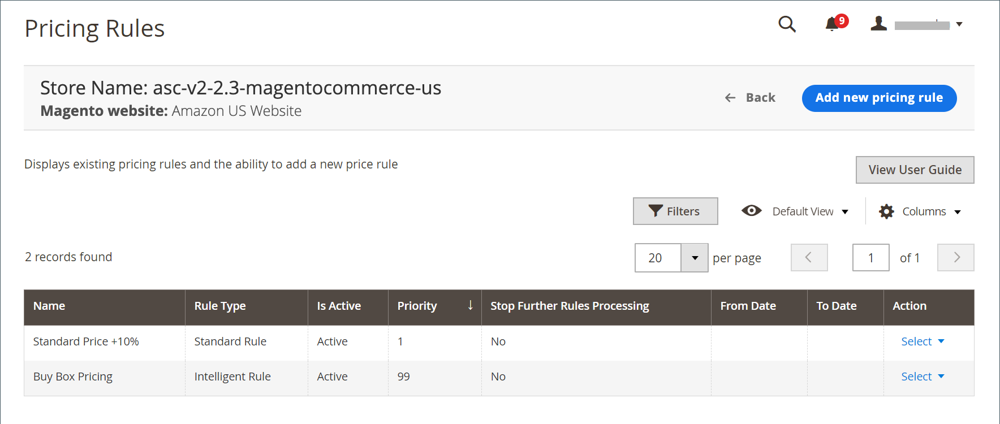

# 管理Amazon定價

Amazon sales channel可讓您設定訂價規則，讓您設定Amazon清單價格，使其與在[清單價格](./listing-price.md)中定義的&#x200B;**[!UICONTROL Magento Price Source]**&#x200B;不同。 您也可以棧疊多個規則，甚至使用智慧型定價，根據競爭者的[[!DNL Buy Box]](./buy-box-competitor-pricing.md)價格或[最低競爭者價格](./lowest-competitor-pricing.md)來調整您的Amazon上市價格。

訂價規則有兩種型別：

- [標準訂價規則](./standard-price-rules.md)
- [智慧型重新訂價規則](./intelligent-repricing-rules.md)

  >[!IMPORTANT]
  >
  >如果Amazon區域設定為`Inactive`狀態（如上線期間），智慧型重新定價規則就無法正常運作。 您的價格計算取決於您的運費，而且您的地區必須處於`Active`狀態，您的運費才能從Amazon同步。
  >
  >若要更新Amazon帳戶中的地區狀態，請前往「設定>帳戶資訊>假期設定」。 請參閱[Amazon：假期清單狀態](https://sellercentral.amazon.com/gp/help/help.html?itemID=200135620) （需要賣家中心登入）。

此功能可讓您以類似[!DNL Commerce] [目錄價格規則](https://experienceleague.adobe.com/docs/commerce-admin/catalog/products/pricing/pricing-advanced.html)的方式操控您的Amazon價格。 您可以建立複雜的規則，讓您變更特定產品、特定類別內的產品，或甚至具有特定屬性的價格。

您可以為Amazon清單新增定價規則。 價格規則可用來根據一組已定義的條件，自動調整您的上市價格。 價格規則會觸發，並在您的產品在Amazon上上市之前計算您調整的價格。

>[!NOTE]
>
>您的Amazon清單價格來源已在[清單價格](./listing-price.md)設定中針對&#x200B;**[!UICONTROL Magento Price Source]**&#x200B;定義。 訂價規則中定義的任何調整計算，都會使用價格來源作為起始值。

訂價規則可讓您在[清單價格](./listing-price.md)設定中，將您的Amazon清單價格設定為與&#x200B;**[!UICONTROL Magento Price Source]**&#x200B;不同的價格。 您也可以棧疊多個規則，這些規則一起運作來調整您的價格。

訂價/重新訂價規則在設定期間需要三組資訊：

- [一般設定](./pricing-rule-general-settings.md)：定義規則的名稱、說明、作用中日期、優先順序，並根據其優先順序設定後續規則的行為。
- [條件](./pricing-rule-conditions.md)：決定哪些產品符合價格規則的條件。
- [動作](./pricing-rule-actions.md)：定義套用至價格來源的調整計算，以決定清單價格。

您可以建立[標準訂價規則](./standard-price-rules.md)，自動調整您的Amazon清單價格（相對於您在[清單價格](./listing-price.md)設定中所選&#x200B;**[!UICONTROL Magento Price Source]**）。 此功能可讓您以類似[!DNL Commerce] [目錄價格規則](https://experienceleague.adobe.com/docs/commerce-admin/marketing/promotions/catalog-rules/price-rules-catalog.html)的方式操控您的Amazon價格。 您可以建立複雜規則，自動變更特定產品、特定類別內的產品或具有特定屬性的產品的價格。 您可以完成傳統設定，並重新訂定產品價格，以根據固定金額或百分比來增減。

另一個強大的工具是[智慧型重新定價](./intelligent-repricing-rules.md)功能，此功能會根據競爭者[[!DNL Buy Box]](./buy-box-competitor-pricing.md)價格或[最低競爭者價格](./lowest-competitor-pricing.md)來調整您的Amazon上市價格。 此進階功能與[!DNL Commerce] [目錄價格規則](https://experienceleague.adobe.com/docs/commerce-admin/marketing/promotions/catalog-rules/price-rules-catalog.html)類似，可讓您建立複雜的規則，藉此控制Amazon價格。 規則可定義特定產品、特定類別內的產品，或甚至具有特定產品屬性的價格變更範圍。

使用智慧型重新定價，根據競爭者的定價調整您的Amazon上市價格。 Amazon sales channel已內建保護裝置，可讓您設定保護利潤率，或避免價格與意見反應不佳的商家相提並論。 使用[智慧型重新訂價規則](./intelligent-repricing-rules.md)，Amazon的清單價格可以自動以固定或百分比金額（上下浮動）加以操控，或甚至與每個專案的[[!DNL Buy Box]](./buy-box-competitor-pricing.md)價格或[最低競爭者價格](./lowest-competitor-pricing.md)同步。 您甚至可以將規則棧疊起來，提供無限制的彈性。

您可以控制規則的重要層面，例如作用中/非作用中狀態、網站適用性、可選日期範圍和可選優先順序層級（用於規則棧疊）。

例如，您可以定義並設定價格規則的條件，當條件符合時，就會在傳送至Amazon之前自動調整您的掛牌價格。

另一個定價選項是設定於個別清單層級的[價格覆寫](./overrides.md)。 可以設定[價格覆寫](./overrides.md)，而且覆寫會忽略/優先於所有其他預設值、設定和規則。 可設定價格、處理時間、條件和賣家備註的[覆寫](./overrides.md) （少數例外）。

{width="600" zoomable="yes"}

## 預設欄

| 欄 | 說明 |
|--------------------------------------------|------------------------------------------------------------------------------------------------------------------------------------------------------------------------------------------------------|
| [!UICONTROL Name] | 在[訂價規則一般設定](./pricing-rule-general-settings.md)中設定的訂價規則名稱 |
| [!UICONTROL Rule Type] | 在[訂價規則動作](./pricing-rule-actions.md)中設定的規則型別（標準價格規則或智慧型重新訂價規則） |
| [!UICONTROL Is Active] | 此規則是否有效（如[訂價規則一般設定](./pricing-rule-general-settings.md)中所設定） |
| [!UICONTROL Priority] | 優先順序高於其他訂價條件，如[訂價規則一般設定](./pricing-rule-general-settings.md)中所設定 |
| [!UICONTROL Stop Further Rules Processing] | 表示是否已在符合此規則的產品上處理任何進一步的價格規則，如[訂價規則一般設定](./pricing-rule-general-settings.md)中所設定 |
| [!UICONTROL From Date] | 規則作用中時段的開始 |
| [!UICONTROL To Date] | 規則作用中的時段結束 |
| [!UICONTROL Action] | 列出可套用至特定清單的所有動作。 若要套用動作，請按一下&#x200B;_[!UICONTROL Action]_欄中的&#x200B;**[!UICONTROL Select]**。 選項： `Edit Price Rule` / `Delete Price Rule` |
