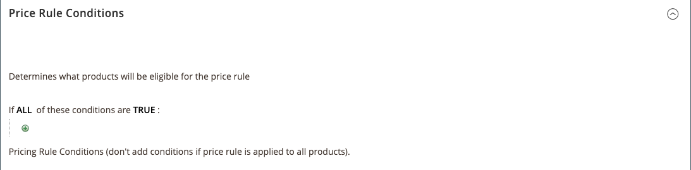
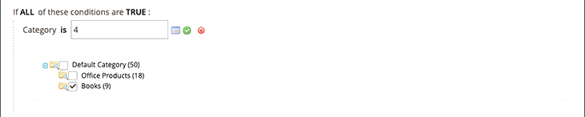
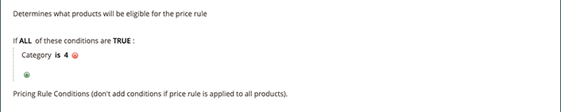

# 價格規則條件

條件會決定哪些產品符合價格規則的條件。 定義Amazon定價規則的條件，會遵循與定義條件相同的邏輯和程式。 [購物車價格規則](https://experienceleague.adobe.com/docs/commerce-admin/marketing/promotions/cart-rules/price-rules-cart.html) 在 [!DNL Commerce].

>[!IMPORTANT]
>
>如果您的價格規則適用於您產品中的所有產品 [!DNL Commerce] 目錄，然後將此區段留空。

條件中任何粗體區域都可以按一下以檢視各種選項。

## 範例：建立價格規則條件

此程式可能簡單或詳細，視您的目錄設定而定。 您可以定義條件，以便 `ALL` 或 `ANY` 條件中包含 `TRUE` 或 `FALSE` 若為產品，則產品符合套用定價規則的資格。

條件是以您的 [產品屬性](https://experienceleague.adobe.com/docs/commerce-admin/catalog/product-attributes/product-attributes.html). 若要將規則套用至所有產品，請將「條件」區段保留空白。

>[!NOTE]
>
>如果您想要根據特定產品屬性定義條件， **用於促銷規則條件** 屬性的for必須設定為 `Yes` 在您的 [店面屬性](https://experienceleague.adobe.com/docs/commerce-admin/catalog/product-attributes/create/attribute-product-create.html) 屬性的。

{width="600" zoomable="yes"}

此範例所定義的規則，會針對中定義的所有產品套用25%折扣。 `Books` 類別。

規則陳述式有兩個粗體連結，按一下就會顯示條件陳述式該部分的選項。 如果您儲存條件而未變更粗體選項，則規則會套用至您的所有產品。

- 按一下 **[!UICONTROL ALL]** 並選擇 `ALL` 或 `ANY`.
- 按一下 **[!UICONTROL TRUE]**，並選擇 `TRUE` 或 `FALSE`.
- 若要將規則套用至所有產品，請保留條件不變。

您可以變更這些值的組合，以建立不同的條件。 在此範例中，會使用下列條件：

`If ALL of these conditions are TRUE:`

1. 若要顯示條件適用的可用屬性，請按一下新增()圖示並選取條件所根據的屬性。

   **[!UICONTROL Conditions Combination]**  — 選擇建立另一組 `All/Any` 和 `True/False` 現有條件內的條件。

   {width="500"}

   **[!UICONTROL Product Attribute]**  — 可用的產品屬性取決於 [屬性的設定](https://experienceleague.adobe.com/docs/commerce-admin/catalog/product-attributes/create/attribute-product-create.html). 若要讓屬性顯示在清單中， *[!UICONTROL Use for Promo Rule Conditions]* 屬性的for必須設定為 `Yes` 在店面屬性中。

   - 對象 **[!UICONTROL Product Attribute]**，選擇您要定義為條件基底的屬性。 在此範例中，選取的條件為 `Category`.

      {width="500"}

      選取的條件會顯示在陳述式中，後面接著兩個粗體連結。 選項會依您選取的產品屬性而有所不同。

      設定屬性後，即無法編輯它。 若要變更屬性，您必須刪除該行並新增屬性。 您可以按一下刪除( 圖示來檢查行尾。

   - 按一下 **[!UICONTROL is]** 並選擇描述產品符合條件的比較運運算元。

      在此範例中，比較運運算元為 `is`. 可用的選項取決於在上一步驟中選取的屬性，並可包含不同的比較選項。 選項可以包括相符的值，不包含或包含至少一個值，以及大於、等於和小於數字量。 在此範例中，選項為 `is` 和 `is not`.

   - 按一下 **[!UICONTROL ...]** 並選擇條件所依據的屬性值。 選項視屬性的設定而定。

      系統可能會提示您選取選項或輸入條件的值。 在此範例中，欄位顯示為空白。 若要選取規則的類別，請按一下選擇器圖示()以顯示您的選取選項。 此規則適用於 _書籍_，選取 **[!UICONTROL Books]** 核取方塊。 系統會填入類別編號。 若要接受類別選擇，請按一下綠色勾號圖示()。

      {width="500"}

      選取的專案會顯示在陳述式中，以完成條件。

      {width="500"}

      此範例條件已完成。 如上所述，此條件表示您產品中任何一項 [!DNL Commerce] 已定義帳本類別的目錄(`4`)符合此定價規則的資格。 您可以新增更多條件行，進一步縮小合格產品的範圍。

1. 若要將另一個條件行新增至陳述式，請返回步驟1並重複此程式，直到所有所需條件都完成為止。

   您可以隨時按一下刪除()圖示來標籤行尾。
