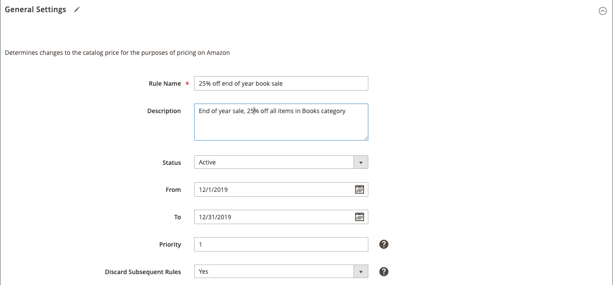

# 定價規則一般設定

定義規則的名稱、說明、作用中日期和優先順序。

## 完成價格規則一般設定區段

1. 對於&#x200B;**[!UICONTROL Rule Name]**（必要），輸入規則的名稱。

   此名稱僅供您內部識別之用。 規則名稱的描述性越強，表示效果越好。

1. 對於&#x200B;**[!UICONTROL Description]**，輸入規則的詳細說明。

   此說明可能包括有關合格產品的資訊、有效日期、用於計算調整價格的公式，或者如果您想修改規則，則您認為有用的任何其他資訊。

1. 對於&#x200B;**[!UICONTROL Status]**，選擇一個選項：

   - `Active`  — 當您想要將定價規則套用至符合資格的產品，並在發佈至Amazon之前調整上市定價時，請選擇此選項。

   - `Inactive`  — 當您不希望定價規則套用至符合資格的產品時，請選擇此選項。修改定價規則或在有限促銷後關閉定價規則時，很可能會使用此選項。

1. 對於&#x200B;**[!UICONTROL From]**&#x200B;和&#x200B;**[!UICONTROL To]**，輸入定價規則的起始和終止日期。

   您也可以按一下日曆圖示，從動態日曆中選取日期。 設定具有確定開始日期和結束日期的有限時間或季節性促銷活動時，此自動開始和停止選項有益。

1. 對於&#x200B;**[!UICONTROL Priority]**，輸入規則優先順序的數值。

   優先順序值等於`1`是最高優先順序。 當您有多個有效定價規則時，可以使用此優先順序值來確定首先應用的規則。 此欄位是使用&#x200B;_[!UICONTROL Discard Subsequent Rules]_功能的必填欄位。

1. 對於&#x200B;**[!UICONTROL Discard Subsequent Rules]**，選擇一個選項：

   - `Yes`  — 當您不希望應用任何適用於產品的其他定價規則時，請選擇此選項。放棄後續規則意味著，如果多個定價規則應用於同一產品，則只有定義優先順序值最高的定價規則才應用於該產品。 此選項可防止多個定價規則堆疊，並提供非預期的額外折扣。

   - `No`  — 如果要允許將多個定價規則應用於同一產品，請選擇此選項。此選項可導致堆疊，並提供要套用的多種折扣。

>[!NOTE]
>
>若要捨棄後續規則，定價規則必須有定義&#x200B;**優先順序**&#x200B;值。

| 欄位 | 說明 |
|---|---|
| [!UICONTROL Rule Name] | （必要）輸入規則的名稱，用於內部識別。 規則名稱的描述性越強，表示效果越好。 例如，「年底圖書銷售優惠25%」。 |
| [!UICONTROL Description] | 輸入詳細說明以說明規則（也用於內部用途）。 例如，「年底銷售，書籍類別中所有項目的折扣為25%」。 |
| [!UICONTROL Status] | 選項：<ul><li>**[!UICONTROL Inactive]**  — 定價規則不適用於您的清單。修改定價規則或在有限促銷後關閉該規則時，可能會使用此選項。</li><li>**[!UICONTROL Active]**  — 定價規則適用於您的清單，並在發佈至Amazon之前調整您的清單定價。</li></ul> |
| [!UICONTROL From] | 輸入定價規則開始的開始日期。 例如，若要在一年的最後一個月進行銷售，您會將`From`日期設為12月1日，這樣定價規則就會自動套用至自12月1日起的Amazon清單。 |
| [!UICONTROL To] | 輸入定價規則結束的結束日期。 繼續上一個範例，若要將銷售限制在一年的最後一個月，您會將`To`日期設為12月31日，因此定價規則將於12月31日到期。 |
| [!UICONTROL Priority] | 輸入定價規則優先順序的值。 優先順序值等於`1`是最高優先順序。 當您有多個定價規則時，可以使用優先順序值來決定要先套用哪個規則。 使用&#x200B;**捨棄後續規則**&#x200B;功能需要此欄位。 |
| [!UICONTROL Discard Subsequent Rules] | 用於允許或防止多個定價規則堆疊並提供額外折扣。 若要捨棄後續規則，定價規則必須有為&#x200B;**[!UICONTROL Priority]**&#x200B;定義的值。 選項：<ul><li>**[!UICONTROL Yes]**  — 選擇您不希望應用於產品的任何其他定價規則。放棄後續規則意味著，當多個定價規則應用於同一產品時，僅應用具有最高定義優先順序值的定價規則。</li><li>**[!UICONTROL No]**  — 選擇何時允許將多個定價規則應用於同一產品。此選項可能導致堆疊和套用至上市價格的多項折扣。</li></ul> |
