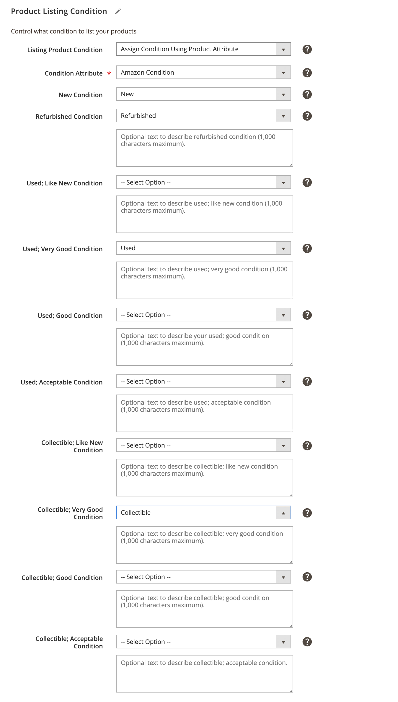

# 產品清單條件

產品清單條件設定是商店清單設定的一部分。 您可以存取[存放區儀表板](./amazon-store-dashboard.md)上的清單設定。

Amazon需要產品清單才能有定義的條件。 如果所有產品具有相同條件，您可以選取其中一個Amazon條件選項，將所有產品表示為您的全域條件值。 標準Amazon條件包括：

- `New`
- `Refurbished`
- `Used; Like New`
- `Used; Very Good`
- `Used; Good`
- `Used; Acceptable`
- `Collectible; Like New`
- `Collectible; Very Good`
- `Collectible; Good`
- `Collectible; Acceptable`

>[!IMPORTANT]
>
>如果您銷售已更新（翻新）的產品，則必須註冊[!DNL Amazon Renewed Program]。 請參閱[已更新產品](./renewed-products.md)。

不過，如果您的目錄包含不同條件的產品（例如「新增」、「已使用」和「已翻新」），您必須選擇&#x200B;**[!UICONTROL Assign Condition Using Product Attribute]**。 此設定可讓您將您的[!DNL Commerce]條件屬性和值對應至您的Amazon清單條件。

在[預先設定工作](./amazon-pre-setup-tasks.md)期間，建議您為產品狀況建立[!DNL Commerce]產品屬性。 如果您以各種條件提供產品，但尚未建立條件屬性，請參閱[在 [!DNL Commerce]](./ob-creating-magento-attributes.md)中建立產品屬性。 建立條件屬性後，您就可以將條件值指派給[!DNL Commerce]目錄中的每個產品。

## 設定設定

1. 按一下商店儀表板上的&#x200B;**[!UICONTROL Listing Settings]**。

1. 展開&#x200B;**[!UICONTROL Product Listing Condition]**&#x200B;區段。

1. 針對&#x200B;**[!UICONTROL Listing Product Condition]**，選擇一個選項。

   為所有清單的全域條件值選擇其中一個標準Amazon條件。 預設設定為`New`。

   如果您的產品/清單具有不同的條件，請選擇`Assign Condition Using Product Attribute`在出現的其他欄位中定義您的產品條件設定。

1. 針對&#x200B;**條件屬性**，請選擇[!DNL Commerce]屬性，以對應每個標準Amazon條件屬性的值。

   如果您有處於`Used`或`Collectible`狀態的產品，但您不進一步區分，您可以對應至單一`Used`或`Collectible` Amazon狀態，並將其他專案留空。 此方法會將您的所有`Used`或`Collectible`條件對應至單一「已使用」或「可收集」Amazon條件。

   例如，您的產品有單一`Used`條件。 對應時，您可以選擇對應至Amazon條件`Used; Like New`、`Used; Very Good`、`Used; Good`或`Used; Acceptable`。 僅針對您想要的Amazon條件完成欄位，將其他`Used`選項保留設定為`--Select Option--`。 在範例影像中，`Used`條件中的所有[!DNL Commerce]產品皆對應至Amazon `Used; Very Good`條件。

   您也可以輸入條件的描述性文字，但`New`除外。

1. 完成時，按一下&#x200B;**[!UICONTROL Save listing settings]**。

{width="600" zoomable="yes"}

| 欄位 | 說明 |
|------------------------------------------|-------------------------------------------------------------------------------------------------------------------------------------------------------------------------------------------------------------------------------------------------------------------------------------------------------------------------------------------------------------------------------------------------------------------------------------------------------------------------------------------------------------------------------------------|
| [!UICONTROL Listing Product Condition] | 產品清單的條件。 選項： `New` / `Refurbished` / `Used: Like New` / `Used: Very Good` / `Used: Good` / `Used: Acceptable` / `Collectible: Like New` / `Collectible: Very Good` / `Collectible: Good` / `Collectible: Acceptable` / `Assign Condition Using Product Attribute`  如果您銷售單一產品條件，請選擇其中一個標準Amazon條件。 如果您的[!DNL Commerce]目錄包含各種條件的產品，請選擇`Assign Condition Using Product Attribute`。 |
| [!UICONTROL Condition Attribute] | 定義產品條件的[!DNL Commerce]屬性。 選取您建立的Magneto屬性，以對應至Amazon條件屬性。 在[預先設定工作範例](./ob-creating-magento-attributes.md)中，建議將其命名為`Amazon Condition`。 選擇後，會出現其他欄位以對映標準Amazon條件。 |
| [!UICONTROL Additional Condition fields] | 針對每個標準Amazon條件，選擇對應的條件。 選項是您在[建立Amazon條件屬性](./ob-creating-magento-attributes.md)時新增的條件標籤。  如果您有處於`Used`或`Collectible`狀態的產品，但您不進一步區分，您可以對應至單一`Used`或`Collectible` Amazon狀態，並將其他專案保留空白。 此方法會將所有`Used`或`Collectible`條件對應至單一「已使用」或「可收集」Amazon條件。 |

**快速存取** - [!UICONTROL Listing Settings]區段

- [[!UICONTROL Product Listing Actions]](./product-listing-actions.md)
- [[!UICONTROL Third Party Listings]](./third-party-listing-settings.md)
- [[!UICONTROL Listing Price]](./listing-price.md)
- [[!UICONTROL (B2B) Business Price]](./business-pricing.md)
- [[!UICONTROL Stock / Quantity]](./stock-quantity.md)
- [[!UICONTROL Fulfilled By]](./fulfilled-by.md)
- [[!UICONTROL Catalog Search]](./catalog-search.md)
- [[!UICONTROL Product Listing Condition]](./product-listing-condition.md)
