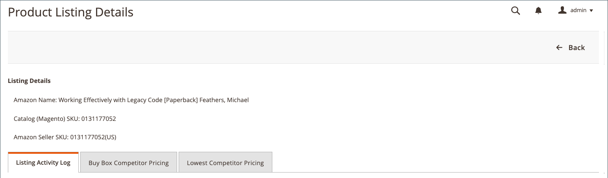
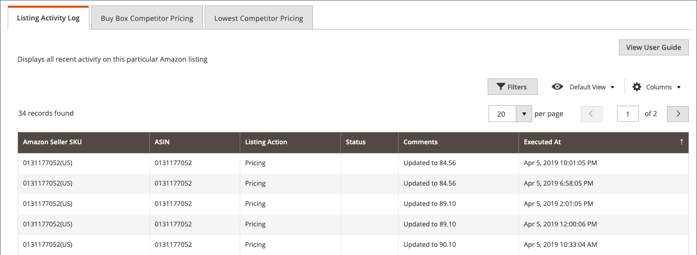
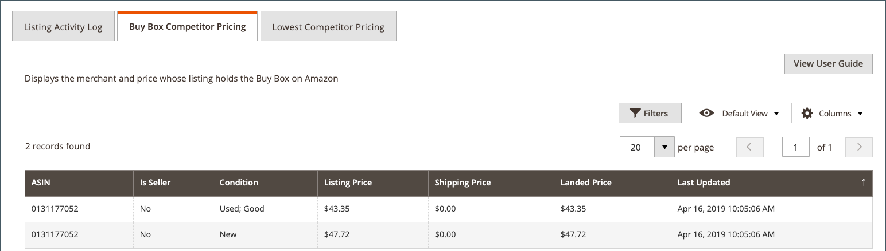
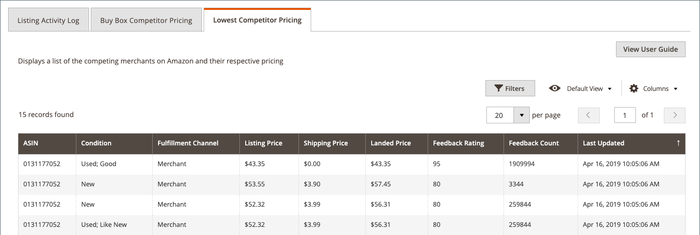

# 查看清單詳細資訊

_[!UICONTROL Product Listing Details]_頁面會顯示您作用中產品清單的其他資訊，包括「清單活動記錄」，其中會顯示個別SKU/產品上的變更。 此資訊可協助您了解產品及個別SKU/產品變更的競爭量度。 本頁面的其他資訊包括：

- **[!UICONTROL Listing Details]**  — 產品詳細資訊，包括名稱和Amazon賣家SKU
- **[!UICONTROL Listing Activity Log]**  — 本次上市所發生的所有更改的歷史記錄，如定價和數量/股票更改。無需採取任何進一步動作。 此記錄可供檢閱，以了解變更記錄。
- **[!UICONTROL Buy Box Competitor Pricing]** -Amazon狀態和競爭 [[!DNL Buy Box]](./buy-box-competitor-pricing.md) 者定價的資料
- **[!UICONTROL Lowest Competitor Pricing]**  — 關於最低Amazon競爭對手的定價和反饋資訊的資訊

Amazon銷售管道首頁共用一些常見的[工作區控制項](./workspace-controls.md)，可讓您自訂顯示的資料。

## 清單詳細資訊

顯示的產品資訊包括：

- _[!UICONTROL Amazon Name]_
- _[!UICONTROL Catalog (Magento) SKU]_
- _[!UICONTROL Amazon Seller SKU]_

## 列出活動日誌 {#listing-activity-log}

顯示Amazon清單的所有最近活動。 顯示的資訊包括：

- Amazon賣家SKU:標識為清單定義的保存單位(SKU)。
- 亞洲：識別10位數的Amazon產品識別碼。
- 清單操作：識別針對清單所發生的動作類型。
- 評論：提供與發生的清單動作類型相關的其他詳細資料。
- 執行時間：識別動作發生的日期和時間。

__

## Buy Box競爭者定價 {#buy-box-competitor-pricing}

此頁簽顯示有關持有清單[[!DNL Buy Box]](./buy-box-competitor-pricing.md)位置的Amazon商家的資訊。 此資訊可用來了解您的競爭對手在Amazon上的價格定位。 顯示的資訊包括：

- 亞洲：10位數的Amazon產品識別碼。
- 賣家：識別您是否為[!DNL Buy Box]賣家。 選項是/否。
- 條件：識別為清單定義的條件。
- 上市價：識別發佈清單的價格。
- 運費：標識添加到清單中的運費。
- 地價：標識上市價格以及上市的運費。
- 上次更新：識別從Amazon更新定價資訊的日期和時間。

## 最低競爭者定價 {#lowest-competitor-pricing}

此索引標籤會顯示相同清單中Amazon競爭者的相關資訊。 此資訊可用於了解價格定位和[最低競爭者定價](./lowest-competitor-pricing.md)。 顯示的資訊包括：

- 亞洲：10位數的Amazon產品識別碼。
- 條件：識別為清單定義的條件。
- 履行渠道：確定負責履行的交易方。 選項：商人/Amazon。
- 上市價：識別發佈清單的價格。
- 運費：標識添加到清單中的運費。
- 地價：標識上市價格以及上市的運費。
- 意見評等：識別最低價格商家的Amazon意見評等。
- 反饋計數：識別最低價格商家的Amazon意見計數。
- 上次更新：識別從Amazon更新定價資訊的日期和時間。

