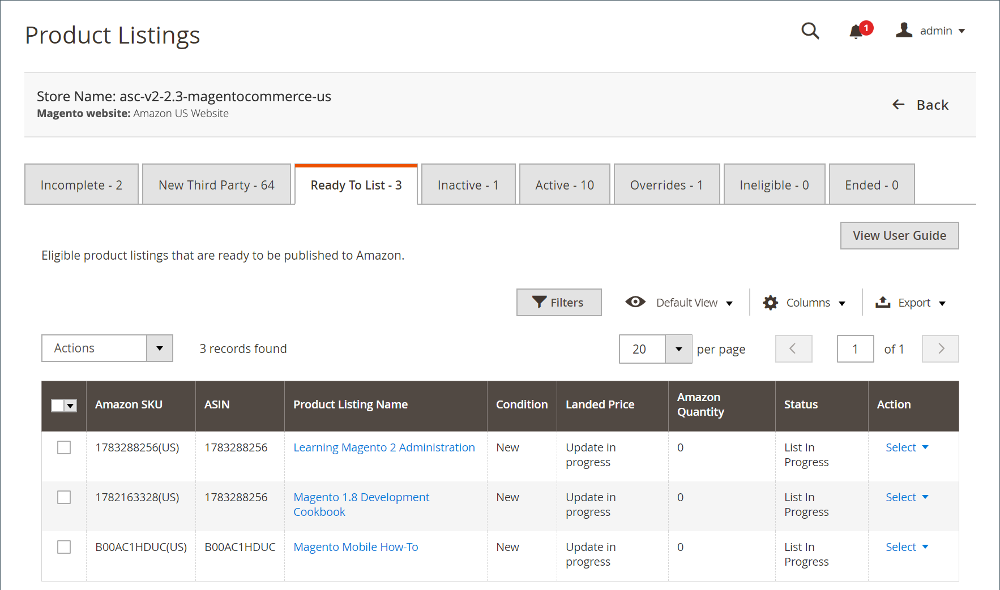

# [!UICONTROL Ready to List]

此 _[!UICONTROL Ready to List]_標籤顯示 [!DNL Commerce] 目錄產品符合您的清單設定，且可發佈至Amazon as a **新**清單。 與其他清單標籤不同，此標籤並不總是顯示在 [_[!UICONTROL Product Listings]_](./managing-product-listings.md) 頁面。

此 _[!UICONTROL Ready to List]_標籤僅出現於 [**[!UICONTROL Automatic List Action]**](./product-listing-actions.md) 在您的清單設定中，設定為 `Do Not Automatically List Eligible Products`. 此設定可告知Amazon sales channel任何新的Amazon清單都必須手動發佈。

時間 [**[!UICONTROL Automatic List Action]**](./product-listing-actions.md) 設為 `Automatically List Eligible Products`，Amazon sales channel會自動發佈合格目錄產品的新清單。 由於新清單會自動發佈，因此 _[!UICONTROL Ready to List]_索引標籤未顯示。

下 _[!UICONTROL Actions]_：

- **[!UICONTROL Publish Product to Amazon]**：選擇將清單重新發佈至 [!DNL Amazon Marketplace]. 另請參閱 [發佈Amazon清單](./publish-listings-manually.md)

下 **[!UICONTROL Select]** 在 _[!UICONTROL Action]_欄：

- **[!UICONTROL Publish On Amazon]**：選擇將清單重新發佈至 [!DNL Amazon Marketplace]. 另請參閱 [發佈Amazon清單](./publish-listings-manually.md).

- **[!UICONTROL View Details]**：選擇檢視清單詳細資訊，包括 [列出活動記錄](./product-listing-details.md#listing-activity-log)， [Buy Box競爭者定價](./product-listing-details.md#buy-box-competitor-pricing)、和 [最低競爭者價格](./product-listing-details.md#lowest-competitor-pricing). 此動作僅供檢視。 清單詳細資料無法變更。 另請參閱 [檢視詳細資料](./product-listing-details.md).

您有幾個選項可手動執行 [將新清單發佈至Amazon](./publish-listings-manually.md).

>[!NOTE]
>如果您有處理中的清單，清單數量會顯示在標籤上方的訊息中。

{width="600" zoomable="yes"}

## 預設欄

| 欄 | 說明 |
|-----------------------------------|------------------------------------------------------------------------------------------------------------------------------------------------------------------------------------------------------------------------------------------------------------------------------------------------------------------------------------------------------------------------------------------------------------------------------------------------------------------------------------------|
| [!UICONTROL Amazon Seller SKU] | Amazon指派給產品的SKU （庫存單位），用於識別產品、選項、價格和製造商。 |
| [!UICONTROL ASIN] | 識別專案的10個字母和/或數字的唯一區塊。  ASIN代表 [!DNL Amazon Standard Identification Number]. ASIN是識別專案的10個字母和/或數字的唯一區塊。 對於書籍，ASIN與ISBN編號相同，但對於所有其他產品，當專案上傳到其目錄時會建立新的ASIN。 您可以在Amazon的產品詳細資訊頁面上找到專案ASIN，以及與該專案相關的進一步詳細資訊。 |
| [!UICONTROL Product Listing Name] | 產品的名稱。 |
| [!UICONTROL Condition] | 此 [條件](./product-listing-condition.md) 產品的。 |
| [!UICONTROL Landed Price] | 產品的清單價格加上其送貨價格。 |
| [!UICONTROL Amazon Quantity] | 產品在Amazon上積極列出時的可用數量。 |
| [!UICONTROL Status] | 清單的狀態，由Amazon定義。 |
| [!UICONTROL Action] | 可套用至特定清單的可用動作清單。 若要套用動作，請按一下 **[!UICONTROL Select]** 在 _[!UICONTROL Action]_欄並選擇選項：<ul><li>[[!UICONTROL Publish on Amazon]](./publish-listings-manually.md)</li><li>[[!UICONTROL View Details]](./product-listing-details.md)</li></ul> |

### 列出清單準備就緒的常見原因

- **[!UICONTROL Ready to List]**  — 產品符合Amazon ASIN並排定上市。 若 [**[!UICONTROL Automatic List Action]**](./product-listing-actions.md) 在您的清單設定中，設定為 `Do Not Automatically List Eligible Products`，此狀態代表已準備好手動列出的產品。

- **[!UICONTROL List in Progress]**  — 產品清單已提交至Amazon，並正等待Amazon的接受確認。
