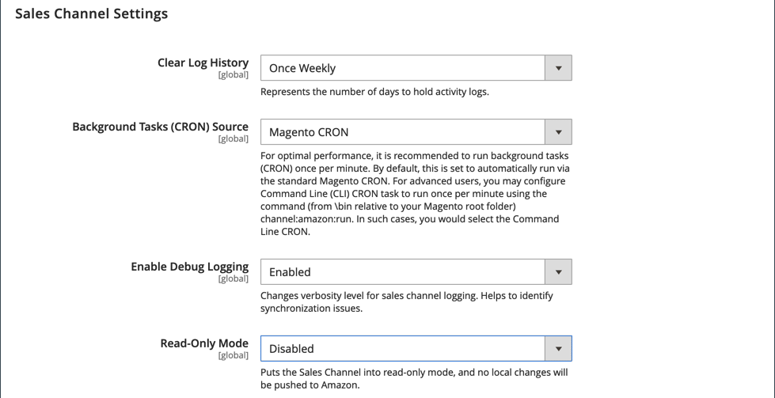

# Sales Channel設定

當 [!DNL Amazon Sales Channel] 已安裝擴充功能，則會在「Amazon銷售管理」管道中設定預設值。 您可在Amazon商店的組態設定中修改這些設定。 這些設定包括：

- 清除活動日誌歷史記錄的間隔
- Cron源選擇
- 日誌同步選項

## 修改「商務」管道設定

1. 在 _管理_ 邊欄，轉到 **[!UICONTROL Stores]** > _[!UICONTROL Settings]_>**[!UICONTROL Configuration]**.

1. 在左側面板中，展開 **[!UICONTROL Sales Channels]** 選擇 **[!UICONTROL Global Settings]**.

1. 針對 **[!UICONTROL Clear Log History]**，選擇選項：

   - `Once Daily`  — 選擇每天清除一次您的商店活動歷史記錄。

   - `Once Weekly`  — 選擇每週清除一次您的商店活動歷史記錄。

   - `Once Monthly`  — （預設）選擇每月清除一次您的商店活動歷史記錄。

1. 針對 **[!UICONTROL Background Tasks (CRON) Source]**，選擇 `Magento CRON`.

   此選項可讓Amazon銷售管道使用 [!DNL Commerce] [Cron](https://docs.magento.com/user-guide/system/cron.html) 確定通信和資料同步間隔的設定 [!DNL Amazon Seller Central].

1. 針對 **[!UICONTROL Enable Debug Logging]**，選擇 `Enabled` 以在需要進行故障排除時收集其他同步資料。

   Amazon銷售管道記錄會寫入 `{Commerce Root}/var/log/channel_amazon.log` 檔案和可在 [開發人員模式](https://docs.magento.com/user-guide/magento/installation-modes.html){target=&quot;_blank&quot;}。 記錄應僅 `Enabled` 進行疑難排解時，應該 `Disabled` 疑難排解完成時。

1. 按一下 **[!UICONTROL Save Config]**.

