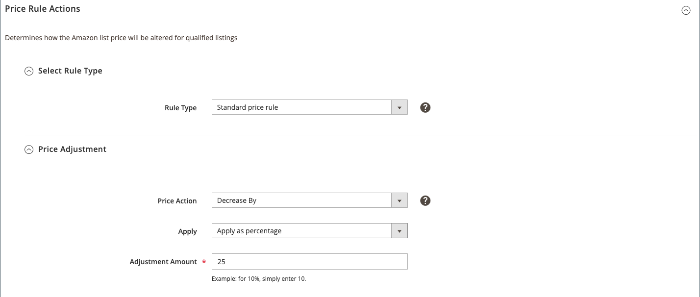

# 標準價格規則操作

標準價格規則操作允許您相對於[!DNL Commerce]目錄價格（或價格來源）以特定百分比或固定美元金額增加或減少Amazon清單價格。

標準價格規則操作的部分包括：

- [!UICONTROL Select Rule Type]
- [!UICONTROL Price Adjustment]

## 配置價格規則操作

1. 對於&#x200B;**[!UICONTROL Rule Type]**，選擇`Standard price rule`。

   此選項會停用&#x200B;_[!UICONTROL Select Rule Type]_區段中的其他欄位。

1. 視需要展開&#x200B;_[!UICONTROL Price Adjustment]_區段。

1. 對於&#x200B;**[!UICONTROL Price Action]**，選擇一個選項以確定要如何更改&#x200B;*[!UICONTROL Magento Price Source]*（在[清單價格](./listing-price.md)中定義）值。

   - `Decrease By`  — 在列入Amazon之前，選擇要降低值的時間。

   - `Increase By`  — 在列入Amazon之前，選擇要增加值的時間。

1. 對於&#x200B;**[!UICONTROL Apply]**，選擇一個選項和選項，以確定要如何調整[清單價格](./listing-price.md)值中定義的&#x200B;*[!UICONTROL Magento Price Source]*:

   - `Apply as percentage`  — 選擇何時要以百 *[!UICONTROL Magento Price Source]* 分比調整上市 [價](./listing-price.md) 值中定義的

   - `Apply as fixed amount`  — 選擇何時要將「上市價 *[!UICONTROL Magento Price Source]* 格」中定 [義](./listing-price.md) 的價格調整為固定金額。

1. 對於&#x200B;**[!UICONTROL Adjustment Amount]**（必要），輸入價格調整的數值。

   - 當&#x200B;*[!UICONTROL Apply]*&#x200B;設為`Apply as percentage`時，輸入百分比值(範例：輸入`25`以調整25%的價格)。

   - 當&#x200B;*[!UICONTROL Apply]*&#x200B;設為`Apply as fixed amount`時，輸入固定金額的數值(例如：輸入`25`以調整$25的固定價格)。

1. 完成後，按一下&#x200B;**[!UICONTROL Save pricing rule]**。

| 欄位 | 說明 |
|---|---|
| [!UICONTROL Rule Type] | 選擇`Standard price rule`。 |
| [!UICONTROL Price Action] | 選項：<ul><li>**[!UICONTROL Decrease By]**  — 在列入Amazon之前， [!DNL Commerce] 選擇要降低定義的價格來源值的時間。</li><li>**[!UICONTROL Increase By]**  — 在列入Amazon之前， [!DNL Commerce] 選擇何時要增加定義的價格來源值。</li></ul> |
| [!UICONTROL Apply] | 選項：<ul><li>**[!UICONTROL Apply as percentage]**  — 選擇何時要按百 [!DNL Commerce] 分比調整定義的價格來源值。</li><li>**[!UICONTROL Apply as fixed amount]**  — 選擇何時要按固 [!DNL Commerce] 定金額調整定義的價格來源值。</li></ul> |
| [!UICONTROL Adjustment Amount] | 必填。  如果您選 `Apply as percentage` 擇 *[!UICONTROL Apply]*&#x200B;用於，請輸入百分比值(例如：輸 `25` 入25%的調整)。  如果您選 `Apply as fixed amount` 擇 *[!UICONTROL Apply]*&#x200B;用於固定金額，請輸入數值(例如：輸 `25` 入$25固定調整)。 |
