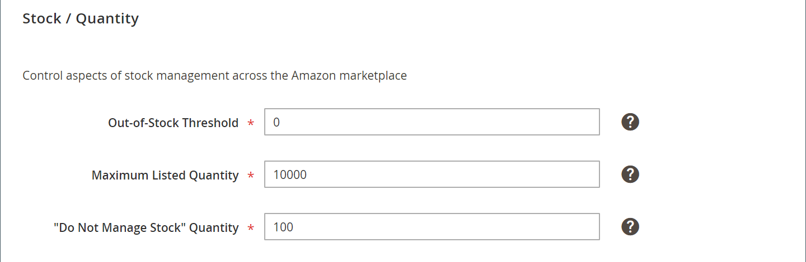

# 存貨/數量

*[!UICONTROL Stock/Quantity]* 設定是商店清單設定的一部分。 清單設定可從以下位置存取： [存放區儀表板](./amazon-store-dashboard.md).

這些設定可用來同步您的產品數量詳細資料 [!DNL Commerce] 店面數量與您的數量 [!DNL Amazon Seller Central] 帳戶。 此工具功能強大，可藉由向買家顯示緊迫性來用於其他廣告，同時保持存貨井然有序。 例如，某些商戶的倉庫中可能有150件特定SKU的庫存，並且想要確保Amazon購物者可以購買其所有存貨。 其他商戶可能希望一次只列出一個專案，讓一般使用者產生稀缺感。 在此情況下，請將 *[!UICONTROL Maximum Listed Quantity]* 至 `1`.

數量是地區屬性，且以 **[!UICONTROL Amazon Marketplace Country]** 設定期間定義 [存放區整合](./store-integration.md). 當對產品數量進行變更時，該變更會影響所有共用該數量的Amazon清單 [!DNL Amazon Seller SKU] 在相同國家/地區銷售的Amazon商店中。 共用專案的變更 [!DNL Amazon Seller SKU] 不會影響您為不同國家/地區設定的Amazon商店。 您的第一個整合的Amazon存放區（具有最早的建立日期）會控制數量設定中的優先順序。

>[!NOTE]
>
>對於Adobe Commerce和Magento Open Source 2.3.x使用者，Amazon sales channel支援使用Inventory management擴充功能，無需任何其他設定。 另請參閱 [管理詳細目錄](https://docs.magento.com/user-guide/v2.3/catalog/inventory-management.html){target="_blank"}.

## 設定庫存/數量設定 {#configure-stock--quantity-settings}

1. 按一下 **[!UICONTROL Listing Settings]** 在商店控制面板上。

1. 展開 **[!UICONTROL Stock / Quantity]** 區段。

1. 對象 **[!UICONTROL Out-of-Stock Threshold]** （必要），輸入產品數量最低的數值，以保持產品符合其Amazon清單的資格。

   預設值為 `0`. 若您的 [!DNL Commerce] 產品庫存低於此數字，各自的Amazon清單不符合透過Amazon銷售的資格。

1. 對象 **[!UICONTROL Maximum Listed Quantity]** （必要），輸入您要在Amazon清單中顯示的數量數值。

   此設定會依輸入的值列出所有符合條件的Amazon清單。 銷售料號時，Amazon清單數量不會變更。 清單可用數量一律會使用此值，即使實際產品數量高於或低於此值。 此設定通常用於不管理產品詳細目錄時。 例如，您的可能有一個產品數量為80 [!DNL Commerce] 目錄。 設定為 `10`，Amazon清單一律會顯示可用的數量： `10` 且不會隨著產品銷售而改變。

1. 對象 **[!UICONTROL "Do Not Manage Stock" Quantity]** （必要），輸入要顯示給Amazon清單的數量值。

   Amazon要求您發佈可用數量。 對象 [!DNL Commerce] 若您設定為不管理庫存但想在Amazon上列出的產品，則清單會隨此處輸入的可用數量一起發佈。

1. 完成後，按一下 **[!UICONTROL Save listing settings]**.

| 欄位 | 說明 |
|---|---|
| [!UICONTROL Out-of-Stock Threshold] | 輸入產品最小數量的數值，以保持產品符合其Amazon清單的資格(預設為 `0`)。  若您的 [!DNL Commerce] 產品庫存低於此數字，各自的Amazon清單不符合透過Amazon銷售的資格。 |
| [!UICONTROL Maximum Listed Quantity] | 輸入您要在Amazon清單中顯示的數量數值。  銷售料號時，Amazon清單會以此處輸入的數量重新發佈。 此設定通常用於不管理產品詳細目錄時。  例如，您輸入「列出數量上限」值如下 `10`. 您產品的實際數量為 `80`. 因為您已將此值設定在 `10`，Amazon清單一律會顯示可用的數量： `10`. 可用數量一律以定義的值顯示，即使存貨數量較低亦然。 |
| [!UICONTROL "Do Not Manage Stock" Quantity] | 輸入Amazon清單的顯示數量值。  Amazon要求您發佈可用數量。 對象 [!DNL Commerce] 若您設定為不管理庫存但想在Amazon上列出的產品，則清單會隨此處輸入值的可用數量一起發佈。 |

**快速存取** - [!UICONTROL Listing Settings] 區段

- [[!UICONTROL Product Listing Actions]](./product-listing-actions.md)
- [[!UICONTROL Third Party Listings]](./third-party-listing-settings.md)
- [[!UICONTROL Listing Price]](./listing-price.md)
- [[!UICONTROL (B2B) Business Price]](./business-pricing.md)
- [[!UICONTROL Stock / Quantity]](./stock-quantity.md)
- [[!UICONTROL Fulfilled By]](./fulfilled-by.md)
- [[!UICONTROL Catalog Search]](./catalog-search.md)
- [[!UICONTROL Product Listing Condition]](./product-listing-condition.md)

## 範例：列出數量上限

銷售料號時，Amazon清單會重新列出此數量的料號。

例如，如果您設定 *[!UICONTROL Maximum Listed Quantity]* 作為 `12`，Amazon清單會顯示數量12，即使產品有 [!DNL Commerce] 數量80：

如果您設定 *[!UICONTROL Maximum Listed Quantity]* 作為 `1`，則所有合格產品都會列出，且數量為 `1`. 當有商品售出時，系統會尋找您的 [!DNL Commerce] 產品，若有其他庫存，則在Amazon上重新搜尋數量為 `1`.

此選項對於通常訂購數量為1的產品可能很有價值。 這也會增加購物者在檢視Amazon清單時的急迫性。

